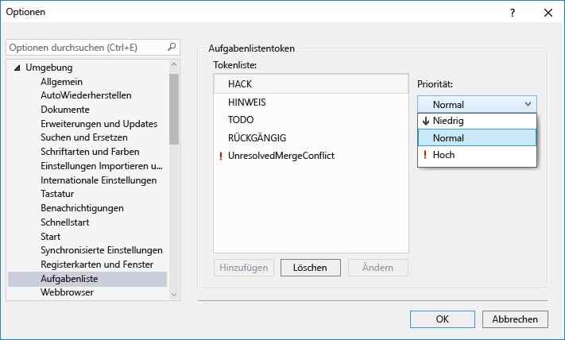

# <a name="use-the-task-list"></a>Verwenden der Aufgabenliste

Verwenden Sie die **Aufgabenliste** , um Codekommentare, die Token wie `TODO` und `HACK`verwenden, nachzuverfolgen und um Verknüpfungen zu verwalten, mit denen Sie direkt zu einem vordefinierten Speicherort im Code gelangen. Klicken Sie auf das Element in der Liste, um an die entsprechende Position im Quellcode zu gelangen.

## <a name="the-task-list-window"></a>Das Fenster "Aufgabenliste"

Wird die **Aufgabenliste** geöffnet, wird sie unten im Anwendungsfenster angezeigt.

### <a name="open-the-task-list"></a>Öffnen der Aufgabenliste

- Klicken Sie im Menü **Ansicht** auf die Option **Aufgabenliste** (Tastatur: **STRG**+**\\**,**T**).

    

### <a name="change-the-sort-order-of-the-list"></a>Ändern der Sortierreihenfolge der Liste

- Klicken Sie auf den Header einer beliebigen Spalte. Um die Suchergebnisse weiter zu verfeinern, drücken Sie die UMSCHALTTASTE und klicken auf einen zweiten Spaltenheader.

     Sie können auch im Kontextmenü die Option **Sortieren nach**und dann einen Header auswählen. Um die Suchergebnisse weiter zu verfeinern, drücken Sie die **UMSCHALTTASTE**, und wählen Sie einen zweiten Header aus.

### <a name="show-or-hide-columns"></a>Ein- oder Ausblenden von Spalten

- Klicken Sie im Kontextmenü auf **Spalten einblenden**. Wählen Sie die Spalten aus, die Sie ein- oder ausblenden möchten.

### <a name="change-the-order-of-the-columns"></a>Ändern der Reihenfolge der Spalten

- Ziehen Sie einen Spaltenheader an die gewünschte Position.

## <a name="user-tasks"></a>Benutzeraufgaben

Das Feature „Benutzeraufgabe“ wurde aus Visual Studio 2015 entfernt. Wenn Sie eine Projektmappe mit Benutzeraufgabendaten aus Visual Studio 2013 oder früher öffnen, bleiben die Benutzeraufgabendaten in Ihrer *SUO*-Datei davon unberührt, aber die Benutzeraufgaben werden nicht in der Aufgabenliste angezeigt.

Um weiterhin auf Ihre Benutzeraufgabendaten zugreifen und diese aktualisieren zu können, sollten Sie das Projekt in Visual Studio 2013 öffnen und den Inhalt aller Benutzeraufgaben in Ihr bevorzugtes Projektmanagementtool (z. B. Team Foundation Server) kopieren.

## <a name="tokens-and-comments"></a>Token und Kommentare

Ein Kommentar im Code, dem ein Kommentarzeichen und ein vordefiniertes Token vorangestellt ist, wird auch im Fenster **Aufgabenliste** angezeigt. Der folgende C#-Kommentar setzt sich beispielsweise aus drei verschiedenen Teilen zusammen:

- Kommentarzeichen (`//`)

- Das Token, z. B. (`TODO`)

- Kommentar (der restliche Text)

```csharp
// TODO: Load state from previously suspended application
```

Da `TODO` ein vordefiniertes Token ist, wird dieser Kommentar als eine `TODO`-Aufgabe in der Liste angezeigt.

###  <a name="customTokens"></a> Benutzerdefinierte Token

Standardmäßig enthält Visual Studio die folgenden Token: `HACK`, `TODO`, `UNDONE`, `NOTE`. Hierbei wird die Groß-/Kleinschreibung nicht berücksichtigt.

Sie können außerdem eigene benutzerdefinierte Token erstellen.

#### <a name="create-a-custom-token"></a>Erstellen eines benutzerdefinierten Tokens

1. Wählen Sie im Menü **Extras** den Befehl **Optionen**.

2. Öffnen Sie den Ordner **Umgebung** , und wählen Sie dann **Aufgabenliste**aus.

     [Die Seite „Aufgabenlistenoptionen“](../ide/reference/task-list-environment-options-dialog-box.md) wird angezeigt.

     

3. Geben Sie in der Kategorie **Token** im Textfeld **Name** den Tokennamen ein, z. B. „BUG“.

4. Wählen Sie in der Dropdownliste **Priorität** eine Standardpriorität für das neue Token aus. Wählen Sie die Schaltfläche **Hinzufügen** aus.

###  <a name="cppComments"></a> C++-TODO-Kommentare

Standardmäßig werden C++-TODO-Kommentare im Fenster **Aufgabenliste** angezeigt. Sie können dieses Verhalten ändern.

#### <a name="turn-off-c-todo-comments"></a>Deaktivieren von C++-TODO-Kommentaren

Wechseln Sie im Menü **Extras** zu **Optionen** > **Text-Editor** > **C/C++** > **Ansicht** > **Kommentaraufgaben aufzählen**, und legen Sie den Wert auf FALSE fest.

## <a name="shortcuts"></a>Verknüpfungen

Eine *Verknüpfung* ist ein Lesezeichen im Code, das in der **Aufgabenliste**nachverfolgt wird. Es weist ein anderes Symbol als ein reguläres Lesezeichen auf. Doppelklicken Sie auf die Verknüpfung in der **Aufgabenliste** , um an die entsprechende Position im Code zu gelangen.


### <a name="create-a-shortcut"></a>Erstellen einer Verknüpfung

Fügen Sie den Zeiger in den Code ein, in dem Sie eine Verknüpfung platzieren möchten, um eine Verknüpfung zu erstellen. Klicken Sie auf **Bearbeiten** > **Lesezeichen** > **Verknüpfung für Aufgabenliste hinzufügen**, oder drücken Sie **STRG**+**K** > **STRG**+**H**.

Um durch die Verknüpfungen im Code zu navigieren, wählen Sie eine Verknüpfung in der Liste und dann im Kontextmenü **Nächste Aufgabe** oder **Vorherige Aufgabe** aus.

## <a name="see-also"></a>Siehe auch

- [Aufgabenliste, Umgebung, Dialogfeld „Optionen“](../ide/reference/task-list-environment-options-dialog-box.md)