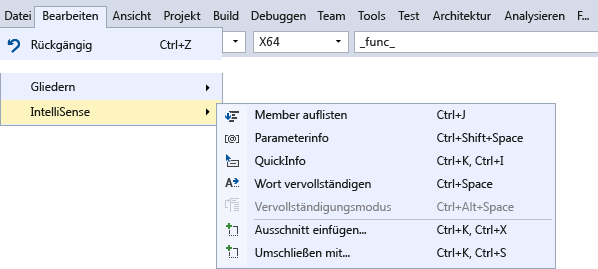
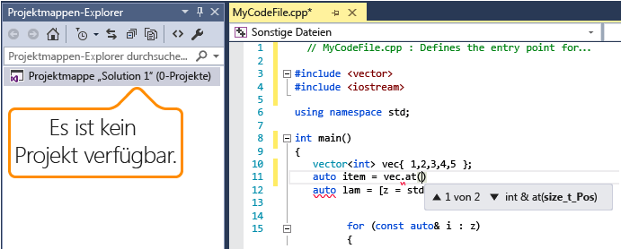

# Visual C++ IntelliSense

IntelliSense für C++ ist für eigenständige Dateien sowie für Dateien innerhalb eines C++-Projekts verfügbar. In plattformübergreifenden Projekten stehen einige IntelliSense-Funktionen in CPP- und C-Dateien im gemeinsam genutzten Projektcode zur Verfügung, auch wenn Sie sich in einem Android- oder iOS-Kontext befinden.

## IntelliSense-Funktionen in C++

IntelliSense ist ein Name für eine Gruppe von Funktionen, die die Codierung erleichtern. Da verschiedene Personen unterschiedliche Vorstellungen dazu haben, was praktisch ist, können im Prinzip alle IntelliSense-Funktionen im Dialogfeld **Optionen** unter **Text-Editor** > **C/C++** > **Erweitert** aktiviert oder deaktiviert werden . Das Dialogfeld **Optionen** steht im Menü **Tools** auf der Menüleiste zur Verfügung.

Sie können die in der folgenden Abbildung aufgeführten Menüelemente und Tastenkombinationen für den Zugriff auf IntelliSense verwenden.

### Anweisungsvervollständigung und Memberliste

Wenn Sie beginnen, ein Schlüsselwort, einen Typ, eine Funktion, einen Variablennamen oder ein anderes Programmelement einzugeben, das der Compiler erkennt, bietet der Editor die Vervollständigung des Worts an.

Eine Liste der Symbole und ihrer Bedeutungen finden Sie unter [Symbole in der Klassenansicht und im Objektbrowser](../ide/class-view-and-object-browser-icons.md).

Wenn zum ersten Mal die Memberliste aufgerufen wird, zeigt sie nur Member am, auf die für den aktuellen Kontext zugegriffen werden kann. Wenn Sie danach **STRG**+**J** drücken, werden alle Member unabhängig vom Zugriff angezeigt. Wenn Sie sie ein drittes Mal aufrufen, wird eine noch größere Liste der Programmelemente angezeigt. Sie können die Memberliste im Dialogfeld **Optionen** unter **Text-Editor** > **C/C++** > **Allgemein** > **Member automatisch auflisten** deaktivieren.

### Parameterhilfe

Wenn Sie eine öffnende geschweifte Klammer eines Funktionsaufrufs oder spitze Klammer in einer Variablendeklaration einer Klassenvorlage eingeben, zeigt der Editor ein kleines Fenster mit den Parametertypen für jede Überladung der Funktion oder des Konstruktors an. Der current-Parameter, der &mdash;auf der Cursorposition basiert&mdash;, wird in Fettformatierung angezeigt. Sie können Parameterinformationen im Dialogfeld **Optionen** unterhalb von **Text-Editor** > **C/C++** > **Allgemein** > **Parameterinformationen** deaktivieren.

### QuickInfo

Wenn Sie mit dem Mauszeiger auf eine Variable zeigen, wird ein kleines Fenster angezeigt, in dem die Informationen und der Header, in dem der Typ definiert wird, angezeigt werden. Zeigen Sie auf einen Funktionsaufruf, um die Signatur der Funktion anzuzeigen. Sie können die QuickInfo im Dialogfeld **Optionen** unterhalb von **Text-Editor** > **C/C++** > **Allgemein** > **Automatische QuickInfo** deaktivieren.

### Fehlerwellenlinien

Wellenlinien unter einem Programmelement (Variable, Schlüsselwort, geschweifte Klammer, Typname usw.) weisen auf einen Fehler oder einen möglichen Fehler im Code hin. Beim Schreiben einer Vorwärtsdeklaration wird eine grüne Wellenlinie eingeblendet, um Sie daran zu erinnern, dass Sie immer noch die Implementierung schreiben müssen. Eine violette Wellenlinie wird in einem freigegebenen Projekt eingeblendet, wenn ein Fehler im Code vorliegt, der gerade nicht aktiv ist, z. B. wenn Sie im Windows-Kontext arbeiten, aber etwas eingeben, das in einem Android-Kontext einen Fehler auslösen würde. Eine rote Wellenlinie weist auf einen Compilerfehler oder eine Warnung im aktiven Code hin, den bzw. die Sie behandeln müssen.

### Farbliche Kennzeichnung von Code und Schriftarten

Die Standardfarben und -schriftarten können im Dialogfeld **Optionen** unter **Umgebung** > **Schriftarten und Farben** geändert werden. Hier können Sie die Schriftarten für viele UI-Fenster ändern, nicht nur für den Editor. Die Einstellungen, die spezifisch für C++ sind, beginnen mit „C++“; die anderen Einstellungen gelten für alle Sprachen.

### Plattformübergreifendes IntelliSense

In einem Projekt mit freigegebenem Code stehen einige IntelliSense-Funktionen, wie z. B. Wellenlinien, sogar bei der Arbeit in einem Android-Kontext zur Verfügung. Wenn Sie Code schreiben, der zu einem Fehler in einem inaktiven Projekt führen würde, zeigt IntelliSense weiterhin Wellenlinien an, aber in einer anderen Farbe als Wellenlinien für Fehler im aktuellen Kontext.

Hier ist eine OpenGLES-Anwendung, die zum Erstellen für Android und iOS konfiguriert ist. Die Abbildung veranschaulicht den bearbeiteten freigegebenen Code. In der ersten Abbildung stellt Android das aktive Projekt dar:

Beachten Sie Folgendes:

- Der #else-Branch in Zeile 8 ist ausgegraut und stellt den aktiven Bereich dar, da __ANDROID\_\_ für das Android-Projekt definiert ist.

- Die Variable für die Grußformel in Zeile 11 wird mit dem HELLO-Bezeichner initialisiert, der eine violette Wellenlinie hat. Der Grund hierfür ist, dass kein HELLO-Bezeichner in dem aktuell inaktiven iOS-Projekt definiert ist. Während im Android-Projekt Zeile 11 kompilieren wird, ist dies im iOS-Projekt nicht der Fall. Da es sich um freigegebenen Code handelt, sollten Sie diesen auch dann ändern, wenn er in der aktuell aktiven Konfiguration kompiliert wird.

- Zeile 12 weist eine rote Wellenlinie am BYE-Bezeichner auf; dieser Bezeichner ist in dem aktuell ausgewählten aktiven Projekt nicht definiert.

Ändern Sie nun das aktive Projekt in iOS.StaticLibrary, und achten Sie auf die Änderungen an den Wellenlinien.

Beachten Sie Folgendes:

- Der #ifdef-Branch in Zeile 6 ist ausgegraut und stellt den inaktiven Bereich dar, da __ANDROID\_\_ für das iOS-Projekt nicht definiert ist.

- Die Variable für die Grußformel in Zeile 11 wird mit dem HELLO-Bezeichner initialisiert, der nun eine rote Wellenlinie hat. Der Grund hierfür ist, dass kein HELLO-Bezeichner in dem aktuell aktiven iOS-Projekt definiert ist.

- Zeile 12 weist der BYE-Bezeichner eine violette Wellenlinie auf; dieser Bezeichner ist im aktuell inaktiven Android.NativeActivity-Projekt nicht definiert.

### IntelliSense für eigenständige Dateien

Wenn Sie eine einzelne Datei außerhalb von Projekten öffnen, können Sie weiterhin IntelliSense verwenden. Sie können bestimmte IntelliSense-Features im Dialogfeld **Optionen** unter **Text-Editor** > **C/C++** > **Erweitert** aktivieren oder deaktivieren. Suchen Sie zum Konfigurieren von IntelliSense für einzelne Dateien, die nicht Teil eines Projekts sind, nach dem Abschnitt **IntelliSense und Suchen nach Nicht-Projektdateien**.

Standardmäßig verwendet eine einzelne IntelliSense-Datei die standardmäßigen Includeverzeichnisse für die Suche nach Headerdateien. Öffnen Sie zum Hinzufügen weiterer Verzeichnisse das Kontextmenü für den Knoten „Projektmappe“, und fügen Sie Ihr Verzeichnis zur Liste **Quellcode debuggen** hinzu, wie in der folgenden Abbildung dargestellt:

## Siehe auch

[Verwenden von IntelliSense](../ide/using-intellisense.md)