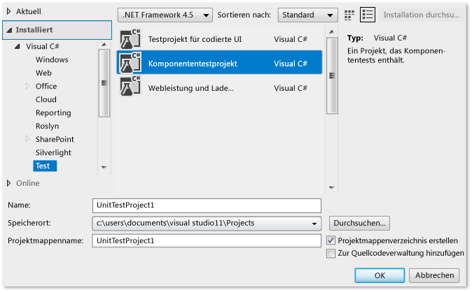
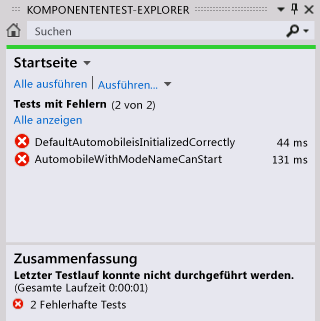

# Exemplarische Vorgehensweise: Testgetriebene Entwicklung mit der Funktion „Generate From Usage“
In diesem Thema wird die Verwendung der [Generate From Usage](../ide/visual-csharp-intellisense.md#generate-from-usage)-Funktion veranschaulicht, die die Test-First-Entwicklung unterstützt.  
  
 Die*testgetriebene Entwicklung* ist eine Methode des Softwareentwurfs, bei der zuerst Unittests basierend auf Produktspezifikationen und dann der Quellcode geschrieben wird, der erforderlich ist, damit die Tests erfolgreich ausgeführt werden. Visual Studio unterstützt die testgetriebene Entwicklung, indem neue Typen und Members im Quellcode generiert werden, wenn Sie in Ihren Testfällen auf diese verweisen, noch bevor sie definiert werden.  
  
 Visual Studio generiert die neuen Typen und Member mit nur minimaler Unterbrechung des Workflows. Sie können Stubs für Typen, Methoden, Eigenschaften, Felder oder Konstruktoren erstellen, ohne die aktuelle Position im Code zu verlassen. Wenn Sie ein Dialogfeld zum Angeben von Optionen für die Typgenerierung öffnen, kehrt der Fokus sofort zur aktuell geöffneten Datei zurück, wenn das Dialogfeld geschlossen wird.  
  
 Die Funktion „Generate From Usage“ kann mit Testframeworks verwendet werden, die in Visual Studio integriert werden können. In diesem Thema wird das Microsoft-Unittestframework veranschaulicht.  
  
[!INCLUDE[note_settings_general](../data-tools/includes/note_settings_general_md.md)]  
  
### So erstellen Sie ein Projekt für eine Windows-Klassenbibliothek und ein Testprojekt  
  
1.  Erstellen Sie in [!INCLUDE[csprcs](../data-tools/includes/csprcs_md.md)] oder [!INCLUDE[vbprvb](../code-quality/includes/vbprvb_md.md)] ein neues Projekt für eine **Windows-Klassenbibliothek**. Nennen Sie es `GFUDemo_VB` oder `GFUDemo_CS`, je nachdem, welche Sprache Sie verwenden.  
  
2.  Klicken Sie im **Projektmappen-Explorer** mit der rechten Maustaste im oberen Bereich auf das Projektmappensymbol. Klicken Sie dann zuerst auf **Hinzufügen** und anschließend auf **Neues Projekt**. Klicken Sie im linken Bereich des Dialogfelds **Neues Projekt** auf **Testen**.  
  
3.  Klicken Sie im mittleren Bereich auf **Kompententestprojekt**, und übernehmen Sie den Standardnamen „UnitTestProject1“. Die folgende Abbildung zeigt das Dialogfeld, wenn es in [!INCLUDE[csprcs](../data-tools/includes/csprcs_md.md)]geöffnet wird. In [!INCLUDE[vbprvb](../code-quality/includes/vbprvb_md.md)] sieht das Dialogfeld ähnlich aus.  
  
       
  
4.  Klicken Sie auf **OK**, um das Dialogfeld **Neues Projekt** zu schließen.  

### Hinzufügen eines Verweises auf das Klassenbibliotheksprojekt

1.  Klicken Sie im **Projektmappen-Explorer** unter Ihrem Komponententestprojekt mit der rechten Maustaste auf den Eintrag **Verweise**, und klicken Sie dann auf **Verweis hinzufügen**.

2.  Klicken Sie im Dialogfeld **Verweis-Manager** zunächst auf die Option **Projekte** und dann auf das Klassenbibliotheksprojekt.

3.  Klicken Sie auf **OK**, um das Dialogfeld **Verweis-Manager** zu schließen.  
    
4.  Speichern Sie die Projektmappe. Sie können nun mit dem Schreiben von Tests beginnen.  
  
### So generieren Sie aus einem Unittest eine neue Klasse  
  
1.  Das Testprojekt enthält eine Datei mit dem Namen "UnitTest1". Doppelklicken Sie auf diese Datei im **Projektmappen-Explorer**, um sie im Code-Editor zu öffnen. Eine Testklasse und eine Testmethode wurden generiert.  
  
2.  Suchen Sie die Deklaration für die Klasse `UnitTest1` , und benennen Sie sie um in `AutomobileTest`.  
  
 > [!NOTE]
 >  IntelliSense bietet jetzt zwei Alternativen für die IntelliSense-Anweisungsvervollständigung: *Beendigungsmodus* und *Vorschlagsmodus*. Verwenden Sie den Vorschlagsmodus für Situationen, in denen Klassen und Member verwendet werden, bevor sie definiert werden. Drücken Sie **STRG+ALT+LEERTASTE**, um bei geöffnetem IntelliSense-Fenster zwischen Beendigungsmodus und Vorschlagsmodus zu wechseln. Weitere Informationen finden Sie unter [Using IntelliSense](../ide/using-intellisense.md) . Der Vorschlagsmodus ist hilfreich, wenn Sie im nächsten Schritt `Automobile` eingeben.  
  
3.  Suchen Sie die `TestMethod1()` -Methode, und benennen Sie sie um in `DefaultAutomobileIsInitializedCorrectly()`. Erstellen Sie wie in den folgenden Screenshots dargestellt innerhalb dieser Methode eine neue Klasseninstanz mit dem Namen `Automobile`. Eine wellenförmige Unterstreichung, die auf einen Kompilierzeitfehler hindeutet, und eine Glühbirne für [Schnelle Aktionen](../ide/quick-actions.md) werden am linken Rand (nur in C#) oder direkt unter der Wellenlinie angezeigt, wenn Sie darauf zeigen.  
  
     ![Quick Actions in Visual Basic] (Schnelle Aktionen in Visual Basic)(../ide/media/genclass_underlinevb.png "GenClass_UnderlineVB")  

     ![Quick Actions in C#] (Schnelle Aktionen in C#) (../ide/media/genclass_underline.png "GenClass_UnderlineVB")  
  
4.  Klicken Sie auf die „Schnelle Aktionen“-Glühbirne. Es wird eine Fehlermeldung angezeigt, die meldet, dass der `Automobile`-Typ nicht definiert ist. Außerdem werden einige Lösungen für das Problem angezeigt.  
  
5. Sie können auch auf **Neuen Typ generieren...** klicken, um das Dialogfeld **Typ generieren** zu öffnen. In diesem Dialogfeld werden verschiedene Optionen dargestellt. Dies umfasst u. a. die Typgenerierung in einem anderen Projekt.  

6. Klicken Sie in der **Projekt**-Liste auf **GFUDemo\_VB** oder **GFUDemo_CS**, um Visual Studio anzuweisen, anstelle des Testprojekts dem Klassenbibliotheksprojekt die Datei hinzuzufügen. Klicken Sie, falls noch nicht geschehen, auf **Neue Datei erstellen** und nennen Sie diese Datei **Automobile.cs** oder **Automobile.vb**.  
  
       
  
6.  Klicken Sie auf **OK** , um das Dialogfeld zu schließen und die neue Datei zu erstellen.  
  
7.  Überprüfen Sie im **Projektmappen-Explorer**unter dem Projektknoten "GFUDemo_VB" oder "GFUDemo_CS", ob die neue Datei "Automobile.vb" oder "Automobile.cs" vorhanden ist. Im Code-Editor liegt der Fokus noch immer auf `AutomobileTest.DefaultAutomobileIsInitializedCorrectly`, wodurch Sie den Test mit so wenigen Unterbrechungen wie möglich weiterschreiben können.  
  
### So generieren Sie einen Eigenschaftsstub  
Angenommen, die Produktspezifikation gibt an, dass die `Automobile` -Klasse über zwei öffentliche Eigenschaften namens `Model` und `TopSpeed`verfügt. Diese Eigenschaften müssen mit den Standardwerten von `"Not specified"` und `-1` durch den Standardkonstruktor initialisiert werden. Im folgenden Unittest wird überprüft, ob der Standardkonstruktor die Eigenschaften auf ihre richtigen Standardwerte festlegt.  
  
1. Fügen Sie der `DefaultAutomobileIsInitializedCorrectly`-Testmethode die folgende Codezeile hinzu.  
  
     [!code-csharp[VbTDDWalkthrough#1](../ide/codesnippet/CSharp/walkthrough-test-first-support-with-the-generate-from-usage-feature_1.cs)]
     [!code-vb[VbTDDWalkthrough#1](../ide/codesnippet/VisualBasic/walkthrough-test-first-support-with-the-generate-from-usage-feature_1.vb)]  
  
2. Da der Code auf zwei nicht definierte Eigenschaften in `Automobile` verweist, wird unter `Model` und `TopSpeed` eine wellenförmige Unterstreichung angezeigt. Zeigen Sie auf `Model`, klicken Sie auf die „Schnelle Aktionen“-Glühbirne und dann auf **Generate property 'Automobile.Model'** (Eigenschaft „Automobile.Model“ generieren).  

3. Generieren Sie auf dieselbe Weise einen Eigenschaftenstub für die `TopSpeed`-Eigenschaft.  
  
     In der `Automobile` -Klasse werden die Typen der neuen Eigenschaften ordnungsgemäß aus dem Kontext abgeleitet.  
  
### So generieren Sie einen Stub für einen neuen Konstruktor  
Jetzt möchten wir Ihnen zeigen, wie Sie eine Testmethode erstellen, die einen Konstruktorstub generiert, um die Eigenschaften `Model` und `TopSpeed` zu initialisieren. Später fügen Sie weiteren Code hinzu, um den Test abzuschließen.  

1. Fügen Sie die folgende zusätzliche Testmethode zur `AutomobileTest` -Klasse hinzu.  
  
     [!code-csharp[VbTDDWalkthrough#2](../ide/codesnippet/CSharp/walkthrough-test-first-support-with-the-generate-from-usage-feature_2.cs)]
     [!code-vb[VbTDDWalkthrough#2](../ide/codesnippet/VisualBasic/walkthrough-test-first-support-with-the-generate-from-usage-feature_2.vb)]  
  
2.  Klicken Sie auf die „Schnelle Aktionen“-Glühbirne unterhalb der roten Wellenlinie, und klicken Sie anschließend auf **Generate constructor in 'Automobile'** (Konstruktor in „Automobile“ generieren).  

     In der `Automobile` -Klassendatei hat der neue Konstruktor die Namen der lokalen Variablen geprüft, die im Konstruktoraufruf verwendet werden, Eigenschaften gefunden, die die gleichen Namen in der `Automobile` -Klasse aufweisen, und Code im Konstruktortext zum Speichern der Argumentwerte in den Eigenschaften `Model` und `TopSpeed` bereitgestellt.
  

3.  Nachdem Sie den neuen Konstruktor generiert haben, wird eine wellenförmige Unterstreichung unter dem Aufruf des Standardkonstruktors in `DefaultAutomobileIsInitializedCorrectly`angezeigt. Die Fehlermeldung gibt an, dass die `Automobile` -Klasse über keinen Konstruktor verfügt, der keine Argumente annimmt. Um einen expliziten Standardkonstruktor ohne Parameter zu generieren, klicken Sie zunächst auf die „Schnelle Aktionen“-Glühbirne, und dann auf **Generate constructor in 'Automobile'** (Konstruktorstub in „Automobile“ generieren).  
  
### So generieren Sie einen Stub für eine Methode  
Angenommen, die Spezifikation gibt an, dass ein neues `Automobile` in einen Ausführzustand gesetzt werden kann, wenn die zugehörigen Eigenschaften `Model` und `TopSpeed` auf andere als die Standardwerte festgelegt werden.  

1. Fügen Sie der `AutomobileWithModelNameCanStart` -Methode die folgenden Zeilen hinzu.
  
     [!code-csharp[VbTDDWalkthrough#3](../ide/codesnippet/CSharp/walkthrough-test-first-support-with-the-generate-from-usage-feature_3.cs)]
     [!code-vb[VbTDDWalkthrough#3](../ide/codesnippet/VisualBasic/walkthrough-test-first-support-with-the-generate-from-usage-feature_3.vb)]  
  
2.  Klicken Sie auf die „Schnelle Aktionen“-Glühbirne für den Methodenaufruf `myAuto.Start` und dann auf **Generate method 'Automobile.Start'** (Methode „Automobile.Start“ generieren).  
  
3.  Klicken Sie auf die „Schnelle Aktionen“-Glühbirne für die `IsRunning`-Eigenschaft und dann auf **Generate method 'Automobile.Start'** (Methode „Automobile.Start“ generieren).  

     Die `Automobile`-Klasse enthält nun eine Methode mit dem Namen `Start()` und eine Eigenschaft mit dem Namen `IsRunning`.  
  
### So führen Sie die Tests aus  
  
1.  Klicken Sie im Menü **Test** auf **Ausführen** > **Alle Tests**.  

     Der Befehl **Ausführen** > **Alle Tests** führt alle Tests in sämtlichen Testframeworks aus, die für die aktuelle Projektmappe geschrieben sind. In diesem Fall sind zwei Tests vorhanden, und beide schlagen erwartungsgemäß fehl. Der `DefaultAutomobileIsInitializedCorrectly` -Test schlägt fehl, weil die `Assert.IsTrue` -Bedingung `False`zurückgibt. Der `AutomobileWithModelNameCanStart` -Test schlägt fehl, weil die `Start` -Methode in der `Automobile` -Klasse eine Ausnahme auslöst.  
  
     Das Fenster **Testergebnisse** wird in der folgenden Abbildung gezeigt.  
  
       
  
2.  Doppelklicken Sie im Fenster **Testergebnisse** auf jede Testergebniszeile, um zum Speicherort der einzelnen Tests zu gelangen.  
  
### So implementieren Sie den Quellcode  
  
1.  Fügen Sie dem Standardkonstruktor den folgenden Code hinzu, sodass die Eigenschaften `Model`, `TopSpeed` und `IsRunning` mit den richtigen Standardwerten von `"Not specified"`, `-1`, und `False` (oder `false` für C#) initialisiert werden.  
  
     [!code-csharp[VbTDDWalkthrough#5](../ide/codesnippet/CSharp/walkthrough-test-first-support-with-the-generate-from-usage-feature_5.cs)]
     [!code-vb[VbTDDWalkthrough#5](../ide/codesnippet/VisualBasic/walkthrough-test-first-support-with-the-generate-from-usage-feature_5.vb)]  
  
2.  Wenn die `Start` -Methode aufgerufen wird, sollte das `IsRunning` -Flag nur auf "true" festgelegt werden, wenn die Eigenschaft `Model` oder `TopSpeed` auf einen anderen als den Standardwert festgelegt sind. Entfernen Sie die `NotImplementedException` aus dem Methodentext, und fügen Sie den folgenden Code hinzu.  
  
     [!code-csharp[VbTDDWalkthrough#6](../ide/codesnippet/CSharp/walkthrough-test-first-support-with-the-generate-from-usage-feature_6.cs)]
     [!code-vb[VbTDDWalkthrough#6](../ide/codesnippet/VisualBasic/walkthrough-test-first-support-with-the-generate-from-usage-feature_6.vb)]  
  
### So führen Sie die Tests erneut aus  
  
- Zeigen Sie im Menü **Test** auf **Ausführen**, und klicken Sie dann auf **Alle Tests**.  

     Dieses Mal werden die Tests bestanden. Das Fenster **Testergebnisse** wird in der folgenden Abbildung gezeigt.  
  
     
  
## Siehe auch  
 [Aus Verwendung generieren](../ide/visual-csharp-intellisense.md#generate-from-usage)   
 [Schreiben von Code](../ide/writing-code-in-the-code-and-text-editor.md)   
 [Verwenden von IntelliSense](../ide/using-intellisense.md)   
 [Komponententest für Code](../test/unit-test-your-code.md)  
 [Schnelle Aktionen](../ide/quick-actions.md)  