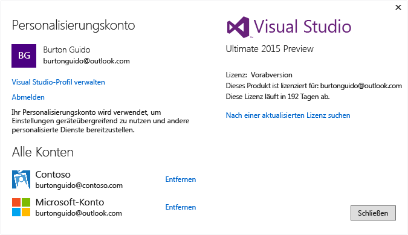

# Arbeiten mit mehreren Benutzerkonten

Wenn Sie mehrere Microsoft-Konten und/oder Geschäfts- oder Schulkonten haben, können Sie all diese Konten zu Visual Studio hinzufügen, sodass Sie über jedes Konto auf die Ressourcen zugreifen können, ohne sich separat anmelden zu müssen. Aktuell unterstützen Azure, Application Insights, Team Foundation Server und Office 365-Dienste die optimierte Anmeldung. Zusätzliche Dienste werden im Laufe der Zeit verfügbar sein.

Wenn Sie auf einem Computer mehrere Benutzerkonten hinzufügen, „wandert“ diese Gruppe von Konten mit Ihnen mit, wenn Sie sich auf einem anderen Computer bei Visual Studio anmelden. Zu beachten ist aber, dass zwar die Namen der Konten übernommen werden, die Anmeldeinformationen jedoch nicht. Aus diesem Grund werden Sie aufgefordert, die Anmeldeinformationen für die anderen Konten einzugeben, wenn Sie zum ersten Mal versuchen, die dazugehörigen Ressourcen auf dem neuen Computer zu verwenden.

Diese exemplarische Vorgehensweise zeigt, wie Sie mehrere Konten zu Visual Studio hinzufügen und wie Sie feststellen, ob die über diese Konten zugänglichen Ressourcen an Stellen wie dem Dialogfeld **Verbundenen Dienst hinzufügen** , im **Server-Explorer**und im **Team Explorer**dargestellt werden.

## Anmelden bei Visual Studio

- Melden Sie sich mit einem Microsoft-Konto oder einem Unternehmenskonto bei Visual Studio an. Ihr Benutzername sollte oben im Fenster angezeigt werden, etwa folgendermaßen:

     

### Zugreifen auf Ihr Azure-Konto in Server-Explorer

Drücken Sie **Strg**+**Alt**+**S**, um **Server-Explorer** zu öffnen. Wählen Sie das **Azure**-Symbol aus. Wenn es aufgeklappt wird, sehen Sie die verfügbaren Ressourcen in dem Azure-Konto, das mit der ID verknüpft ist, die Sie zum Anmelden bei Visual Studio verwendet haben. Es sollte etwa Folgendes angezeigt werden (davon abgesehen, dass Sie Ihre eigenen Ressourcen sehen).

Wenn Sie Visual Studio auf einem bestimmten Gerät zum ersten Mal verwenden, zeigt das Dialogfeld nur die Abonnements an, die unter der ID registriert sind, mit der Sie sich bei der IDE angemeldet haben. Auf die Ressourcen Ihrer anderen Konten können Sie direkt über den **Server-Explorer** zugreifen, indem Sie mit der rechten Maustaste auf den **Azure**-Knoten klicken, **Abonnements verwalten und filtern** auswählen und Ihre Konten über das Kontoauswahl-Steuerelement hinzufügen. Um ein anderes Konto auszuwählen, klicken Sie auf den Pfeil nach unten, und wählen Sie das gewünschte Konto aus der Liste aus. Nach dem Auswählen des Kontos können Sie auswählen, welche Abonnements dieses Kontos im **Server-Explorer** angezeigt werden sollen.

Wenn Sie den **Server-Explorer** dann das nächste Mal öffnen, werden die Ressourcen für diese(s) Abonnement(s) angezeigt.

### Zugreifen auf Ihr Azure-Konto über das Dialogfeld "Verbundenen Dienst hinzufügen"

1. Erstellen Sie ein UWP-App-Projekt in C#.

1. Wählen Sie im **Projektmappen-Explorer** den Projektknoten und dann **Hinzufügen** > **Verbundener Dienst** aus. Der Assistent **Verbundenen Dienst hinzufügen** zeigt die Liste der Dienste in dem Azure-Konto an, das mit Ihrer Visual Studio-Anmelde-ID verknüpft ist. Sie müssen sich nicht separat bei Azure anmelden. Allerdings müssen Sie sich beim ersten Versuch, von einem bestimmten Computer auf die Ressourcen eines anderen Kontos zuzugreifen, bei diesem Konto anmelden.

    > [!WARNING]
    > Wenn Sie auf einem bestimmten Computer zum ersten Mal eine UWP-App in Visual Studio erstellen, werden Sie aufgefordert, den Entwicklungsmodus für Ihr Gerät zu aktivieren. Gehen Sie dazu auf Ihrem Computer zu **Einstellungen** > **Updates und Sicherheit** > **Für Entwickler**. Weitere Informationen finden Sie unter [Aktivieren Ihres Geräts für die Entwicklung](/windows/uwp/get-started/enable-your-device-for-development).

###  Zugreifen auf Azure Active Directory in einem Webprojekt

Azure AD unterstützt das einmalige Anmelden für Endbenutzer in ASP.NET MVC-Webanwendungen oder die AD-Authentifizierung in Web-API-Diensten. Die Domänenauthentifizierung unterscheidet sich von der Authentifizierung einzelner Benutzerkonten: Benutzer mit Zugriff auf Ihre Active Directory-Domäne können ihre vorhandenen Azure AD-Konten verwenden, um eine Verbindung zu Ihren Webanwendungen herzustellen. Auch Office 365-Anwendungen können die Domänenauthentifizierung verwenden. Um diesen Vorgang zu sehen, erstellen Sie eine Webanwendung (**Datei** > **Neues Projekt** > **C#** > **Cloud** > **ASP.NET-Webanwendung**). Wählen Sie im Dialogfeld **Neues ASP.NET-Projekt** die Option **Authentifizierung ändern** aus. Der Authentifizierungsassistent wird angezeigt und ermöglicht es Ihnen, die Art der Authentifizierung in Ihrer Anwendung auszuwählen.

Weitere Informationen zu den verschiedenen Arten der Authentifizierung in ASP.NET finden Sie unter [Erstellen von ASP.NET-Webprojekten in Visual Studio 2013](http://www.asp.net/visual-studio/overview/2013/creating-web-projects-in-visual-studio#orgauth) (die Informationen zur Authentifizierung gelten auch noch für die aktuellen Versionen von Visual Studio).

### Zugreifen auf Ihre Team Foundation Server-Organisation (TFS)

Wählen Sie im Hauptmenü **Team** > **Verbindung mit Team Foundation Server herstellen** aus, um das Fenster **Team Explorer** aufzurufen. Klicken Sie auf **Projekte auswählen**. Im Listenfeld unter **Team Foundation Server-Computer auswählen** sehen Sie die URL für Ihre TFS-Organisation. Nach Auswahl der URL werden Sie angemeldet, ohne Ihre Anmeldeinformationen erneut eingeben zu müssen.

## Hinzufügen eines zweiten Benutzerkontos zu Visual Studio

Klicken Sie auf den Abwärtspfeil neben Ihrem Benutzernamen oben in Visual Studio. Wählen Sie dann das Menüelement **Kontoeinstellungen** aus. Im Dialogfeld **Konto-Manager** wird das Konto angezeigt, mit dem Sie sich angemeldet haben. Wählen Sie den Link **Konto hinzufügen** unten im Dialogfeld aus, um ein neues Microsoft-Konto oder ein neues Geschäfts- bzw. Schulkonto hinzuzufügen.

Folgen Sie den Anweisungen, um die neuen Anmeldeinformationen für das Konto einzugeben. Die folgende Abbildung zeigt den **Konto-Manager**, nachdem ein Benutzer sein *Contoso.com*-Geschäftskonto hinzugefügt hat.

## Erneutes Aufrufen des Assistenten zum Hinzufügen verbundener Dienste und des Server-Explorers

Wechseln Sie nun erneut zum **Server-Explorer**, klicken Sie mit der rechten Maustaste auf den **Azure**-Knoten, und wählen Sie **Abonnements verwalten und filtern** aus. Wählen Sie das neue Konto durch Klicken auf den Dropdownpfeil neben dem aktuellen Konto aus, und wählen Sie dann aus, welche Abonnements Sie im **Server-Explorer** anzeigen möchten. Es sollten alle Dienste angezeigt werden, die dem angegebenen Abonnement zugeordnet sind. Auch wenn Sie mit dem zweiten Konto gerade nicht bei der Visual Studio-IDE angemeldet sind, sind Sie bei den Diensten und Ressourcen dieses Kontos angemeldet. Dies gilt auch für **Projekt** > **Verbundenen Dienst hinzufügen** und **Team** > **Verbindung mit Team Foundation Server herstellen**.

## Siehe auch

- [Anmelden bei Visual Studio](signing-in-to-visual-studio.md)
