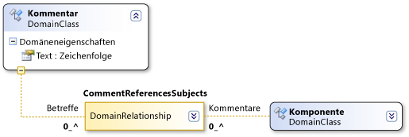

# Dom&#228;nenpfadsyntax
[!INCLUDE[vs2017banner](../code-quality/includes/vs2017banner.md)]

In DSL\-Definitionen wird eine XPath\-artige Syntax für die Suche nach bestimmten Elementen in einem Modell verwendet.  
  
 In der Regel ist es nicht erforderlich, direkt mit dieser Syntax zu arbeiten. Wenn sie in DSL\-Details oder im Eigenschaftenfenster angezeigt wird, können Sie auf den nach unten weisenden Pfeil klicken und den Pfad\-Editor verwenden. Der Pfad wird jedoch in dieser Form im Feld angezeigt, nachdem Sie den Editor verwendet haben.  
  
 Ein Domänenpfad weist die folgende Form auf:  
  
 *Beziehungsname.Eigenschaftenname\/\!Rolle*  
  
   
  
 Die Syntax durchläuft die Baumstruktur des Modells. Beispielsweise enthält die Domänenbeziehung "CommentReferencesSubjects" in der obigen Abbildung eine Subjects\-Rolle. Mit dem Pfadsegment "\/\!Subjectt" wird angegeben, dass der Pfad bei Elementen endet, auf die mit der Subjects\-Rolle zugegriffen wird.  
  
 Jedes Segment beginnt mit dem Namen einer Domänenbeziehung. Wenn der Durchlauf von einem Element zu einer Beziehung erfolgt, wird das Pfadsegment als *Beziehung.Eigenschaftenname* angezeigt. Wenn der Hop von einem Link zu einem Element verläuft, wird das Pfadsegment als *Beziehung\/\!Rollenname* angezeigt.  
  
 Die Syntax eines Pfads wird durch Schrägstriche unterteilt. Jedes Pfadsegment ist entweder ein Hop von einem Element zu einem Link \(einer Instanz einer Beziehung\) oder von einem Link zu einem Element. Pfadsegmente treten häufig paarweise auf. Ein Pfadsegment steht für einen Hop von einem Element zu einem Link, und das nächste Segment steht für einen Hop vom Link zum Element am anderen Ende. \(Jeder Link kann auch die Quelle oder das Ziel der Beziehung selbst sein.\)  
  
 Der Name, den Sie für den Hop vom Element zum Link verwenden, ist der Wert von `Property Name` der Rolle. Der Name, den Sie für den Hop vom Link zum Element verwenden, ist der Zielrollenname.  
  
## Siehe auch  
 [Grundlagen von Modellen, Klassen und Beziehungen](../modeling/understanding-models-classes-and-relationships.md)