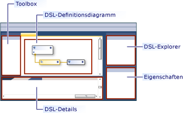

# Übersicht über die Benutzeroberfläche für domänenspezifische Sprachtools
Beim ersten Öffnen einer Projektmappe domänenspezifische Sprachtools (DSL Tools) in [!INCLUDE[vsprvs](../code-quality/includes/vsprvs_md.md)], die Benutzeroberfläche die folgenden Abbildung ähneln.

 

 In der folgenden Tabelle wird erläutert, wie die Teile der Benutzeroberfläche verwendet werden.

|**Element**|**Definition**|
|-----------------|--------------------|
|Diagramm|Das Diagramm zeigt die Domänenmodell.   Das Diagramm verfügt über zwei Seiten. Einseitige definiert die Typen der Elemente in Ihren Modellen. Die andere Seite definiert, wie die Modelle auf dem Bildschirm angezeigt werden.|
|Werkzeugkasten|Ziehen Sie Tools aus der Toolbox hinzufügen Domänenklassen und shape-Typen in das Diagramm. Beziehungen, Connectors und flächenkartogrammen hinzufügen möchten, klicken Sie auf das Tool, und klicken Sie auf den Quellknoten auf das Diagramm und dann auf den Zielknoten.|
|DSL-Explorer|**DSL-Explorer** wird angezeigt, wenn eine DSL-Definition des aktiven Fensters verwendet wird. Es zeigt die DSL als Struktur. DSL-Explorer können Sie die Features des Modells zu bearbeiten, die nicht im Diagramm angezeigt werden. Sie können z. B. Toolboxelemente hinzufügen und auf dem Validierungsprozess wechseln, indem die **Explorer für DSL**.|
|DSL-Detailfenster|Die **DSL-Detailfenster** Fenster zeigt die Eigenschaften der Domäne des Modells-Elemente, mit denen Sie steuern, wie Elemente angezeigt werden und wie die Elemente kopiert und gelöscht werden.   -Standardmäßig die **DSL-Detailfenster** Fenster wird neben der **Fehlerliste** und **Ausgabe** Windows.|

## Die Domäne Modelldiagramms
 Die Domäne Modelldiagramm ist in zwei Bereiche unterteilt. Eine Seite des Diagramms zeigt die Elemente und Beziehungen im Modell an. Die andere Seite wird gezeigt, wie das Modell ist, die angezeigt werden, sowie die Formen, die verwendet werden, um die Elemente und die Eigenschaften des Modelldiagramms anzuzeigen. Das folgende Bild zeigt die Elemente des Diagramms.

 

 In der folgenden Tabelle werden einige der Elemente des Diagramms Modell Domäne erläutert.

|**Begriff**|**Definition**|
|--------------|--------------------|
|Domänenklasse|Domänenklassen sind die Typen von Elementen in Ihren Modellen.   Eine Domänenklasse kann mehr als einmal in einem Diagramm angezeigt werden, wenn sie das Ziel von mehr als eine Beziehung ist.   Eine Domänenklasse hinzufügen möchten, ziehen Sie das Tool für die Klasse von Domänen aus der **Toolbox** auf die **Klassen und Beziehungen** Seite des Diagramms.|
|Domänenbeziehung|Zwischen Domänen sind die Typen von Links zwischen Elementen in Ihren Modellen.   Ein *einbetten Beziehung* gibt an, dass das Zielelement ist im Besitz oder im Source-Element enthalten sind, und als eine durchgehende Linie angezeigt wird. Jedes Element in einem Modell sollte das Ziel eine Beziehung einbetten, sein, damit, dass das Modell eine Struktur bildet. Ein *verweisbeziehung* gibt eine allgemeine Verknüpfung zwischen Modellelementen und wird als gestrichelte Linie dargestellt. Jedes Element kann eine beliebige Anzahl von Links zu Referenzen haben.   Erstellen Sie eine Beziehung, indem Sie auf das Tool für die **Toolbox**, klicken Sie auf die Domäne Quellklasse und dann auf die Zielklasse.|
|Formen und Konnektoren|Formen angeben wie die betroffenen Modellelemente auf einem DSL-Diagramm angezeigt werden soll, Connectors Linien in einem DSL-Diagramm, die zum Anzeigen von Beziehungen verwendet werden kann.   Um eine Form oder den Connector zu erstellen, ziehen Sie das Tool die **Diagrammelemente** Seite des Diagramms.|
|Formzuordnungen|Ein flächenkartogramm angezeigt als Linie in der Domäne Modelldiagramm, verknüpfen eine Form auf die Domänenklasse, die er angezeigt wird, oder eine Verbindung zu den zwischen der Domäne, in dem er angezeigt wird.|

## Siehe auch

- [Übersicht über domänenspezifische Sprachtools](../modeling/overview-of-domain-specific-language-tools.md)
- [Domänenspezifische Sprache Tools Glossar](http://msdn.microsoft.com/ca5e84cb-a315-465c-be24-76aa3df276aa)
- [Anpassen und Erweitern einer domänenspezifischen Sprache](../modeling/customizing-and-extending-a-domain-specific-language.md)