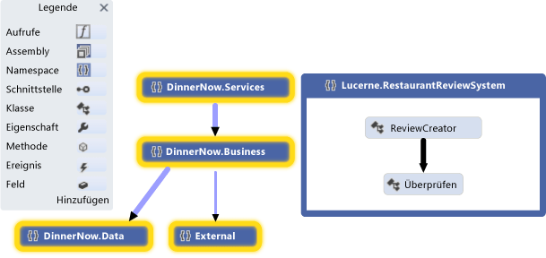
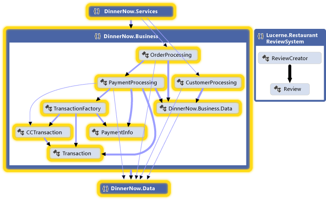
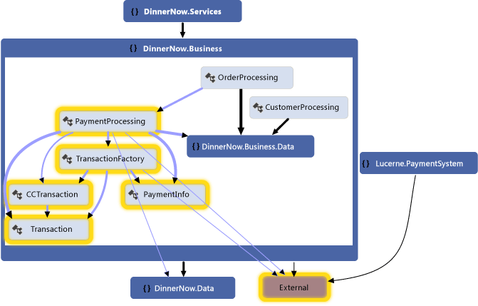
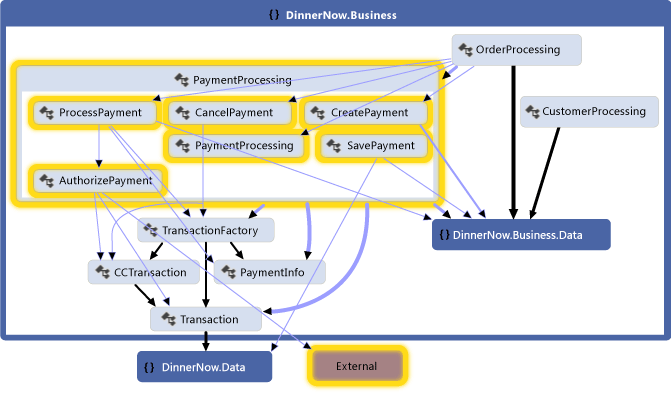
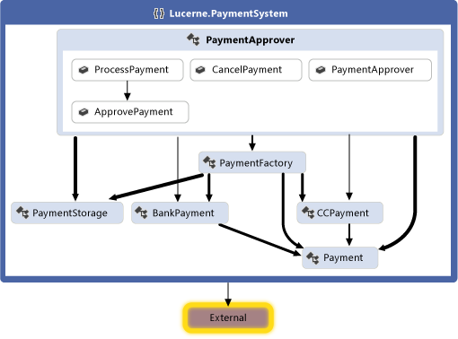
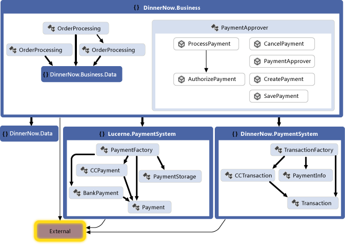
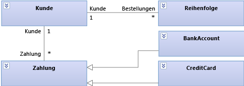
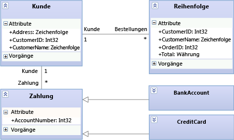
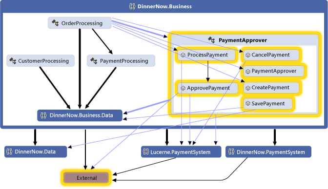
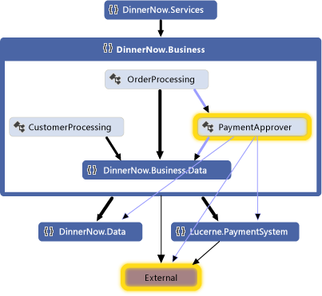

# Szenario: Ändern des Entwurfs mithilfe von Visualisierung und Modellierung
Stellen Sie sicher, dass das Softwaresystem die Anforderungen der Benutzer erfüllt, indem Sie die Visualisierungs- und Modellierungstools in Visual Studio verwenden.
Verwenden Sie Tools wie z. B. Code Maps, Abhängigkeit Diagramme und Klassendiagramme für:

 Informationen dazu, welche Versionen von Visual Studio die einzelnen Tools unterstützen, finden Sie unter [Versionsunterstützung für Architektur- und Modellierungstools](../modeling/what-s-new-for-design-in-visual-studio.md#VersionSupport).

-   Ermitteln der Anforderungen und Geschäftsprozesse von Benutzern

-   Visualisieren und Untersuchen von vorhandenem Code

-   Beschreiben der Änderungen an einem vorhandenen System

-   Sicherstellen, dass das System die Anforderungen erfüllt

-   Sicherstellen, dass der Code konsistent mit dem Entwurf ist

 Diese exemplarische Vorgehensweise:

-   Beschreibt den Nutzen dieser Tools für Ihr Softwareprojekt

-   Zeigt, wie Sie diese Tools unabhängig von Ihrem Entwicklungsansatz in einem Beispielszenario verwenden können

 Weitere Informationen zu diesen Tools und den Szenarien, die sie unterstützen, finden Sie unter:

-   [Analysieren und Modellieren der Architektur](../modeling/analyze-and-model-your-architecture.md)

-   [Visualisieren von Code](../modeling/visualize-code.md)

##   Übersicht über das Szenario
 Dieses Szenario beschreibt Episoden in den Lebenszyklen der Softwareentwicklung von zwei fiktiven Unternehmen: Dinner Now und Lucerne Publishing. Dinner Now bietet einen webbasierten Essenslieferdienst in Seattle an. Kunden können Essen bestellen auf der Dinner Now-Website bezahlen. Die Bestellungen werden dann an das entsprechende örtliche Restaurant für die Lieferung gesendet. Lucerne Publishing, ein Unternehmen in New York, unterhält mehrere Geschäfte sowohl im Internet als auch außerhalb des Internets. Beispielsweise wird eine Website betrieben, auf der Kunden Restaurantkritiken veröffentlichen können.

 Lucerne hat vor kurzem Dinner Now übernommen und möchte die folgenden Änderungen vornehmen:

-   Integrieren der Websites durch Hinzufügen von Restaurantkritikfunktionen zu Dinner Now

-   Ersetzen des Zahlungssystems von Dinner Now durch das System von Lucerne

-   Ausweiten der Dienstleistung von Dinner Now auf die gesamte Region.

 Dinner Now verwendet SCRUM- und eXtreme-Programmierung. Sie verfügen über eine sehr hohe Testabdeckung und nur wenig nicht unterstützten Code. Risiken werden minimiert, indem kleine, funktionierende Versionen eines Systems erstellt und dann schrittweise Funktionen hinzugefügt werden. Der Code wird über kurze und regelmäßige Iterationen entwickelt. Dadurch werden Änderungen auf sichere Weise eingeführt, der Code wird häufig umgestaltet, und ein "Big Design Up Front" wird vermieden.

 Lucerne unterhält eine überaus umfangreichere und komplexe Auflistung von Systemen, die teilweise über 40 Jahre alt sind. Aufgrund von Komplexität und Umfang des älteren Codes werden Änderungen nur mit größter Vorsicht vorgenommen. Lucerne verfolgt einen rigoroseren Entwicklungsprozess und zieht es vor, detaillierte Lösungen zu entwerfen und den Entwurf und sowie während der Entwicklung auftretende Änderungen zu dokumentieren.

 Beide Teams verwenden Modellierungsdiagramme in Visual Studio, die sie dabei unterstützen, Systeme zu entwickeln, die die Anforderungen der Benutzer erfüllen. Sie verwenden Team Foundation Server zusammen mit anderen Tools zum Planen, Organisieren und Verwalten ihrer Arbeit.

 Weitere Informationen über Team Foundation Server finden Sie unter:

-   [Planen und Nachverfolgen der Arbeit](#PlanningTracking)

-   [Testen, Überprüfen und Einchecken von aktualisiertem Code](#TestValidateCheckInCode)

##   Rollen von Architektur- und Modellierungsdiagrammen in der Softwareentwicklung
 In der folgenden Tabelle werden Rollen beschrieben, die diese Tools während verschiedener Phasen des Lebenszyklus der Softwareentwicklung spielen können:

||**Modellieren von Benutzeranforderungen**|**Modellierung von Geschäftsprozessen**|**Systemarchitektur und -entwurf**|**Visualisieren und Untersuchen von Code**|**Überprüfung**|
|------|------------------------------------|-----------------------------------|--------------------------------------|------------------------------------------|----------------------|
|DSL-Diagramm (domänenspezifische Sprache)|Ja|Ja|Ja|||
|Diagramm der Abhängigkeit, ebenenvalidierung|||Ja|Ja|Ja|
|Code Map|||Ja|Ja|Ja|
|Klassen-Designer (codebasiert)||||Ja||

Um die Abhängigkeit-Diagramme zeichnen, müssen Sie ein Modellierungsprojekt als Teil einer vorhandenen Projektmappe oder ein neues Konto erstellen. Diese Diagramme müssen im Modellierungsprojekt erstellt werden.
Elemente in Abhängigkeit von Diagrammen befinden sich im Modellierungsprojekt, aber sie sind nicht im allgemeinen Modell gespeichert. Code Maps und .NET-Klassendiagramme, die aus Code erstellt werden, sind außerhalb des Modellierungsprojekts vorhanden.

 Thema

-   [Erstellen von Abhängigkeitsdiagrammen aus dem Code](../modeling/create-layer-diagrams-from-your-code.md)

-   [Projektmappenübergreifendes Zuordnen von Abhängigkeiten](../modeling/map-dependencies-across-your-solutions.md)

-   [Gewusst wie: Hinzufügen von Klassendiagrammen zu Projekten (Klassen-Designer)](../ide/how-to-add-class-diagrams-to-projects-class-designer.md)

-   [Modellierungs-SDK für Visual Studio - Domänenspezifische Sprachen](../modeling/modeling-sdk-for-visual-studio-domain-specific-languages.md)

[!INCLUDE[modeling_sdk_info](includes/modeling_sdk_info.md)]

 Beide Teams verwenden außerdem abhängigkeitsüberprüfung, um sicherzustellen, dass Code in der Entwicklung mit dem Entwurf konsistent bleibt.

 Thema

-   [Sicherstellen der Konsistenz von Code und Entwurf](#ValidatingCode)

-   [Beschreiben der logischen Architektur: Abhängigkeit-Diagramme](#DescribeLayers)

-   [Überprüfen von Code mit Abhängigkeitsdiagrammen](../modeling/validate-code-with-layer-diagrams.md)

    > [!NOTE]
    >  Einige Versionen von Visual Studio unterstützen abhängigkeitsüberprüfung und schreibgeschützte Versionen von Code Maps für Visualisierung und Modellierung. Welche Versionen von Visual Studio dieses Feature unterstützen, erfahren Sie unter [Versionsunterstützung für Architektur- und Modellierungstools](../modeling/what-s-new-for-design-in-visual-studio.md#VersionSupport).

##   Verstehen und Kommunizieren von Informationen zum System
 Es gibt keine vorgeschriebene Reihenfolge zum Verwenden der Visual Studio-Modellierungsdiagramme. Daher können Sie sie ganz Ihren Anforderungen oder dem Ansatz entsprechend verwenden. Normalerweise rufen Teams ihre Modelle im Verlauf des Projekts wiederholt und häufig auf. Jedes Diagramm bietet bestimmte Vorteile, um verschiedene Aspekte des Systems in der Entwicklung zu verstehen, zu beschreiben und zu kommunizieren.

 Dinner Now und Lucerne kommunizieren untereinander sowie mit Projektbeteiligten anhand von Diagrammen als einheitliche Sprache. Beispielsweise verwendet Dinner Now Diagramme, um folgende Aufgaben auszuführen:

-   Visualisieren von vorhandenem Code

-   Kommunizieren mit Lucerne über neue oder aktualisierte User Storys

-   Identifizieren von Änderungen, die für die Unterstützung neuer oder aktualisierter User Storys erforderlich sind

 Lucerne verwendet Diagramme, um folgende Aufgaben auszuführen:

-   Aneignung von Kenntnissen über den Geschäftsprozess von Dinner Now

-   Verstehen des Systementwurfs

-   Kommunizieren mit Dinner Now über neue oder aktualisierte Benutzeranforderungen

-   Dokumentieren von Aktualisierungen am System

 Die Diagramme sind in Team Foundation Server integriert, sodass die Teams ihre Arbeit leichter planen, verwalten und verfolgen können. Beispielsweise verwenden sie Modelle, um Testfälle und Entwicklungsaufgaben zu identifizieren und ihre Arbeit einzuschätzen. Lucerne verknüpft Team Foundation Server-Arbeitsaufgaben mit Modellelementen, sodass sie den Fortschritt überwachen sowie sicherstellen können, dass das System die Anforderungen der Benutzer erfüllt. Beispielsweise werden Anwendungsfälle mit Testfallarbeitsaufgaben verknüpft, um sehen zu können, dass Anwendungsfälle erfüllt werden, wenn alle Tests erfolgreich verlaufen.

 Bevor Teams ihre Änderungen einchecken, überprüfen sie den Code anhand der Tests und des Entwurfs durch Ausführen von Builds, die abhängigkeitsüberprüfung und automatisierte Tests beinhalten. Dadurch wird sichergestellt, dass der aktualisierte Code dem Entwurf nicht widerspricht und Funktionen, die bereits funktionieren, nicht beeinträchtigt werden.

 Thema

-   [Identifizieren von Änderungen am vorhandenen System](#DeterminingChanges)

-   [Keeping code consistent with the design](#ValidatingCode)

-   [Allgemeine Tipps zum Erstellen und Verwenden von Modellen](#GeneralTips)

-   [Planen und Nachverfolgen der Arbeit](#PlanningTracking)

-   [Testen, Überprüfen und Einchecken von aktualisiertem Code](#TestValidateCheckInCode)

###   Identifying Changes to the Existing System
 Dinner Now muss die Kosten für die Erfüllung der neuen Anforderung schätzen. Diese hängen teilweise davon ab, wie sehr sich diese Änderung auf andere Teile des Systems auswirkt. Zur Verdeutlichung erstellt einer der Dinner Now-Entwickler die folgenden Code Maps und Diagramme aus vorhandenem Code:

|**Code Map oder Diagramm**|**Zeigt Folgendes an**|
|------------------------|---------------|
|*Code Map*   Thema   -   [Zuordnen von lösungsübergreifenden Abhängigkeiten](../modeling/map-dependencies-across-your-solutions.md) -   [Durchsuchen und Neuanordnen von Code maps](../modeling/browse-and-rearrange-code-maps.md) -   [Anpassen von Code Maps durch Bearbeiten der DGML-Dateien](../modeling/customize-code-maps-by-editing-the-dgml-files.md)|Abhängigkeiten und andere Beziehungen im Code.   Dinner Now könnte z. B. damit beginnen, Assembly-Code Maps zu überprüfen, um eine Übersicht der Assemblys und ihrer Abhängigkeiten zu erhalten. Sie können in den Code Maps einen Drilldown durchführen, um die Namespaces und Klassen in diesen Assemblys zu untersuchen.   Dinner Now kann auch Code Maps erstellen, um bestimmte Bereiche und andere Arten von Beziehungen im Code zu untersuchen. Sie verwenden den Projektmappen-Explorer, um relevante Bereiche und Beziehungen zu finden und auszuwählen.|
|*Codebasiertes Klassendiagramm*   Siehe [How to: Add Class Diagrams to Projects (Class Designer)](../ide/how-to-add-class-diagrams-to-projects-class-designer.md).|Vorhandene Klassen in Code|

 Beispiel: Die Entwicklerin erstellt eine Code Map. Sie passt den Umfang an, um sich auf die Bereiche zu konzentrieren, die von dem neuen Szenario betroffen sind. Diese Bereiche werden ausgewählt und auf der Code Map hervorgehoben:

 

 **Namespace-Code Map**

 Die Entwicklerin erweitert die ausgewählten Namespaces, um die zugehörigen Klassen, Methoden und Beziehungen anzuzeigen:

 

 **Erweiterte Code Map für Namespaces mit sichtbaren gruppenübergreifenden Links**

 Die Entwicklerin untersucht den Code, um nach den betroffenen Klassen und Methoden zu suchen. Um die Auswirkungen der einzelnen Änderungen sofort anzuzeigen, generieren Sie Code Maps nach jeder Änderung neu. Finden Sie unter [Visualisieren von Code](../modeling/visualize-code.md).

 Um Änderungen an anderen Teilen des Systems zu beschreiben, wie z. B. Komponenten oder Interaktionen, kann das Team diese Elemente bei Bedarf auf Whiteboards zeichnen. Sie können auch die folgenden Diagramme in Visual Studio zeichnen, sodass die Details von beiden Teams erfasst, verwaltet und verstanden werden können:

|**Diagramme**|**Beschreibt**|
|------------------|-------------------|
|*Codebasiertes Klassendiagramm*   Siehe [How to: Add Class Diagrams to Projects (Class Designer)](../ide/how-to-add-class-diagrams-to-projects-class-designer.md).|Vorhandene Klassen in Code|

###   Sicherstellen der Konsistenz von Code und Entwurf
 Dinner Now muss sicherstellen, dass der aktualisierte Code konsistent mit dem Entwurf bleibt. Diagramme werden erstellt, Abhängigkeit, die die Funktionsebenen im System beschreiben, die erlaubten Abhängigkeiten zwischen diesen Ebenen Lösungsartefakte zuordnen und diese Lösungsartefakten angeben.

|**Diagramm**|**Beschreibt**|
|-----------------|-------------------|
|*Diagramm zur Abhängigkeitseigenschaft*   Thema   -   [Erstellen von Diagrammen Abhängigkeit aus Ihrem code](../modeling/create-layer-diagrams-from-your-code.md) -   [Abhängigkeit Diagrammen: Referenz](../modeling/layer-diagrams-reference.md) -   [Abhängigkeit Diagrammen: Richtlinien](../modeling/layer-diagrams-guidelines.md) -   [Überprüfen von Code mit der Abhängigkeit-Diagramme](../modeling/validate-code-with-layer-diagrams.md)|Die logische Architektur des Codes   Ein Diagramm Abhängigkeit organisiert und ordnet die Elemente in einem [!INCLUDE[vsprvs](../code-quality/includes/vsprvs_md.md)] Lösung abstrakten Gruppen, genannt *Ebenen*. Diese Ebenen identifizieren die Rollen, Aufgaben oder Funktionen, die diese Artefakte im System spielen.   Ebenendiagramme sind hilfreich, um den beabsichtigten Entwurf des Systems zu beschreiben und in der Entwicklung befindlichen Code anhand des Entwurfs zu validieren.   Um Ebenen zu erstellen, ziehen Sie Elemente aus dem Projektmappen-Explorer, Code Maps, der Klassenansicht und dem Objektkatalog. Verwenden Sie die Toolbox, oder klicken Sie mit der rechten Maustaste auf die Diagrammoberfläche, um neue Ebenen zu zeichnen.   Um vorhandene Abhängigkeiten anzuzeigen, klicken Sie mit der rechten Maustaste auf die Ebenendiagrammoberfläche, und klicken Sie dann auf **Abhängigkeiten generieren**. Um beabsichtigte Abhängigkeiten anzugeben, zeichnen Sie neue Abhängigkeiten.|

 Das folgende Diagramm für die Abhängigkeitseigenschaft beschreibt z. B. Abhängigkeiten zwischen Ebenen sowie die Anzahl der Artefakte, die jeder Ebene zugeordnet sind:

 

 **Diagramm zur Abhängigkeitseigenschaft**

 Um sicherzustellen, während der Codeentwicklung keine Konflikte mit dem Entwurf auftreten, werden die Teams abhängigkeitsüberprüfung für Builds auf Team Foundation Build ausgeführt werden. Außerdem erstellen Sie eine benutzerdefinierte MSBuild-Aufgabe, um abhängigkeitsüberprüfung in ihrer Vorgänge Einchecken zu erfordern. Mithilfe von Buildberichten werden Validierungsfehler erfasst.

 Thema

-   [Definieren des Buildprozesses](http://msdn.microsoft.com/Library/61593e10-d24b-492f-b19a-af4d85abea6b)

-   [Verwenden eines abgegrenzten Eincheckbuildprozesses zur Überprüfung von Änderungen](http://msdn.microsoft.com/Library/9cfc8b9c-1023-40fd-8ab5-1b1bd9c172ec)

-   [Anpassen der Buildprozessvorlage](http://msdn.microsoft.com/Library/b94c58f2-ae6f-4245-bedb-82cd114f6039)

###   General Tips for Creating and Using Models

-   Die meisten Diagramme bestehen aus Knoten, die durch Linien verbunden sind. Für jeden Diagrammtyp stellt die Toolbox verschiedene Arten von Knoten und Linien bereit.

     Zum Öffnen der Toolbox klicken Sie im Menü **Ansicht** auf **Toolbox**.

-   Um einen Knoten zu erstellen, ziehen Sie ihn von der Toolbox in das Diagramm. Bestimmte Arten von Knoten müssen auf vorhandene Knoten gezogen werden. In einem Komponentendiagramm muss einer vorhandenen Komponente z. B. ein neuer Port hinzugefügt werden.

-   Um eine Linie oder Verbindung zu erstellen, klicken Sie in der Toolbox auf das entsprechende Tool, klicken Sie auf den Quellknoten und dann auf den Zielknoten. Einige Linien können nur zwischen bestimmten Arten von Knoten erstellt werden. Wenn Sie den Mauszeiger über mögliche Quellen oder Ziele bewegen, wird angezeigt, ob Sie eine Verbindung erstellen können.

###   Planning and Tracking Work
 Visual Studio-Modellierungsdiagramme sind in Team Foundation Server integriert, sodass Sie Arbeit leichter planen, verwalten und nachverfolgen können. Beide Teams verwenden Modelle, um Testfälle und Entwicklungsaufgaben zu identifizieren und ihre Arbeit einzuschätzen. Lucerne erstellt und verknüpft Team Foundation Server-Arbeitsaufgaben mit Modellelementen, wie z. B. Anwendungsfälle oder Komponenten. Auf diese Weise kann der Status überwacht werden, und die Arbeit kann bis zu den Benutzeranforderungen zurückverfolgt werden. Somit wird sichergestellt, dass die Änderungen stets den Anforderungen entsprechen.

 Im Verlauf ihrer Arbeit aktualisieren die Teams die Arbeitsaufgaben, um die Zeit zu berücksichtigen, die sie mit ihren Aufgaben verbracht haben. Außerdem wird eine Überwachung und Berichterstellung des Status der Arbeit mithilfe der folgenden Team Foundation Server-Funktionen durchgeführt:

-   Tägliche *Burndownberichte* , die angeben, ob die geplante Arbeit in der erwarteten Zeit angeschlossen wird. Es werden andere ähnliche Berichte in Team Foundation Server generiert, um den Status von Fehlern zu verfolgen.

-   Ein *Iterationsarbeitsblatt* , das Microsoft Excel verwendet, mit dem das Team die Arbeitsauslastung überwachen und zwischen den Mitgliedern ausgleichen kann. Dieses Arbeitsblatt ist mit Team Foundation Server verknüpft und bietet eine Diskussionsbasis bei den regelmäßigen Statusbesprechungen.

-   Ein *Entwicklungsdashboard* , das Office Project verwendet, um das Team mit wichtigen Projektinformationen auf dem neuesten Stand zu halten.

 Thema

-   [Nachverfolgen von Arbeit mit Visual Studio Team Services oder Team Foundation Server](http://msdn.microsoft.com/Library/52aa8bc9-fc7e-4fae-9946-2ab255ca7503)

-   [Diagramme, Dashboards und Berichte für Visual Studio ALM](http://msdn.microsoft.com/Library/1f28ba6c-c5e5-46d3-9209-ede24ae78e48)

-   [Erstellen von Backlog und Aufgaben mit Project](http://msdn.microsoft.com/Library/be5cef4f-755f-4ffe-8dd7-876d1e02c330)

###   Testen, Überprüfen und Einchecken von Code
 Beim Abschließen der einzelnen Aufgaben wird der Code von den Teams in der Team Foundation-Versionskontrolle eingecheckt. Wird dies vergessen, werden von Team Foundation Server entsprechende Erinnerungen angezeigt. Bevor Team Foundation Server das Einchecken akzeptiert, führen die Teams Komponententests und abhängigkeitsüberprüfung auf den Code anhand der Testfälle und des Entwurfs zu überprüfen. Verwenden sie Team Foundation Server zum Ausführen von Builds, automatisierte Komponententests und abhängigkeitsüberprüfung regelmäßig. Dadurch wird sichergestellt, dass der Code die folgenden Kriterien erfüllt:

-   Er funktioniert.

-   Bereits funktionierender Code wird dadurch nicht beeinträchtigt.

-   Er steht nicht in Konflikt mit dem Entwurf.

 Dinner Now verfügt über eine große Auflistung automatisierter Tests, die Lucerne wiederverwenden kann, da fast alle weiterhin gültig sind. Lucerne kann außerdem auf diesen Tests aufbauen und neue hinzufügen, um neue Funktionen abzudecken. Beide verwenden auch Visual Studio, um manuelle Tests auszuführen.

 Um sicherzustellen, dass der Code dem Entwurf entspricht, konfigurieren die Teams ihre Builds in Team Foundation Build abhängigkeitsüberprüfung einschließen. Wenn Konflikte auftreten, wird ein Bericht mit den Details generiert.

 Thema

-   [Testen der Anwendung](https://www.visualstudio.com/docs/test/overview)

-   [Überprüfen des Systems während der Entwicklung](../modeling/validate-your-system-during-development.md)

-   [Verwenden der Versionskontrolle](http://go.microsoft.com/fwlink/?LinkID=525605)

-   [Build und Release](/vsts/build-release/index)

##   Updating the System Using Visualization and Modeling
 Lucerne und Dinner Now müssen ihre Zahlungssysteme integrieren. Die folgenden Abschnitte zeigen die Modellierungsdiagramme in Visual Studio, die beim Ausführen dieser Aufgabe helfen:

-   [Visualisieren von vorhandenem Code: Code Maps](#VisualizeCode)

-   [Definieren eines Glossars der Typen: Klassendiagramme](#DefineClasses)

-   [Beschreiben der logischen Architektur: Abhängigkeit-Diagramme](#DescribeLayers)

 Thema

-   [Visualisieren von Code](../modeling/visualize-code.md)

-   [Verwenden von Modellen im Entwicklungsprozess](../modeling/use-models-in-your-development-process.md)

-   [Modellieren der Architektur Ihrer App](../modeling/model-your-app-s-architecture.md)

###   Visualisieren von vorhandenem Code: Code Maps
 Code Maps zeigen die aktuelle Organisation und die Beziehungen im Code. Elemente werden auf der Code Map durch *Knoten* und Beziehungen durch *Links*dargestellt. Mit Code Maps können Sie die folgenden Arten von Aufgaben ausführen:

-   Untersuchen von unbekanntem Code

-   Verstehen, wo und wie sich eine vorgeschlagene Änderung auf vorhandenen Code auswirken könnte

-   Suchen von Bereichen mit Komplexität, natürlichen Abhängigkeiten oder Muster oder anderen Bereichen, die von Verbesserungen profitieren könnten.

 Dinner Now muss z. B. die Kosten für die Aktualisierung der PaymentProcessing-Komponente schätzen. Diese hängen teilweise davon ab, wie sehr sich diese Änderung auf andere Teile des Systems auswirkt. Zur Verdeutlichung erstellt einer der Dinner Now-Entwickler Code Maps aus dem Code und richtet den Fokus des Projektumfangs auf die Bereiche aus, die durch die Änderung betroffen sein könnten.

 Die folgende Code Map zeigt die Abhängigkeiten zwischen der PaymentProcessing-Klasse und anderen Teilen des Dinner Now-Systems, die markiert dargestellt werden:

 

 **Code Map für das Zahlungssystem von Dinner Now**

 Der Entwickler untersucht die Code Map, indem er die PaymentProcessing-Klasse erweitert und die zugehörigen Member auswählt, um die potenziell betroffenen Bereiche anzuzeigen:

 

 **Methoden in der PaymentProcessing-Klasse und ihre Abhängigkeiten**

 Für das Zahlungssystem von Lucerne wird die folgende Code Map generiert, um die zugehörigen Klassen, Methoden und Abhängigkeiten zu untersuchen. Das Team erkennt, dass das Lucerne-System auch Arbeit erfordern könnte, damit es mit anderen Teilen von Dinner Now interagieren kann:

 

 **Code Map für das Zahlungssystem von Lucerne**

 Beide Teams arbeiten zusammen, um die Änderungen zu ermitteln, die zum Integrieren der beiden Systeme erforderlich sind. Es wird entschieden, einen Teil des Codes umzugestalten, damit er einfacher zu aktualisieren ist. Die PaymentApprover-Klasse wird in den DinnerNow.Business-Namespace verschoben und erfordert einige neue Methoden. Die Dinner Now-Klassen, die Transaktionen behandeln, erhalten einen eigenen Namespace. Die Teams erstellen und verwenden Arbeitsaufgaben, um ihre Arbeit zu planen, zu organisieren und nachzuverfolgen. Wo sinnvoll, werden Arbeitsaufgaben mit Modellelementen verknüpft.

 Nach der Neuorganisation des Codes generieren die Teams eine neue Code Map, um die aktualisierte Struktur und die Beziehungen anzuzeigen:

 

 **Code Map mit neu organisiertem Code**

 Diese Code Map zeigt, dass sich die PaymentApprover-Klasse jetzt im DinnerNow.Business-Namespace befindet und über ein paar neue Methoden verfügt. Die Dinner Now-Transaktionsklassen verfügen jetzt über einen eigenen PaymentSystem-Namespace, mit dem der Code später leichter behandelt werden kann.

#### Erstellen einer Code Map

-   Folgen Sie den folgenden Schritten zum Generieren einer Code Map, um eine schnelle Übersicht über Quellcode zu erhalten:

     Klicken Sie im Menü **Architektur** auf **Code Map für Projektmappe generieren**.

     Erstellen Sie für eine schnelle Übersicht über kompilierten Code eine leere Code Map, und ziehen Sie dann Assemblydateien oder Binärdateien auf die Oberfläche der Code Map.

-   Um bestimmte Code- oder Projektmappenelemente zu untersuchen, wählen Sie im Projektmappen-Explorer die Elemente und Beziehungen aus, die Sie visualisieren möchten. Sie können dann entweder eine neue Code Map generieren oder einer vorhandenen Code Map ausgewählte Elemente hinzufügen. Finden Sie unter [Zuordnen von lösungsübergreifenden Abhängigkeiten](../modeling/map-dependencies-across-your-solutions.md).

-   Um die Code Map einfacher zu untersuchen, können Sie das Layout den auszuführenden Aufgaben entsprechend neu anordnen.

     Wählen Sie beispielsweise ein Strukturlayout aus, um die Ebenen im Code zu visualisieren. Finden Sie unter [durchsuchen und Neuanordnen code Maps](../modeling/browse-and-rearrange-code-maps.md).

#### Zusammenfassung: Vorteile von Code Maps
 Mit Code Maps können Sie Folgendes durchführen:

-   Verdeutlichen der Organisation und Beziehungen in vorhandenem Code

-   Identifizieren der Bereiche, die von einer vorgeschlagenen Änderung betroffen sein könnten

-   Auffinden von Bereichen mit Komplexität, Mustern oder Ebenen sowie andere Bereichen, die Sie optimieren könnten, um den Code leichter verwalten, ändern und wiederverwenden zu können

#### Beziehung zu anderen Diagrammen

|**Diagramm**|**Beschreibt**|
|-----------------|-------------------|
|Diagramm zur Abhängigkeitseigenschaft|Die logische Architektur des Systems Verwenden Sie abhängigkeitsüberprüfung, um sicherzustellen, dass der Code konsistent mit dem Entwurf bleibt.   Um vorhandene Dependencys oder vorgesehenen Dependencys identifizieren zu können, erstellen Sie eine Code Map, und gruppieren Sie zugehörige Elemente. Um eine Abhängigkeit Diagramm erstellen zu können, finden Sie unter:   -   [Erstellen von Diagrammen Abhängigkeit aus Ihrem code](../modeling/create-layer-diagrams-from-your-code.md) -   [Abhängigkeit Diagrammen: Richtlinien](../modeling/layer-diagrams-guidelines.md)|
|Klassendiagramm (codebasiert)|Vorhandene Klassen in Code für ein bestimmtes Projekt   Verwenden Sie den Klassen-Designer, um eine vorhandene Klasse in Code zu visualisieren und zu ändern.   Siehe [How to: Add Class Diagrams to Projects (Class Designer)](../ide/how-to-add-class-diagrams-to-projects-class-designer.md).|

###   Definieren eines Glossars der Typen: Klassendiagramme
 Klassendiagramme definieren die am System beteiligten Entitäten, Begriffe oder Konzepte sowie ihre Beziehungen untereinander. Beispielsweise können Sie diese Diagramme während der Entwicklung verwenden, um die Attribute und Vorgänge für jede Klasse unabhängig von Implementierungssprache oder Format zu beschreiben.

 Um die am Anwendungsfall "Process Payment" (Zahlung verarbeiten) beteiligten Entitäten zu erläutern und zu besprechen, zeichnet Lucerne das folgende Klassendiagramm:

 

 **Process Payment-Entitäten in einem Klassendiagramm**

 Dieses Diagramm zeigt, dass ein Kunde über viele Bestellungen und verschiedene Methoden zum Bezahlen der Bestellungen verfügen kann. "BankAccount" und "CreditCard" erben beide von "Payment".

 Während der Entwicklung verwendet Lucerne das folgende Klassendiagramm, um die Details der einzelnen Klassen zu beschreiben und zu besprechen:

 

 **Process Payment-Details im Klassendiagramm**

#### Zeichnen eines Klassendiagramms
 Ein Klassendiagramm umfasst die folgenden Hauptfunktionen:

-   Typen wie z. B. Klassen, Schnittstellen und Enumerationen:

    -   Eine *Klasse* ist die Definition von Objekten, die gemeinsame strukturelle Merkmale oder Verhaltensmerkmale aufweisen.

    -   Eine *Schnittstelle* definiert einen Teil des extern sichtbaren Verhaltens eines Objekts.

    -   Eine *Enumeration* ist eine Klassifizierung, die eine Liste von literalen Werten enthält.

-   *Attribute* sind Werte eines bestimmten Typs, der die einzelnen Instanzen einer *Klassifizierung*beschreiben. Eine Klassifizierung ist ein allgemeiner Name für Typen, Komponenten, Anwendungsfälle und sogar Akteure.

-   *Vorgänge* sind Methoden oder Funktionen, die Instanzen einer Klassifizierung ausführen können.

-   Eine *Zuordnung* gibt eine Art von Beziehung zwischen zwei Klassifizierern an.

    -   Eine *Aggregation* ist eine Zuordnung, die einen gemeinsamen Besitz zwischen Klassifizierungen angibt.

    -   Eine *Komposition* ist eine Zuordnung, die eine ganzteilige Beziehung zwischen Klassifizierungen angibt.

     Um Aggregationen oder Kompositionen anzuzeigen, legen Sie die Eigenschaft **Aggregation** für eine Zuordnung fest. Mit**Freigegeben** werden Aggregationen und mit **Verbund** werden Kompositionen angezeigt.

-   Eine *Abhängigkeit* gibt an, dass durch Änderungen an der Definition einer Klassifizierung möglicherweise auch die Definition einer anderen Klassifizierung geändert wird.

-   Eine *Generalisierung* gibt an, dass eine bestimmte Klassifizierung einen Teil ihrer Definition von einer allgemeinen Klassifizierung erbt. Eine *Realisierung* gibt an, dass eine Klasse die Vorgänge und Attribute implementiert, die von einer Schnittstelle bereitgestellt werden.

     Verwenden Sie das Tool **Vererbung** , um diese Beziehungen zu erstellen. Alternativ kann eine Realisierung als *Lollipop*dargestellt werden.

-   *Pakete* sind Gruppen von Klassifizierern, Zuordnungen, Lebenslinien, Komponenten und anderen Paketen. *Importbeziehungen* geben an, dass ein Paket alle Definitionen eines anderen Pakets enthält.

 Als Ausgangspunkt für die Untersuchung und Besprechung bestehender Klassen können Sie mit dem Klassen-Designer Klassendiagramme aus Code erstellen.

-   [Gewusst wie: Hinzufügen von Klassendiagrammen zu Projekten (Klassen-Designer)](../ide/how-to-add-class-diagrams-to-projects-class-designer.md)

#### Zusammenfassung: Vorteile von Klassendiagrammen
 Mit Klassendiagrammen können Sie Folgendes definieren:

-   Ein allgemeines Glossar von Begriffen, die zum Erläutern der Benutzeranforderungen und der am System beteiligten Entitäten verwendet werden. Finden Sie unter [Modellieren von benutzeranforderungen](../modeling/model-user-requirements.md).

-   Typen, die von Teilen des Systems verwendet werden, wie z. B. Komponenten, unabhängig von ihrer Implementierung. Finden Sie unter [modellieren Ihrer app-Architektur](../modeling/model-your-app-s-architecture.md).

-   Beziehungen, wie z. B. Abhängigkeiten zwischen Typen. Sie können z. B. anzeigen, dass ein Typ mehreren Instanzen eines anderen Typs zugeordnet sein kann.

#### Beziehung zu anderen Diagrammen

|**Diagramm**|**Beschreibung**|
|-----------------|---------------------|
|Diagramm zur Abhängigkeitseigenschaft|Definieren Sie die logische Architektur des Systems in Bezug auf Klassen.   Verwenden Sie abhängigkeitsüberprüfung, um sicherzustellen, dass der Code konsistent mit dem Entwurf bleibt.   Thema   -   [Erstellen von Diagrammen Abhängigkeit aus Ihrem code](../modeling/create-layer-diagrams-from-your-code.md) -   [Abhängigkeit Diagrammen: Referenz](../modeling/layer-diagrams-reference.md) -   [Abhängigkeit Diagrammen: Richtlinien](../modeling/layer-diagrams-guidelines.md) -   [Überprüfen von Code mit der Abhängigkeit-Diagramme](../modeling/validate-code-with-layer-diagrams.md)|
|Code Map|Visualisieren Sie die Organisation und Beziehungen in vorhandenem Code.   Um Klassen, ihre Beziehungen und ihre Methoden zu identifizieren, erstellen Sie eine Code Map, in der diese Elemente angezeigt werden.   Thema   -   [Zuordnen von lösungsübergreifenden Abhängigkeiten](../modeling/map-dependencies-across-your-solutions.md)|

###   Beschreiben der logischen Architektur: Abhängigkeit-Diagramme
 Abhängigkeit Diagramme beschreiben die logische Architektur eines Systems, indem die Artefakte in der Projektmappe in abstrakten Gruppen organisieren oder *Ebenen*. Artefakte können viele Dinge sein, z. B. Namespaces, Projekte, Klassen, Methoden usw. Ebenen stellen die Rollen oder Aufgaben dar, die die Artefakte im System ausführen. Sie können auch eine Ebenenvalidierung in die Build- und Eincheckvorgänge einschließen, um sicherzustellen, dass der Code konsistent mit dem Entwurf bleibt.

 Dinner Now und Lucerne verwenden die folgende Abhängigkeit Diagramm um den Code mit dem Entwurf konsistent zu halten, um ihren Code zu überprüfen, während der Entwicklung:

 

 **Abhängigkeit-Diagramm für Dinner Now nach der Integration mit Lucerne**

 Die Ebenen in diesem Diagramm sind mit den entsprechenden Lösungsartefakten von Dinner Now und Lucerne verknüpft. Die Business-Ebene ist z. B. mit dem DinnerNow.Business-Namespace und seinen Membern verknüpft, die nun die PaymentApprover-Klasse einschließen. Die Resource Access-Ebene ist mit dem DinnerNow.Data-Namespace verknüpft. Die Pfeile (bzw. *Abhängigkeiten*) geben an, dass die Funktionen in der Resource Access-Ebene nur von der Business-Ebene verwendet werden können. Beim Aktualisieren des Codes durch die Teams wird regelmäßig eine Ebenenvalidierung ausgeführt, um Konflikte bei ihrer Entstehung sofort erkennen und beheben zu können.

 Die Teams arbeiten zusammen, um die beiden Systeme schrittweise zu integrieren und zu testen. Zuerst wird sichergestellt, dass "PaymentApprover" und der Rest von Dinner Now erfolgreich miteinander funktionieren, bevor "PaymentProcessing" behandelt wird.

 Die folgende Code Map zeigt die neuen Aufrufe zwischen Dinner Now und "PaymentApprover":

 

 **Code Map mit aktualisierten Methodenaufrufen**

 Nachdem bestätigt wurde, dass das System wie erwartet funktioniert, wird der PaymentProcessing-Code von Dinner Now auskommentiert. Die Ebenenvalidierungsberichte sind einwandfrei, und die resultierende Code Map zeigt, dass keine PaymentProcessing-Abhängigkeiten mehr vorhanden sind:

 

 **Code Map ohne "PaymentProcessing"**

#### Zeichnen ein Diagramm zur Abhängigkeitseigenschaft
 Eine Abhängigkeit Diagramm umfasst die folgenden Hauptfunktionen:

-   *Ebenen* beschreiben logische Gruppen von Artefakten.

-   Ein *Link* ist eine Zuordnung zwischen einer Ebene und einem Artefakt.

     Um Ebenen aus Artefakten zu erstellen, ziehen Sie Elemente aus dem Projektmappen-Explorer, aus Code Maps, der Klassenansicht oder dem Objektkatalog. Um neue Ebenen zu zeichnen und sie dann mit Artefakten zu verknüpfen, verwenden Sie die Toolbox, oder klicken Sie mit der rechten Maustaste auf die Diagrammoberfläche, um die Ebenen zu erstellen, und ziehen Sie dann Elemente in diese Ebenen.

     Die Zahl auf einer Ebene zeigt die Anzahl von Artefakten an, die mit der Ebene verknüpft sind. Diese Artefakte können Namespaces, Projekte, Klassen, Methoden usw. sein. Beachten Sie folgendes, wenn Sie die Anzahl der Artefakte in einer Ebene interpretieren:

    -   Wenn eine Ebene mit einem Artefakt verknüpft ist, das andere Artefakte enthält, die Ebene jedoch nicht direkt mit den anderen Artefakten verknüpft ist, umfasst die Zahl nur das verknüpfte Artefakt. Die anderen Artefakte werden jedoch während der Ebenenvalidierung für die Analyse berücksichtigt.

         Ist z. B. eine Ebene mit einem einzelnen Namespace verknüpft, ist die Anzahl der verknüpften Artefakte 1, auch wenn der Namespace Klassen enthält. Wenn die Ebene auch mit den einzelnen Klassen im Namespace verknüpft ist, umfasst die Zahl die verknüpften Klassen.

    -   Wenn eine Ebene andere Ebenen enthält, die mit Artefakten verknüpft sind, ist die Containerebene ebenfalls mit diesen Artefakten verknüpft, obwohl in der Zahl auf der Containerebene diese Artefakte nicht berücksichtigt sind.

     Um die Artefakte anzuzeigen, die auf eine Ebene verknüpft sind, mit der rechten Maustaste der Abhängigkeitsverhältnis, und klicken Sie dann auf **Links anzeigen** öffnen **Ebenen-Explorer**.

-   Eine *Abhängigkeit* gibt an, dass eine Ebene die Funktionen in einer anderen Ebene verwenden darf, jedoch nicht umgekehrt. Eine *bidirektionale Abhängigkeit* gibt an, dass eine Ebene die Funktionen in einer anderen Ebene verwenden darf und umgekehrt.

     Um vorhandene Abhängigkeiten im Diagramm Abhängigkeit anzuzeigen, mit der rechten Maustaste der Diagrammoberfläche, und klicken Sie dann auf **Abhängigkeiten generieren**. Um beabsichtigte Abhängigkeiten zu beschreiben, zeichnen Sie neue.

 Thema

-   [Erstellen von Abhängigkeitsdiagrammen aus dem Code](../modeling/create-layer-diagrams-from-your-code.md)

-   [Abhängigkeitsdiagramme: Referenz](../modeling/layer-diagrams-reference.md)

-   [Abhängigkeitsdiagramme: Richtlinien](../modeling/layer-diagrams-guidelines.md)

-   [Überprüfen von Code mit Abhängigkeitsdiagrammen](../modeling/validate-code-with-layer-diagrams.md)

#### Zusammenfassung: Vorteile von Abhängigkeit-Diagramme
 Abhängigkeit Diagrammen können Sie Folgendes:

-   Beschreiben der logischen Architektur eines Systems entsprechend den Funktionen der zugehörigen Artefakte

-   Sicherstellen, dass dieser Code in der Entwicklung dem vorgegebenen Entwurf entspricht

#### Beziehung zu anderen Diagrammen

|**Diagramm**|**Beschreibung**|
|-----------------|---------------------|
|Code Map|Visualisieren Sie die Organisation und Beziehungen in vorhandenem Code.   Um Ebenen zu erstellen, generieren Sie eine Code Map, und gruppieren Sie dann die Elemente auf der Code Map als potenzielle Ebenen. Ziehen Sie die Gruppen aus der Zuordnung in das Diagramm Abhängigkeit.   Thema   -   [Zuordnen von lösungsübergreifenden Abhängigkeiten](../modeling/map-dependencies-across-your-solutions.md) -   [Durchsuchen und Neuanordnen von Code maps](../modeling/browse-and-rearrange-code-maps.md)|

## Externe Ressourcen

|**Kategorie**|**Links**|
|------------------|---------------|
|**Foren**|-   [Visual Studio-Visualisierungs- & Modellierungstools](http://go.microsoft.com/fwlink/?LinkId=184720) -   [Visual Studio Visualization & Modeling SDK (DSL Tools)](http://go.microsoft.com/fwlink/?LinkId=184721)|

## Siehe auch

- [Visualisieren von Code](../modeling/visualize-code.md)
- [Verwenden von Modellen im Entwicklungsprozess](../modeling/use-models-in-your-development-process.md)
- [Verwenden von Modellen in Agile development](http://msdn.microsoft.com/592ac27c-3d3e-454a-9c38-b76658ed137f)
- [Überprüfen des Systems während der Entwicklung](../modeling/validate-your-system-during-development.md)
