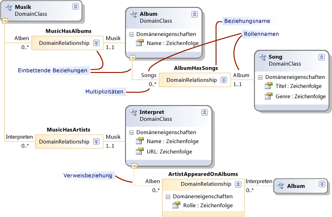
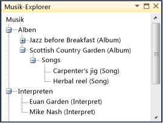

# Grundlagen von Modellen, Klassen und Beziehungen
Eine domänenspezifische Sprache (DSL) wird durch die DSL-Definitionsdatei, zusammen mit benutzerdefinierten Programmcode definiert, die Sie schreiben können. Die meisten der Programmcode der DSL-Projektmappe wird aus dieser Datei generiert.  
  
 Dieses Thema erklärt die zentralen Funktionen von DSL-Definition.  
  
## Der DSL-Definition  
 Beim Öffnen einer `Dsl\DslDefinition.dsl`, Ihre [!INCLUDE[vsprvs](../code-quality/includes/vsprvs_md.md)] Fenster ähnelt die folgende Abbildung.  
  
   
  
 Die wichtigste Information in der DSL-Definition wird in der DSL-Definitionsdiagramm angezeigt. Zusätzliche Informationen, die auch Teil des "DslDefinition.DSL" ist, wird im DSL-Explorer angezeigt, die in der Regel auf der Seite des Diagramms angezeigt wird. Sie arbeiten mit dem Diagramm für die häufigsten Aufgaben und DSL-Explorer zum erweiterten Anpassung.  
  
 Das DSL-Definition-Diagramm zeigt die Domänenklassen, die Definieren von Modellelementen und Beziehungen, die Links zwischen Modellelementen definieren. Es zeigt auch die Formen und Konnektoren, mit denen die Modellelemente für den Benutzer anzuzeigen.  
  
   
  
 Bei Auswahl eines Elements in der DSL-Definition im Diagramm oder im DSL-Explorer wird die Informationen im Fenster Eigenschaften angezeigt. Weitere Informationen können im DSL-Details-Fenster angezeigt werden.  
  
### Modelle werden Instanzen von DSLs  
 Ein *Modell* ist eine Instanz Ihrer DSL, die von einem Benutzer erstellt. Ein Modell enthält Modellelemente, die Instanzen von Domänenklassen, die Sie definieren und Links zwischen den Elementen, die Instanzen von domänenbeziehungen sind, die Sie definieren. Ein Modell kann auch haben, Formen und Konnektoren, bei die Modellelemente und Links in einem Diagramm angezeigt. Die DSL-Definition enthält die Shape-Klassen, Connectors und eine Klasse für das Diagramm.  
  
 Eine DSL-Definition ist auch bekannt als ein *Domänenmodell*. Ein DSL-Definition oder Domäne Modell ist die Entwurfszeit-Darstellung der domänenspezifischen Sprache, während das Modell die Laufzeit-Instanziierung der domänenspezifischen Sprache ist.  
  
## Domänenklassen definieren Modellelemente  
 Domänenklassen werden verwendet, um die verschiedenen Elemente in der Domäne zu erstellen, und zwischen Domänen sind die Links zwischen den Elementen. Sie sind zur Entwurfszeit-Darstellung der Elemente und Links, die von den Benutzern der Design-spezifischen Sprache instanziiert werden soll, wenn sie ihre Modelle erstellen.  
  
 Diese Abbildung zeigt ein Modell, das vom Benutzer eine Musikbibliothek DSL erstellt wurde. Musikalben werden durch Felder dargestellt, die Listen von Songs enthalten. Nach Feldern mit abgerundeten Ecken dargestellt werden und mit den Alben, an denen sie mitgearbeitet haben, verbunden sind.  
  
   
  
 Der DSL-Definition trennt zwei Aspekte zu berücksichtigen. Die Darstellung der Modellelemente im Modelldiagramm wird mithilfe von Form und Connector-Klassen definiert. Die Informationen im Modell durchgeführt wird mithilfe von Domänenklassen und Beziehungen definiert.  
  
 Die folgende Abbildung zeigt die Domänenklassen und Beziehungen in der DSL-Definition der Musikbibliothek.  
  
   
  
 Die Abbildung zeigt vier Domänenklassen: Musik, Album, Interpret und Titel. Die Domänenklassen definieren Domäneneigenschaften wie Name, Titel und So weiter. Im Modell werden die Werte für einige dieser Eigenschaften im Diagramm angezeigt.  
  
 Zwischen den Klassen sind zwischen Domänen: MusicHasAlbums, MusicHasArtists, AlbumbHasSongs und "artistappearedonalbums". Die Beziehungen haben Multiplizitäten wie z. B. 1..1, 0.. *. Beispielsweise muss jeder Titel genau ein Album durch AlbumHasSongs-Beziehung verknüpft sein. Jedes Album kann eine beliebige Anzahl von Songs verfügen.  
  
### Neuanordnen von DSL-Definitionsdiagramm  
 Beachten Sie, dass eine Domänenklasse mehrmals im Diagramm DSL-Definition angezeigt werden kann, wie Album in der folgenden Abbildung. Es ist immer ein Hauptansicht, und es können einige *Verweis* Ansichten.  
  
 Um das Diagramm DSL-Definition zu ändern, können Sie folgende Aktionen ausführen:  
  
-   Austauschen von main und auf Ansichten können Sie mit der **Struktur hier** und **Struktur teilen** Befehle. Mit der rechten Maustaste in einer einzelne Domäne-Klasse, um diese Befehle finden Sie unter.  
  
-   Neu anordnen von Domänenklassen und Formklassen durch Drücken von STRG + nach-oben und STRG + nach-unten.  
  
-   Klassen, die über das Symbol in der oberen rechten jeder Form erweitern oder reduzieren.  
  
-   Reduzieren Sie Teile der Struktur, indem Sie auf das Minuszeichen (-) am unteren Rand eine Domänenklasse.  
  
## Vererbung  
 Domänenklassen können mithilfe von Vererbung definiert werden. Um eine Ableitung von Vererbung zu erstellen, klicken Sie auf die Vererbung, klicken Sie auf die abgeleitete Klasse, und klicken Sie dann auf die Basisklasse. Ein Modellelement hat alle Eigenschaften, die auf seiner eigenen Domänenklasse, zusammen mit den Eigenschaften, die für die von der Basisklasse geerbt werden. Es erbt auch die Rollen in Beziehung.  
  
 Vererbung kann auch zwischen Beziehungen, Formen und Konnektoren verwendet werden. Vererbung muss innerhalb der gleichen Gruppe beibehalten. Eine Form kann nicht von einer Domänenklasse erben.  
  
## Zwischen Domänen  
 Modellelemente können durch Beziehungen verknüpft werden. Hyperlinks sind immer binary. genau zwei Elemente verknüpft. Allerdings jedes Element kann haben viele Links zu anderen Objekten, und es kann mehr als eine Verknüpfung zwischen demselben Paar von Elementen.  
  
 Wie Sie verschiedene Klassen von Elementen definieren können, können Sie verschiedene Klassen von Links definieren. Die Klasse einer Verknüpfung wird aufgerufen, ein *domänenbeziehung*. Eine domänenbeziehung gibt an, welche Klassen von Elementen, deren Instanzen herstellen können. Jedes Ende einer Beziehung wird aufgerufen, ein *Rolle*, und die domänenbeziehung Namen für die beiden Rollen sowie für die Beziehung selbst definiert.  
  
 Es gibt zwei Arten von domänenbeziehungen: Einbetten von Beziehungen und verweisbeziehungen. Klicken Sie im Diagramm DSL-Definition einbettende Beziehungen durchgezogene Linien an jede Rolle und verweisbeziehungen haben gestrichelte Linien.  
  
### Einbetten von Beziehungen  
 Jedes Element in einem Modell, mit Ausnahme der Stamm ist das Ziel einer einbettenden links. Das gesamte Modell bildet daher eine einzelne Struktur Links einbetten. Eine einbettende Beziehung stellt Containment oder des Besitzes dar. Zwei Modellelementen, die auf diese Weise beziehen sind auch bekannt als übergeordnete und untergeordnete. Das untergeordnete Element wird als im übergeordneten Element eingebettet werden.  
  
 Einbetten von Links sind nicht in der Regel explizit als Connectors in einem Diagramm dargestellt. Stattdessen werden sie in der Regel durch Einschluss dargestellt. Der Stamm des Modells wird im Diagramm dargestellt, und eingebettete Elemente als Formen im Diagramm angezeigt werden.  
  
 Im Beispiel wurde die Stammklasse Musik eine einbettende Beziehung MusicHasAlbums Album, über eine einbettende AlbumHasSongs zu Song. Titel werden als Elemente in einer Liste in jedes Album angezeigt. Musik verfügt auch über eine einbettende MusicHasArtists an die Interpreten-Klasse, deren Instanzen auch als Formen im Diagramm angezeigt werden.  
  
 Standardmäßig werden eingebettete Elemente automatisch gelöscht, wenn ihre übergeordneten Elemente gelöscht werden.  
  
 Beim Speichern eines Modells in Form von XML-Datei, eingebettete Elemente geschachtelt sind innerhalb von ihren übergeordneten Elementen, wenn Sie die Serialisierung angepasst haben.  
  
> [!NOTE]
>  Einbettung ist nicht identisch mit Vererbung. Untergeordnete Elemente in einer einbettenden Beziehung erben keine Eigenschaften des übergeordneten Elements. Einbetten von einer ist ein Link zwischen Modellelementen. Vererbung ist eine Beziehung zwischen Klassen und erstellt keine Verknüpfungen zwischen Modellelementen.  
  
### Einbetten von Regeln  
 Jedes Element in einem Modell muss das Ziel des genau eine einbetten, mit Ausnahme der Stamm des Modells.  
  
 Aus diesem Grund jede nichtabstrakte Domänenklasse mit Ausnahme der Stammklasse muss Ziel mindestens einer einbettenden Beziehung sein, oder er muss die eine Einbetten von einer Basisklasse erben. Eine Klasse kann das Ziel der zwei oder mehr eingefügtes sein, aber seine Instanz Modellelemente können jeweils nur ein übergeordnetes Element haben. Die Multiplizität von Ziel zu Quelle muss 0.. 1 oder 1..1 sein.  
  
### Der Explorer zeigt die einbettende Struktur  
 DSL-Definition erstellt auch einen Explorer, in dem Benutzer zusammen mit ihren Modelldiagramm finden Sie unter.  
  
   
  
 Explorer zeigt alle Elemente im Modell, auch solche, die für die Sie keine Formen definiert haben. Zeigt Elemente und einbettenden Beziehungen, aber keine Beziehungen zu verweisen.  
  
 Um die Werte der Domäneneigenschaften eines Elements anzuzeigen, der Benutzer wählt ein Element im Modell oder im Modell-Explorer, und öffnet das Fenster Eigenschaften. Alle werden die Domäneneigenschaften angezeigt, einschließlich derer, die nicht im Diagramm angezeigt werden. Im Beispiel hat jeder Titel, einen Titel und ein Genre, aber nur der Wert des Titels wird im Diagramm angezeigt.  
  
## Verweisbeziehungen  
 Eine verweisbeziehung stellt jede Art von Beziehung, die nicht eingebettet ist.  
  
 Verweisbeziehungen werden in der Regel als Verbinder zwischen Shapes in einem Diagramm angezeigt.  
  
 In der XML-Darstellung des Modells ein Verweislink zwischen zwei Elementen dargestellt *Moniker.* Moniker sind, also Namen, die jedes Element im Modell eindeutig zu identifizieren. Der XML-Knoten für jedes Modellelement enthält einen Knoten, der den Namen der Beziehung und den Moniker des anderen Elements angibt.  
  
## Rollen  
 Jede domänenbeziehung verfügt über zwei Rollen, eine Quelle und ein Zielrolle.  
  
 In der folgenden Abbildung werden die Linie zwischen den **Publisher** Domänenklasse und die **PublisherCatalog** domänenbeziehung ist die Rolle der Quelldatenbank. Die Linie zwischen der domänenbeziehung und der **Album** Domänenklasse Zielrolle ist.  
  
 ![Rollen und Eigenschaften. ] (../modeling/media/propertycode.png "PropertyCode")  
  
 Die Namen einer Beziehung sind besonders wichtig, wenn Sie Programmcode schreiben, die das Modell herzustellen. Bei der Erstellung der DSL-Projektmappe hat die generierte Klasse Verleger z. B. eine Eigenschaft enthalten, der eine Auflistung von Alben ist. Die Klasse Album hat es sich um eine Eigenschaft Verleger, die eine einzelne Instanz der Klasse Verleger ist.  
  
 Wenn Sie eine Beziehung in einer DSL-Definition erstellen, werden die Namen der Eigenschaft und die Beziehung Standardwerte zugewiesen. Allerdings können Sie diese ändern.  
  
## Multiplizitäten  
 Multiplizitäten anzugeben, wie viele Elemente die gleiche Rolle in einer domänenbeziehung haben. Im Beispiel, die NULL-zu-n (0..\*) Multiplizität-Einstellung auf die **Katalog** Rolle angibt, die jede Instanz von der **Publisher** Domänenklasse können beliebig viele **PublisherCatalog** Beziehung verknüpft werden, wie Sie es möchten.  
  
 Die Multiplizität einer Rolle konfigurieren, entweder indem Sie auf das Diagramm eingeben oder durch Ändern der `Multiplicity` Eigenschaft in der **Eigenschaften** Fenster. Die folgende Tabelle beschreibt die Einstellungen für diese Eigenschaft.  
  
|Multiplizität-Typ|Beschreibung|  
|-----------------------|-----------------|  
|0.. * (0 bis n)|Jede Instanz der Domänenklasse kann es sich um mehrere Instanzen der Beziehung oder keine Instanzen der Beziehung aufweisen.|  
|0..&1; (null bis eins)|Jede Instanz der Domänenklasse kann es sich um nicht mehr als eine Instanz der Beziehung oder keine Instanzen der Beziehung aufweisen.|  
|1..1 (eine)|Jede Instanz der Domänenklasse kann es sich um eine Instanz der Beziehung aufweisen. Sie können nicht mehr als eine Instanz der Beziehung von einer Instanz der Klasse erstellen. Wenn die Validierung aktiviert ist, wird ein Validierungsfehler angezeigt, wenn jede Instanz der Klasse keine Instanz der Beziehung hat.|  
|1.. * (1: n)|Jede Instanz der-Klasse für die Rolle, die dieser Multiplizität hat kann mehrere Instanzen der Beziehung haben, und jede Instanz muss über mindestens eine Instanz der Beziehung verfügen. Wenn die Validierung aktiviert ist, wird ein Validierungsfehler angezeigt, wenn jede Instanz der Klasse keine Instanz der Beziehung hat.|  
  
## Zwischen Domänen als Klassen  
 Eine Verknüpfung wird im Speicher als eine Instanz von LinkElement, dargestellt, die eine abgeleitete Klasse von Modellelement ist. Sie können diese Eigenschaften im Modell Domäne Domäne Beziehungen definieren.  
  
 Sie können auch einer Beziehung als Quelle oder Ziel einer anderen Beziehung machen. In das Modelldiagramm Domäne mit der rechten Maustaste in der domänenbeziehung, und klicken Sie dann auf **als Klasse anzeigen**. Eine zusätzliche Klasse angezeigt. Sie können anschließend Beziehungen zu verbinden.  
  
 Sie können eine Beziehung teilweise durch Vererbung definieren, ebenso wie mit Domänenklassen. Wählen Sie die abgeleitete Beziehung und legen **Base Beziehung** im Eigenschaftenfenster angezeigt.  
  
 Eine abgeleitete Beziehung spezialisiert auf dessen Basis Beziehung. Die Domäne Klassen, It, die Links von abgeleitet werden soll, oder die gleiche wie die Klassen, die von der Basisklasse Beziehung verknüpft. Wenn eine Verknüpfung der abgeleiteten Beziehung in einem Modell erstellt wird, ist es eine Instanz der abgeleiteten und die grundlegenden Beziehungen. Sie können im Programmcode an das andere Ende der Verbindung mit den Eigenschaften, die vom Basistyp oder von der abgeleiteten Klasse generiert navigieren.  
  
## Siehe auch  
 [Tools für domänenspezifische Sprache – Glossar](http://msdn.microsoft.com/en-us/ca5e84cb-a315-465c-be24-76aa3df276aa)

