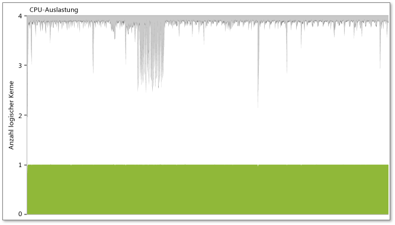

# Häufige Muster von Multithreadanwendungen mit unerwünschtem Verhalten

Die Parallelitätsschnellansicht ermöglicht Entwicklern die visuelle Darstellung des Verhaltens einer Multithreadanwendung. Dieses Tool enthält einen Katalog mit häufigen Mustern von Multithreadanwendungen mit unerwünschtem Verhalten. Der Katalog umfasst typische und erkennbare visuelle Muster, die durch das Tool sichtbar gemacht werden. Außerdem wird das Verhalten erläutert, das durch das jeweilige Muster dargestellt wird, und das wahrscheinliche Ergebnis des Verhaltens und der gängigste Ansatz zu seiner Lösung werden aufgezeigt.

## Sperrenkonflikte und serialisierte Ausführung

Eine parallelisierte Anwendung wird manchmal weiter seriell ausgeführt, obwohl mehrere Threads vorhanden sind und der Computer über eine ausreichende Anzahl von logischen Kernen verfügt. Das erste Symptom ist eine schlechte Multithreadleistung – unter Umständen sogar noch etwas schlechter als bei der seriellen Implementierung. In der Threadansicht werden keine parallel ausgeführten Threads angezeigt. Stattdessen sehen Sie, dass immer nur ein einzelner Thread ausgeführt wird. Wenn Sie an diesem Punkt in einem Thread auf ein Synchronisierungssegment klicken, werden eine Aufrufliste für den blockierten Thread (Aufrufliste für Blockierungen) sowie der Thread angezeigt, von dem die Blockierbedingung entfernt wurde (Aufrufliste für Blockierungsaufhebungen). Wenn die Aufrufliste für die Blockierungsaufhebung Teil des zu analysierenden Prozesses ist, wird auch ein threadkompatibler Konnektor angezeigt. Von hier können Sie zum Code der Aufruflisten für die Blockierung und für die Blockierungsaufhebung navigieren, um die Ursache der Serialisierung genauer zu untersuchen.

Wie in der folgenden Abbildung gezeigt, kann die Parallelitätsschnellansicht dieses Symptom auch in der CPU-Auslastungsansicht anzeigen, wo die Anwendung trotz mehrerer Threads nur einen logischen Kern nutzt.

Weitere Informationen finden Sie unter „Performance Pattern 1: Identifying Lock Contention“ (Verhaltensmuster 1: Identifizieren von Sperrenkonflikten) in Hazim Shafis Blog [Parallel Performance Tools For Windows](http://go.microsoft.com/fwlink/?LinkID=160569) auf der MSDN-Blogwebsite.

## Ungleiche Arbeitslastverteilung

Bei einer unregelmäßigen Verteilung der Arbeitslast auf mehrere parallele Threads in einer Anwendung tritt nach Abschluss der Ausführung der Threads ein typisches Treppenmuster auf. Dieses wird in der obigen Abbildung gezeigt. Die Parallelitätsschnellansicht zeigt in der Regel sehr nahe beieinander liegende Startzeiten für die einzelnen parallelen Threads an. Normalerweise werden diese Threads jedoch nicht gleichzeitig, sondern unregelmäßig beendet. Dieses Muster deutet auf eine unregelmäßige Verteilung der Arbeitslast in einer Gruppe paralleler Threads hin, was sich negativ auf die Leistung auswirken kann. Die beste Methode, dieses Problem zu beheben, besteht darin, den Algorithmus erneut auszuwerten, mit dem die Arbeitslast auf die parallelen Threads aufgeteilt wurde.

Wie in der folgenden Abbildung gezeigt wird, kann dieses Symptom von der Parallelitätsschnellansicht auch als graduelle Abstufung der CPU-Nutzung in der CPU-Auslastungsansicht dargestellt werden.

## Überzeichnung

Im Falle einer Überzeichnung ist die Anzahl der aktiven Threads in einem Prozess größer als die Anzahl der verfügbaren logischen Kerne im System. Die obige Abbildung zeigt die Ergebnisse der Überzeichnung mit erheblicher vorzeitiger Entfernung der Zeilenbildung in allen aktiven Threads. Darüber hinaus zeigt die Legende, dass ein großer Prozentsatz der Zeit auf die vorzeitige Entfernung entfällt (84 Prozent in diesem Beispiel). Dies zeigt möglicherweise an, dass das System vom Prozess aufgefordert wird, mehr parallele Threads auszuführen, als logische Kerne vorhanden sind. Es kann jedoch auch sein, dass Ressourcen von anderen Prozessen im System verwendet werden, die eigentlich für diesen Prozess zur Verfügung stehen sollten.

Beachten Sie beim Auswerten dieses Problems Folgendes:

- Das Gesamtsystem ist möglicherweise überzeichnet. Beachten Sie, dass die Threads möglicherweise von anderen Prozessen im System präemptiv unterbrochen werden. Wenn Sie den Cursor in der Threadansicht über einem Segment mit vorzeitiger Entfernung ruhen lassen, werden der Thread und der Prozess, von dem dieser präemptiv unterbrochen wurde, in einer QuickInfo benannt. Bei diesem Prozess muss es sich nicht zwingend um den Prozess handeln, der während der gesamten präemptiven Unterbrechung des Prozesses ausgeführt wurde, Sie erhalten dadurch jedoch einen Hinweis auf mögliche Ursachen für die präemptive Unterbrechung.

- Untersuchen Sie, wie die entsprechende Anzahl der Threads zur Ausführung in dieser Arbeitsphase vom Prozess ermittelt wird. Wenn der Prozess die Anzahl der aktiven parallelen Threads direkt berechnet, können Sie den Algorithmus ändern, um der Anzahl der verfügbaren logischen Kerne auf dem System besser Rechnung zu tragen. Bei Verwendung von Concurrency Runtime, Task Parallel Library oder PLINQ wird die Anzahl der Threads von diesen Bibliotheken berechnet.

## Ineffizienter E/A

Die übermäßige oder missbräuchliche E/A-Verwendung ist ein häufiger Grund für Ineffizienz in Anwendungen. Sehen Sie sich die obige Abbildung an. Laut sichtbarem Zeitachsenprofil entfallen 44 Prozent der sichtbaren Threadzeit auf E/A-Vorgänge. Die Zeitachse zeigt umfangreiche E/A an, die angeben, dass die profilierte Anwendung häufig durch E/A blockiert wird. Detaillierte Informationen zu den E/A-Arten und zu Blockierungen im Programm erhalten Sie durch Vergrößern der problematischen Bereiche, Untersuchen des sichtbaren Zeitachsenprofils und Klicken auf einen bestimmten E/A-Block, um aktuelle Aufruflisten anzuzeigen.

## Kolonnensperren

Kolonnensperren treten auf, wenn zum Abrufen die First-In-First-Out-Reihenfolge verwendet wird und die Ankunftsrate bei der Sperre höher ist als die Abrufrate. Aufgrund des Zusammentreffens dieser beiden Bedingungen laufen nach und nach Anforderungen der Sperre auf. Eine Möglichkeit, dieses Problem zu beheben, besteht darin, „unfaire“ Sperren oder Sperren zu verwenden, die Zugriff auf den ersten Thread ermöglichen, um den entsprechenden entsperrten Zustand zu finden. Die obige Abbildung zeigt dieses Kolonnenverhalten. Zum Beheben dieses Problems verringern Sie die Konflikte um die Synchronisierungsobjekte, verwenden Sie zudem unfaire Sperren.

## Siehe auch

[Threads View (Threadansicht)](../profiling/threads-view-parallel-performance.md)