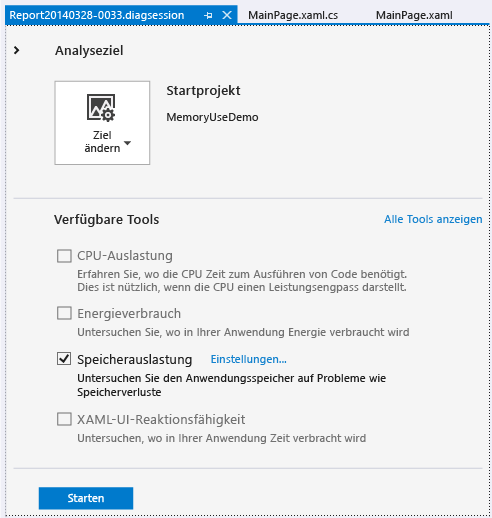
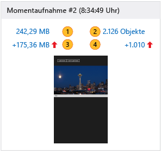
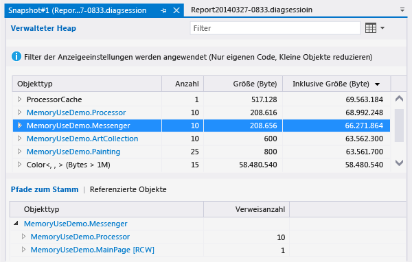
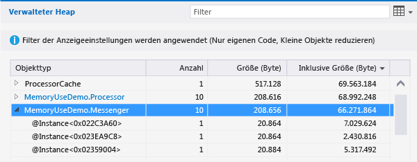
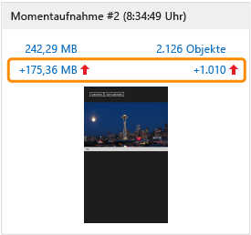
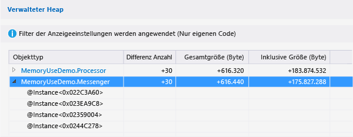
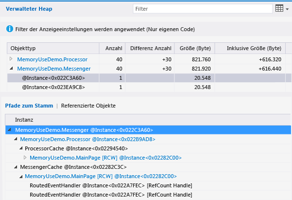

# Speicherauslastung ohne Debuggen
Sie können das Tool **Speicherverwendung** ohne Debuggen verwenden, um die folgenden Aktionen ausführen:  
  
-   Die Speicherauslastung Ihrer App direkt in Visual Studio überwachen, während Sie ein Szenario entwickeln.  
  
-   Erstellen Sie detaillierte Momentaufnahmen des Zustands Ihres App-Speichers.  
  
-   Vergleichen Sie Momentaufnahmen, um die Grundursache von Speicherproblemen zu finden.  
  
 In diesem Thema wird beschrieben, wie Sie das Speicherauslastungstool verwenden, um eine universelle Windows XAML-App zu analysieren. Wenn Sie die Speichernutzung in universellen Windows-Apps, die JavaScript und HTML verwenden, analysieren möchten, gehen Sie unter [Analysieren der Speicherauslastung (JavaScript)](http://msdn.microsoft.com/library/windows/apps/jj819176.aspx).  
  
##   Starten einer Diagnosesitzung zur Speicherauslastung  
  
1.  Öffnen Sie ein universelles Windows-C#-Projekt in Visual Studio.  
  
2.  Wählen Sie im Menü **Debuggen / Leistungsprofiler...** aus.  
  
3.  Wählen Sie **Speicherauslastung** aus, und klicken Sie dann auf die Schaltfläche **Start** ganz unten auf der Seite.  
  
       
  
##   Speicherverwendung überwachen  
 Sie können das Tool **Speicherauslastung** verwenden, um detaillierte Berichte zu erstellen, mit denen Sie Probleme finden und beheben, aber Sie können dieses Tool auch verwenden, um die Echtzeit-Speicherauswirkungen eines Szenarios zu untersuchen, das Sie gerade entwickeln.  
  
 Wenn Sie eine Diagnosesitzung starten, startet Ihre App, und das Fenster **Diagnosetools** zeigt eine Zeitachse der Speicherauslastung Ihrer App an.  
  
   
  
 Die Zeitachse der zeigt Schwankungen im Speicher Ihrer App an, während diese ausgeführt wird. Spitzen in der Zeitachse weisen normalerweise darauf hin, dass Code in der App Daten erfasst oder erstellt und diese dann verwirft, wenn die Verarbeitung abgeschlossen ist. Hohe Spitzen weisen auf Bereiche hin, die Sie ggf. optimieren können. Problematischer ist ein Anstieg in der Auslastung von Speicher, der nicht zurückgegeben wird, denn dies kann auf ineffiziente Speicherverwendung oder sogar einen Speicherverlust hindeuten.  
  
###   Schließen der Überwachungssitzung  
   
  
 Um eine Überwachungssitzung zu schließen, ohne einen Bericht zu erstellen, schließen Sie das Diagnosefenster einfach. Um einen Bericht zu generieren, wenn Sie Momentaufnahmen erstellt haben, wählen Sie **Beenden** aus.  
  
##   Momentaufnahmen des Speicherzustands Ihrer App erstellen  
 Wenn Sie auf ein Speicherproblem stoßen und es untersuchen möchten, können Sie während der Diagnosesitzung Momentaufnahmen erstellen, um Speicherobjekte zu bestimmten Zeitpunkten zu erfassen. Da eine App eine Vielzahl verschiedener Arten von Objekten verwendet, sollten Sie Ihre Analyse auf ein Szenario ausrichten. Empfehlenswert ist es auch, vor dem Auftreten eines Speicherproblems eine Baselinemomentaufnahme der App zu erstellen, nach dem ersten Auftreten des Problems eine weitere Momentaufnahme zu erstellen und eine oder mehrere zusätzliche, wenn Sie das Szenario wiederholen.  
  
 Um Momentaufnahmen zu erstellen, starten Sie eine neue Diagnosesitzung. Wählen Sie **Momentaufnahme erstellen** aus, wenn Sie mit dem Erfassen der Speicherdaten beginnen möchten. Um einen Bericht zu erstellen, wählen Sie **Beenden** aus.  
  
##   Übersichtsseite Speicherauslastung  
 Wenn Sie die Datenerfassung beenden, hält das Speicherauslastungstool die App an und zeigt die Übersicht an.  
  
   
  
###   Ansichten der Momentaufnahmen zur Speicherauslastung  
 Die Ansichten der Momentaufnahmen dienen dazu, detaillierte Berichte in neuen Visual Studio-Fenstern zu öffnen. Es gibt zwei zwei Arten von Ansichten:  
  
-   Ein [Momentaufnahmedetailbericht](../profiling/memory-usage-without-debugging2.md#BKMK_Snapshot_details_reports) zeigt die Arten und Instanzen in einer Momentaufnahme.  
  
-   Ein [Momentaufnahmevergleichsbericht](../profiling/memory-usage-without-debugging2.md#BKMK_Snapshot_difference__diff__reports) vergleicht die Typen und Instanzen in zwei Momentaufnahmen.  
  
   
  
 Die nummerierten Objekte im Bild sind Links, die Momentaufnahmenberichte öffnen.  
  
|||  
|-|-|  
||Der Text des Links zeigt die Gesamtzahl der Bytes im Speicher zum Zeitpunkt der Momentaufnahme.   Wählen Sie diesen Link, um einen Bericht über Momentaufnahmendetails anzuzeigen, der nach der Gesamtgröße der Typinstanzen geordnet ist.|  
||Der Text des Links zeigt die Gesamtzahl der Objekte im Speicher zum Zeitpunkt der Momentaufnahme.   Wählen Sie diesen Link, um einen Bericht über Momentaufnahmendetails anzuzeigen, der nach der Anzahl der Typinstanzen geordnet ist.|  
||Der Text des Links zeigt den Unterschied zwischen der Gesamtgröße der Objekte im Speicher zum Zeitpunkt dieser Momentaufnahme und der Gesamtgröße der vorhergehenden Momentaufnahme.   Er zeigt eine positive Zahl, wenn die Speichergröße dieser Momentaufnahme größer ist als die der vorhergehenden, und eine negative Zahl, wenn die Speichergröße kleiner ist. Der Linktext **Baseline** weist darauf hin, dass diese Momentaufnahme die erste in dieser Diagnosesitzung ist, **No Difference** bedeutet, dass die Differenz null ist.   Wählen Sie diesen Link, um einen Bericht über Momentaufnahmenunterschiede anzuzeigen, der nach den Unterschieden in der Gesamtgröße der Typinstanzen geordnet ist.|  
||Der Text des Links zeigt den Unterschied zwischen der Gesamtzahl an Speicherobjekten in dieser Momentaufnahme und der Zahl der Objekte in der vorhergehenden Momentaufnahme.   Wählen Sie diesen Link, um einen Bericht über Momentaufnahmenunterschiede anzuzeigen, der nach den Unterschieden in der Gesamtzahl der Typinstanzen geordnet ist.|  
  
##   Momentaufnahmenberichte  
   
  
###   Strukturen der Momentaufnahmenberichte  
  
####   Verwalteter Heap  
 Die Struktur des verwalteten Heaps [Struktur des verwalteten Heaps (Momentaufnahmendetails)](../profiling/memory-usage-without-debugging2.md#BKMK_Managed_Heap_tree__Snapshot_details_) und die [Struktur des verwalteten Heaps (Momentaufnahmenunterschiede)](../profiling/memory-usage-without-debugging2.md#BKMK_Managed_Heap_tree__Snapshot_diff_) zeigen die Typen und Instanzen im Bericht. Wenn Sie einen Typ oder eine Instanz auswählen, werden die Strukturen **Pfade zum Stamm** und **Referenzierte Objekte** für das gewählte Element angezeigt.  
  
####   Pfade zum Stamm  
 Die [Struktur der Pfade zum Stamm (Momentaufnahmendetails)](../profiling/memory-usage-without-debugging2.md#BKMK_Paths_to_Root_tree__Snapshot_details_) und die [Struktur der Pfade zum Stamm (Momentaufnahmenunterschiede)](../profiling/memory-usage-without-debugging2.md#BKMK_Paths_to_Root_tree__Snapshot_diff_) zeigen die Kette von Objekten, die auf den Typ oder die Instanz verweisen. Der Garbage Collector von .NET Framework bereinigt den Speicher für ein Objekt nur dann, wenn alle Verweise darauf freigegeben wurden.  
  
####   Referenzierte Objekte  
 Die [Struktur der referenzierten Objekte (Momentaufnahmendetails)](../profiling/memory-usage-without-debugging2.md#BKMK_Referenced_Objects_tree__Snapshot_details_) und die [Struktur der referenzierten Objekte (Momentaufnahmenunterschiede)](../profiling/memory-usage-without-debugging2.md#BKMK_Referenced_Objects_tree__Snapshot_diff_) zeigen die Objekte, die vom ausgewählten Typ oder der ausgewählten Instanz referenziert werden.  
  
###   Objekttyp und Instanzenfelder  
 Wenn ein **Objekttyp**-Eintrag über untergeordnete Einträge verfügt, können Sie diese über das Pfeilsymbol anzeigen. Ist die Farbe des **Objekttyp**-Textes blau, können Sie es auswählen, um zu dem Objekt in dessen Quellcodedatei zu navigieren. Die Datei wird in einem separaten Fenster geöffnet.  
  
 Instanzennamen sind eindeutige IDs, die durch das Speicherauslastungstool generiert werden.  
  
 Wenn Sie einen Typ bemerken, den Sie nicht einfach identifizieren können, oder wenn Sie nicht wissen, wie er mit Ihrem Code zusammenhängt, machen Sie sich darüber keine Gedanken. Wahrscheinlich handelt es sich um ein Objekt aus dem .NET Framework, dem Betriebssystem oder dem Compiler, das das Speicherauslastungstool anzeigt, weil es mit den Besitzketten Ihrer Objekte zusammenhängt.  
  
###   Berichtsstrukturenfilter  
 Die meisten Apps enthalten überraschend viele Typen, von denen die meisten für den App-Entwickler nicht von Interesse sind. Das **Speicherauslastungstool** definiert zwei Filter, mit denen Sie die meisten dieser Typen in den Strukturen des **verwalteten Heaps** und der **Pfade zum Stamm** verbergen können. Sie können eine Struktur auch nach dem Typennamen filtern.  
  
   
  
####   Filter  
 Geben Sie in das Feld **Filter** eine Zeichenfolge ein, um die Strukturanzeigen auf Typen zu beschränken, die diese Zeichenfolge enthalten. Der Filter berücksichtigt die Groß-/Kleinschreibung nicht und erkennt die angegebene Zeichenfolge in jedem Teil des Typennamens.  
  
####   Kleine Objekte reduzieren  
 Wird dieser Filter angewendet, dann werden Typen mit einer **Größe (Bytes)** von weniger als 0,5 Prozent der Gesamtgröße des Speichers bei Momentaufnahme in der Liste des **verwalteten Heaps** verborgen.  
  
####   Nur mein Code  
 Der Filter **Nur mein Code** verbirgt die meisten Instanzen, die durch externen Code generiert werden. Externe Typen gehören zum Betriebssystem oder zu Framework-Komponenten oder werden durch den Compiler generiert.  
  
##   Berichte über Momentaufnahmendetails  
 Berichte über Momentaufnahmendetails werden verwendet, um sich auf eine Momentaufnahme aus einer Diagnosesitzung zu konzentrieren. Um einen Detailbericht zu öffnen, wählen Sie einen der Links aus der Ansicht der Momentaufnahme, wie im Bild unten gezeigt. Beide Links öffnen denselben Bericht; der Unterschied besteht lediglich in der Sortierreihenfolge der Struktur des **Managed Heap**. In beiden Fällen können Sie die Sortierreihenfolge ändern, nachdem der Bericht geöffnet wurde.  
  
   
  
-   Der Link **MB** ordnet den Bericht nach der Spalte **Inklusive Größe (Bytes)**.  
  
-   Der Link **Objekte** ordnet den Bericht nach der Spalte **Anzahl**.  
  
###   Struktur des verwalteten Heaps (Momentaufnahmendetails)  
 Die Struktur des **verwalteten Heaps** führt die Objekttypen auf, die im Speicher gehalten werden. Sie können den Typennamen erweitern, um die zehn größten Instanzen des Typs nach Größe geordnet anzuzeigen. Wenn Sie einen Typ oder eine Instanz auswählen, werden die Strukturen **Pfade zum Stamm** und **Referenzierte Objekte** für das gewählte Element angezeigt.  
  
   
  
|||  
|-|-|  
|**Objekttyp**|Der Name des Typs oder der Objektinstanz.|  
|**Anzahl**|Die Anzahl der Objektinstanzen des Typs. Für eine Instanz ist die Anzahl stets 1.|  
|**Größe (Byte)**|Für Typen: Die Größe aller Instanzen des Typs in der Momentaufnahme des Speichers, ohne die Größe der in den Instanzen enthaltenen Objekte.   Für Instanzen: Die Größe des Objekts ohne die Größe der in den Instanzen enthaltenen Objekte. Instanzen geändert.|  
|**Inklusive Größe (Bytes)**|Die Größe der Instanzen des Typs oder einer einzelnen Instanz, einschließlich der Größe der enthaltenen Objekte.|  
  
###   Struktur der Pfade zum Stamm (Momentaufnahmendetails)  
 Die **Paths to Root tree** (Struktur der Pfade zum Stamm) zeigt die Kette der Objekte, die den Typ oder die Instanz referenzieren. Der Garbage Collector von .NET Framework bereinigt den Speicher für ein Objekt nur dann, wenn alle Verweise darauf freigegeben wurden.  
  
   
  
 Wenn Sie einen Typ in der Struktur der **Pfade zum Stamm** anzeigen, wird die Zahl der Objekte der Typen mit Verweisen auf diesen Typ in der Spalte **Verweiszähler** angezeigt. Wenn Sie eine Instanz analysieren, wird die Spalte nicht angezeigt.  
  
###   Struktur der referenzierten Objekte (Momentaufnahmendetails)  
 Die Struktur der **referenzierten Objekte** zeigt die Objekte, die der gewählte Typ oder die gewählte Instanz referenziert.  
  
   
  
|||  
|-|-|  
|**Objekttyp / -instanz**|Der Name des Typs oder der Objektinstanz.|  
|**Größe (Byte)**|Für Typen: Die Größe aller Instanzen des Typs ohne die Größe der in dem Typ enthaltenen Objekte.   Für Instanzen: Die Größe des Objekts ohne die Größe der in dem Objekt enthaltenen Objekte.|  
|**Inklusive Größe (Bytes)**|Die Gesamtgröße der Instanzen des Typs oder die Größe der Instanz, einschließlich der Größe der enthaltenen Objekte.|  
  
##   Bericht über Momentaufnahmenunterschiede  
 Ein Bericht über Momentaufnahmenunterschiede zeigt die Unterschiede zwischen der primären Momentaufnahme und der direkt davor erstellten Momentaufnahme. Um einen solchen Bericht zu öffnen, wählen Sie einen der Links in der Momentaufnahmenansicht, wie im Bild unten gezeigt. Beide Links öffnen denselben Bericht; der Unterschied besteht lediglich in der Sortierreihenfolge der Struktur des **Managed Heap**. Sie können die Sortierreihenfolge ändern, nachdem der Bericht geöffnet wurde.  
  
   
  
-   Der Link **MB** ordnet den Bericht nach der Spalte **Inklusive Größe (Bytes)**.  
  
-   Der Link **Objekte** ordnet den Bericht nach der Spalte **Anzahl**.  
  
###   Struktur des verwalteten Heaps (Momentaufnahmenunterschiede)  
 Die Struktur des **verwalteten Heaps** führt die Objekttypen auf, die im Speicher gehalten werden. Sie können den Typennamen erweitern, um die zehn größten Instanzen des Typs nach Größe geordnet anzuzeigen. Wenn Sie einen Typ oder eine Instanz auswählen, werden die Strukturen **Pfade zum Stamm** und **Referenzierte Objekte** für das gewählte Element angezeigt.  
  
   
  
 Im Bild sind die Spalten **Anzahl**, **Größe (Bytes)** und **Inklusive Größe (Bytes)** reduziert.  
  
|||  
|-|-|  
|**Objekttyp**|Der Name des Typs oder der Objektinstanz.|  
|**Anzahl**|Die Zahl der Instanzen eines Typs in der primären Momentaufnahme. Für eine Instanz ist die **Anzahl** stets 1.|  
|**Differenz der Anzahl**|Für Typen: Der Unterschied zwischen der Anzahl der Instanzen des Typs in der primären Momentaufnahme und der vorhergehenden Momentaufnahme. Für Instanzen ist das Feld leer.|  
|**Größe (Byte)**|Die Größe der Objekte in der primären Momentaufnahme ohne die Größe der in den Objekten enthaltenen Objekte. Für Typen sind **Größe (Bytes)** und **Inklusive Größe (Bytes)** die Gesamtgrößen der Typinstanzen.|  
|**Unterschied der Gesamtgrößen (Bytes)**|Für Typen: Der Unterschied in der Gesamtgröße der Typinstanzen zwischen der primären Momentaufnahme und der vorhergehenden Momentaufnahme, ohne die Größe der in den Instanzen enthaltenen Objekte. Für Instanzen ist das Feld leer.|  
|**Inklusive Größe (Bytes)**|Die Größe der Objekte in der primären Momentaufnahme einschließlich der Größe der in den Objekten enthaltenen Objekte.|  
|**Unterschied der inklusiven Größen (Bytes)**|Für Typen: Der Unterschied in der Größe aller Typinstanzen zwischen der primären Momentaufnahme und der vorhergehenden Momentaufnahme, einschließlich der Größe der in den Objekten enthaltenen Objekte. Für Instanzen ist das Feld leer.|  
  
###   Struktur der Pfade zum Stamm (Momentaufnahmenunterschiede)  
 Die **Paths to Root tree** (Struktur der Pfade zum Stamm) zeigt die Kette der Objekte, die den Typ oder die Instanz referenzieren. Der Garbage Collector von .NET Framework bereinigt den Speicher für ein Objekt nur dann, wenn alle Verweise darauf freigegeben wurden.  
  
   
  
###   Struktur der referenzierten Objekte (Momentaufnahmenunterschiede)  
 Die Struktur der **referenzierten Objekte** zeigt die Objekte, die der primäre Typ oder die Instanz referenziert.  
  
   
  
|||  
|-|-|  
|**Objekttyp / -instanz**|Der Name des Typs oder der Objektinstanz.|  
|**Größe (Byte)**|Für Instanzen: Die Größe des Objekts in der primären Momentaufnahme ohne die Größe der in der Instanz enthaltenen Objekte.   Für Typen: Die Gesamtgröße der Instanzen des Typs in der primären Momentaufnahme ohne die Größe der in der Instanz enthaltenen Objekte.|  
|**Inklusive Größe (Bytes)**|Die Größe der Objekte in der primären Momentaufnahme einschließlich der Größe der in den Objekten enthaltenen Objekte.|  
  
## Siehe auch  
 [JavaScript-Speicher](../profiling/javascript-memory.md)
 [Profilerstellungstools](../profiling/profiling-tools.md)
 [Bewährte Methoden zur Leistungssteigerung für Windows Store-Apps mit C++, C# und Visual Basic](http://msdn.microsoft.com/library/windows/apps/hh750313.aspx)   
 [Diagnosing memory issues with the new Memory Usage Tool in Visual Studio (Diagnostizieren von Speicherproblemen mithilfe des neuen Speicherauslastungstools in Visual Studio)](http://go.microsoft.com/fwlink/p/?LinkId=394706)
