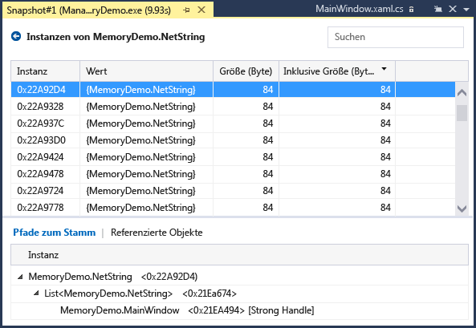
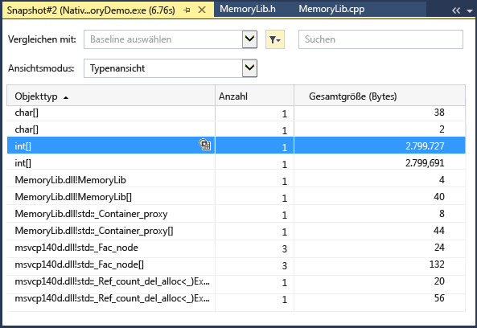
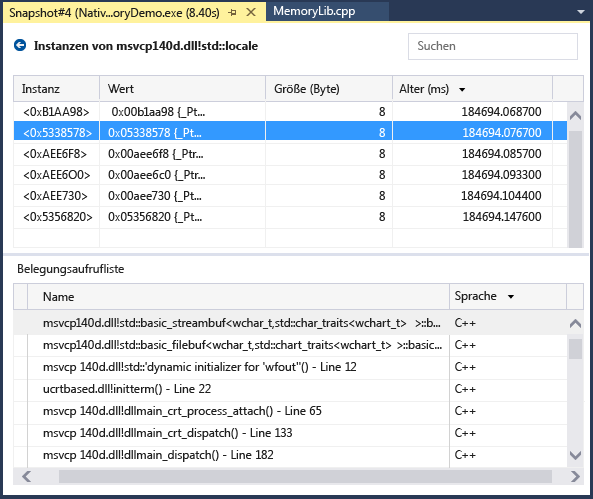
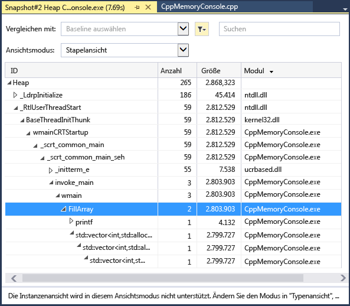

# Analysieren der Speicherauslastung
Suchen Sie Speicherverluste und ineffiziente Arbeitsspeichernutzung während des Debuggens mit dem Debugger-integrierten **Speicherauslastungs** -Diagnosetool. Mit dem Speicherauslastungstool können Sie einen oder mehrere *Momentaufnahmen* des verwalteten und systemeigenen Momentaufnahme-Heaps machen. Sie können Momentaufnahmen von .NET-Apps, systemeigenen Apps und Apps in gemischtem Modus (.Net und systemeigen) erfassen.  
  
-   Sie können eine einzelne Momentaufnahme analysieren, um die relativen Auswirkungen der Objekttypen auf die Arbeitsspeichernutzung zu verstehen und Code in der App zu suchen, die Arbeitsspeicher auf ineffiziente Weise verwendet.  
  
-   Sie können auch einen Vergleich zweier Momentaufnahmen einer App vornehmen, um Bereiche im Code aufzuspüren, die dazu führen, dass die Arbeitsspeichernutzung im Zeitverlauf zunimmt.  
  
 Das folgende Bild zeigt das Fenster **Diagnosetools** (verfügbar in Visual Studio 2015 Update 1 und höheren Versionen):  
  
   
  
 Obwohl Sie Speichermomentaufnahmen des Arbeitsspeichers zu jedem beliebigen Zeitpunkt im **Speicherauslastungstool** erfassen können, können Sie mit dem Visual Studio-Debugger kontrollieren, wie Ihre Anwendung die Ausführung vornimmt, und dabei Leistungsprobleme untersuchen. Festlegen von Haltepunkten, schrittweises Ausführen, alles unterbrechen und andere Debugger-Aktionen können Ihnen helfen, Ihre Leistungsuntersuchungen auf die relevantesten Codepfade zu fokussieren. Durch die Ausführung dieser Aktionen, während Ihre App ausgeführt wird, kann das Rauschen, das Sie nicht interessiert, vom Code entfernt werden, wodurch sich der Zeitaufwand, den Sie zur Diagnose eines Problems benötigen, maßgeblich verringert.  
  
 Sie können das Speichertool auch außerhalb des Debuggers verwenden. Siehe [Memory Usage without Debugging](../profiling/memory-usage-without-debugging2.md).  
  
> [!NOTE]
>  **Unterstützung für benutzerdefinierte Zuweisungen** Die systemeigene Speicherprofilerstellung funktioniert dadurch, dass speicherbelegungsbezogene [ETW-](https://msdn.microsoft.com/en-us/library/windows/desktop/bb968803\(v=vs.85\).aspx) -Ereignisdaten gesammelt werden, die während der Laufzeit ausgegeben wurden.  Zuweisungen im CRT und Windows SDK wurden auf Quellebene kommentiert, sodass ihre Speicherbelegungsdaten erfasst werden können.  Wenn Sie Ihre eigenen Zuweisungen schreiben, kann jede Funktion, die einen Zeiger auf neu zugewiesenen Heapspeicher zurückgibt, mit [__declspec](/cpp/cpp/declspec)(allocator) ergänzt werden, wie in diesem Beispiel für myMalloc zu sehen ist:  
>   
>  `__declspec(allocator) void* myMalloc(size_t size)` 

## Sammeln von Speicherauslastungsdaten

1.  Öffnen Sie das Projekt, das Sie in Visual Studio debuggen möchten, und legen Sie in Ihrer App einen Haltepunkt an dem Punkt fest, an dem Sie die CPU-Auslastung untersuchen möchten.

    Wenn Sie über einen Bereich verfügen, bei dem Sie ein Speicherproblem vermuten, legen Sie den ersten Haltepunkt fest, bevor das Speicherproblem auftritt.

    > [!TIP]
    >  Da es schwierig sein kann, das Speicherprofil eines Vorgangs zu erfassen, der für Sie von Interesse ist, wenn Ihre App häufig Speicher zuweist und dessen Speicherung wieder aufhebt, richten Sie zu Beginn und zum Ende des Vorgangs Haltepunkte ein (oder gehen Sie schrittweise durch den Vorgang), um so den genauen Punkt zu finden, an dem sich der Speicher geändert hat. 

2.  Legen Sie einen zweiten Haltepunkt am Ende der Funktion oder des Codebereichs an, den Sie analysieren möchten (oder nachdem ein vermutetes Speicherproblem aufgetreten ist).
  
3.  Das Fenster **Diagnosetools** wird automatisch angezeigt, es sei denn, Sie haben es deaktiviert. Klicken Sie auf **Debuggen / Windows / Diagnosetools anzeigen**, um das Fenster erneut aufzurufen.

4.  Wählen Sie **Speicherauslastung** mit der Einstellung **Auswahltools** auf der Symbolleiste aus.

     

5.  Klicken Sie auf **Debuggen / Debugging starten** (oder auf **Start** auf der Symbolleiste oder auf **F5**).

     Wenn das Laden der Anwendung abgeschlossen ist, wird die Zusammenfassungsansicht der Diagnosetools angezeigt.

     

     > [!NOTE]
     >  Da das Erfassen von Speicherdaten die Debugleistung Ihrer systemeigenen Apps oder Ihrer Apps mit gemischtem Modus beeinträchtigen kann, sind Speichermomentaufnahmen standardmäßig deaktiviert. Starten Sie eine Debugsitzung (Tastenkombination: **F5**), um Momentaufnahmen in nativen Apps oder in Apps im gemischten Modus zu aktivieren. Wenn das Fenster **Diagnosetools** eingeblendet wird, wählen Sie die Registerkarte „Speicherauslastung“ und dann **Heap Profiling** (Heapprofilerstellung) aus.  
     >   
     >    
     >   
     >  Beenden Sie den Debugvorgang (Tastenkombination: **UMSCHALT+F5**), und starten Sie ihn neu.  

6.  Um eine Momentaufnahme zu Beginn der Debugsitzung zu erstellen, wählen Sie auf der Übersichtssymbolleiste **Speicherauslastung** die Option **Momentaufnahme erstellen** aus. (Es kann hilfreich sein, auch hier einen Haltepunkt festzulegen.)

     
     
     > [!TIP]
     >  Um eine Basislinie für Speichervergleiche zu erstellen, sollten Sie zu Beginn Ihrer Debugsitzung eine Momentaufnahme erstellen.  

6.  Führen Sie das Szenario aus, bei dem Ihr erster Haltepunkt erreicht wird.

7.  Wählen Sie **Momentaufnahme erstellen** auf der Übersichtssymbolleiste **Speicherauslastung** aus, während der Debugger am ersten Haltepunkt angehalten wird.  

8.  Drücken Sie F5, um die App bis zum zweiten Haltepunkt auszuführen.

9.  Erstellen Sie nun eine andere Momentaufnahme.

     An diesem Punkt können Sie beginnen, die Daten zu analysieren.    
  
## Analysieren der Speicherauslastungsdaten
Die Zeilen der Speicherauslastungs-Übersichtstabelle führt die Momentaufnahmen auf, die Sie während der Debugsitzung erstellt haben, und bietet Links zu detaillierteren Ansichten.

 Der Name der Spalten ist abhängig von dem Debugmodus, den Sie in den Projekteigenschaften gewählt haben: .NET, nativ oder gemischt (sowohl .NET als auch nativ).  
  
-   Die Spalten **Objekte (Diff.)**und **Zuweisungen (Diff.)** zeigen die Anzahl der Objekte im .NET-Speicher und im nativen Speicher zum Zeitpunkt der Erstellung der Momentaufnahme an.  
  
-   Die Spalte **Heapgröße (Diff)** zeigt die Anzahl der Bytes in den .NET- und nativen Heaps 

Wenn Sie mehrere Momentaufnahmen erstellt haben, beinhalten die Zellen der Übersichtstabelle die Wertänderung zwischen Zeilenmomentaufnahme und vorheriger Momentaufnahme.  

Um die Speicherauslastung zu analysieren, klicken Sie auf einen der Links. Ein detaillierter Bericht der Speicherauslastung wird geöffnet:  

-   Um die Details des Unterschiedes zwischen aktueller Momentaufnahme und vorheriger Momentaufnahme anzuzeigen, wählen Sie die Änderungsverknüpfung links des Pfeils aus (). Ein roter Pfeil zeigt eine Zunahme der Speicherauslastung und ein grüner Pfeil die Abnahme der Speicherauslastung.

    > [!TIP]
    >  Um Speicherprobleme schnell auszumachen, werden die Unterschiedsberichte nach Objekttypen sortiert, deren Anzahl sich am stärksten erhöht hat (klicken Sie auf die Änderungsverknüpfung in der Spalte **Objekte (Diff.)**) oder deren gesamte Heapgröße sich am signifikantesten erhöht hat (klicken Sie auf die Änderungsverknüpfung in der Spalte **Heapgröße (Diff.)**).

-   Um nur die Details der ausgewählten Momentaufnahme anzuzeigen, klicken Sie auf die Verknüpfung ohne Änderung. 
  
 Der Bericht wird in einem separaten Fenster angezeigt.   
  
### Berichte zu den verwalteten Typen  
 Wählen Sie die aktuelle Verknüpfung einer **Objekte (Diff.)**- oder **Zuweisungen (Diff.)**-Zelle in der Übersichtstabelle der Speicherauslastung aus.  
  
   
  
 Im oberen Bereich werden Anzahl und Größe der Typen in der Momentaufnahme angezeigt, einschließlich der Größe aller Objekte, auf die der Typ verweist (**Umfassende Größe**).  
  
 Die Baumstruktur **Pfade zum Stamm** im unteren Bereich zeigt die Objekte an, die auf den im oberen Bereich ausgewählten Typ verweisen. Der .NET Framework-Garbage Collector bereinigt den Speicher für ein Objekt nur, wenn der letzte Typ, der darauf verweist, freigegeben wurde.  
  
 Die Baumstruktur **Referenzierte Typen** enthält die Verweise, die von dem Typ, der im oberen Bereich ausgewählt ist, gehalten werden.  
  
   
  
 Um die Instanzen eines ausgewählten Typs im oberen Bereich anzuzeigen, wählen Sie das .  
  
   
  
 Die Ansicht **Instanzen** zeigt die Instanzen des ausgewählten Objekts in der Momentaufnahme des oberen Bereichs an. Der Bereich "Pfade zum Stamm" und "Referenzierte Objekte" zeigt die Objekte an, die auf die ausgewählte Instanz verweisen, sowie die Typen, auf die die ausgewählte Instanz verweist. Wenn der Debugger an dem Punkt beendet wird, an  dem die Momentaufnahme erstellt wurde, können Sie den Mauszeiger über die Zelle "Wert" führen, um die Werte des Objekts in einer QuickInfo anzuzeigen.  
  
### Berichte zu den systemeigenen Typen  
 Wählen Sie die aktuelle Verknüpfung einer Zelle **Zuordnungen (Diff.)** oder **Heapgröße (Diff.)** aus der Speicherauslastungs-Übersichtstabelle des Fensters **Diagnosetools** aus.  
  
   
  
 Die **Typenansicht** zeigt die Anzahl und Größe der Typen in der Momentaufnahme an.  
  
-   Wählen Sie das Instanzensymbol () eines ausgewählten Typs, um Informationen zum Objekt des ausgewählten Typs in der Momentaufnahme anzuzeigen.  
  
     Die Ansicht **Instanzen** zeigt jede Instanz des ausgewählten Typs an. Durch Auswahl einer Instanz wird die Aufrufliste angezeigt, welche die Erstellung der Instanz im Bereich **Belegungsaufrufliste** bewirkt hat.  
  
       
  
-   Wählen Sie **Stapelansicht** im **Ansichtsmodus** , um den Zuweisungsstapel für den ausgewählten Typ anzuzeigen.  
  
       
  
### (Diff) Änderungsberichte  
  
-   Wählen Sie die Änderungsverknüpfung in einer Zelle der Übersichtstabelle der Registerkarte **Speicherauslastung** im Fenster **Diagnosetools** aus.  
  
       
  
-   Wählen Sie eine Momentaufnahme aus der Liste **Vergleichen mit** Liste eines verwalteten oder systemeigenen Berichts aus.  
  
       
  
 Der Änderungsbericht fügt dem Basisbericht Spalten (durch **(Diff)**gekennzeichnet) hinzu, die den Unterschied zwischen der Basismomentaufnahme und der Vergleichsmomentaufnahme anzeigen. So könnte ein Diff-Bericht der Ansicht mit systemeigenen Typen aussehen:  
  
   
  
## Blogs und Videos  
 [Diagnostic Tools debugger window in Visual Studio 2015](http://blogs.msdn.com/b/visualstudioalm/archive/2015/01/16/diagnostic-tools-debugger-window-in-visual-studio-2015.aspx)  
  
 [Blog: Memory Usage Tool while debugging in Visual Studio 2015](http://blogs.msdn.com/b/visualstudioalm/archive/2014/11/13/memory-usage-tool-while-debugging-in-visual-studio-2015.aspx)  
  
 [Visual C++ Blog: Native Memory Diagnostics in VS2015 Preview](http://blogs.msdn.com/b/vcblog/archive/2014/11/21/native-memory-diagnostics-in-vs2015-preview.aspx)  
  
 [Visual C++ Blog: Native Memory Diagnostic Tools for Visual Studio 2015 CTP](http://blogs.msdn.com/b/vcblog/archive/2014/06/04/native-memory-diagnostic-tools-for-visual-studio-14-ctp1.aspx)
