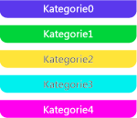

# Bereichsmarker
[!INCLUDE[vs2017banner](../code-quality/includes/vs2017banner.md)]

Ein Spannenmarker stellt eine sinnvolle Phase einer Anwendung dar.  Beispielsweise können Sie eine Spanne verwenden, um ein Intervall der Zeit anzuzeigen, während dessen eine bestimmte Arbeitsaufgabe verarbeitet wird.  Die Länge stellt die Dauer der entsprechenden Anwendungsphase dar.  Diese Abbildung zeigt eine Spanne in der Parallelitätsschnellansicht angezeigt:  
  
   
Ein Spannenmarker in der Parallelitätsschnellansicht  
  
## Spannen\-Kategorie  
 Ein Spannenmarker wird in eine von fünf unterschiedlichen Farben, abhängig von ihrer Kategorie angezeigt.  Die Farben werden wiederholt, wenn mehr als fünf Kategorien gibt.  Die Kategorie kann eine ganze Zahl sein.  Diese Abbildung zeigt die fünf möglichen Farben:  
  
   
Die Farben der ersten fünf Spannenkategorien  
  
## Spannen\-Aggregations\-Marker  
 Manchmal treten Spannenmarker auf, das Sie schließen beieinander in der Parallelitätsschnellansicht, dass sie nicht einzeln gezeichnet werden können.  Wenn dies auftritt, wird ein *Spannenaggregationsmarker* grauer, der die zugrunde liegenden Spannen darstellt, angezeigt.  Wenn Sie den Mauszeiger auf einem dieser Symbole zeigen, Anzeigen einer QuickInfo die Zahl des zugrunde liegens von Spannen, die dargestellt werden.  Um die Spannen anzuzeigen, Vergrößern Sie.  Beim Einchecken ähnlich Vergrößern und weiterhin einen Spannenaggregationsmarker erhalten, können Sie die zugrunde liegenden Spannenmarker im [Markerbericht](../profiling/markers-report.md) anzeigen.  Diese Abbildung zeigt einen Spannenaggregationsmarker an:  
  
   
Ein Spannenaggregationsmarker  
  
## Siehe auch  
 [Parallelitätsschnellansichtsmarker](../profiling/concurrency-visualizer-markers.md)   
 [Parallelitätsschnellansichts\-SDK](../profiling/concurrency-visualizer-sdk.md)