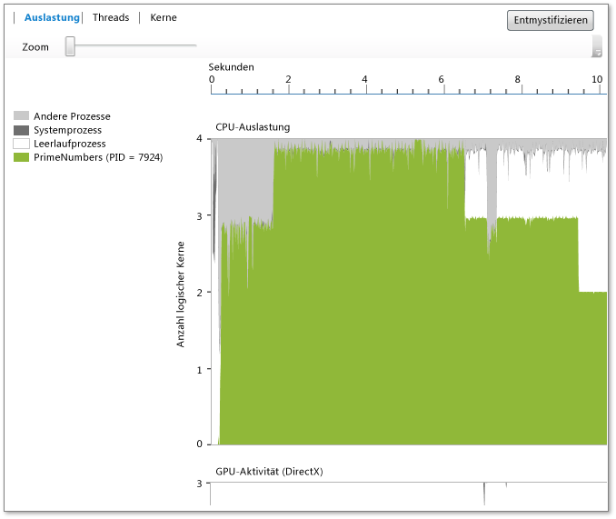

# Auslastungsansicht
[!INCLUDE[vs2017banner](../code-quality/includes/vs2017banner.md)]

Die **Auslastungsansicht** Informationen zu den CPU\-, GPU und andere Systemressourcen, die durch den aktuellen Prozess verwendet werden.  Sie zeigt die durchschnittliche Kernauslastung durch den analysierten Prozess, den Leerlaufprozess, den Systemprozess und andere Prozesse, die auf dem System im Zeitverlauf ausgeführt werden.  Es ist nicht ersichtlich, welcher bestimmte Kern zu einem bestimmten Zeitpunkt aktiv ist.  Wenn beispielsweise zwei Kerne jeder Ausführung bei einer 50\-Prozent\-Kapazität während eines bestimmten Zeitraums sind, dann zeigt dieser Ansicht ein logischer Kern, der verwendet wird.  Die Ansicht wird generiert, indem die Profilerstellungszeit in kurze Zeitsegmente unterteilt wird.  Für jedes Segment wird im Diagramm die durchschnittliche Anzahl von Prozessthreads, die während des Intervalls auf logischen Kernen ausgeführt werden.  
  
   
  
 Das Diagramm zeigt die Zeit \(auf der x\-Achse\) und die durchschnittliche Anzahl der logischen Kerne, die vom Zielprozess, Leerlaufprozess sowie vom Systemprozess. \(In der im Leerlauf Prozessshows Kerne im Leerlauf.  Der Systemprozess ist ein Prozess in Windows, das Arbeiten im Namen anderer Prozesse ausgeführt werden kann.\) Die verbleibenden Prozesse, die auf dem System ausgeführt werden, wird die Auslastung aller verbleibenden Kerne.  
  
 Die Anzahl der logischen Kerne wird auf der y\-Achse angezeigt.  Windows behandelt gleichzeitige Multithreadingunterstützung in der Hardware als logische Kerne, \(beispielsweise Hyper\-Threading\).  Deshalb wird ein System, mit einem Quad\-Core\-Prozessor, der zwei Hardwarethreads pro Kern unterstützt, als Acht\-logischKernsystem.  Dies gilt auch für die Kernansicht.  Weitere Informationen finden Sie unter [Kernansicht](../profiling/cores-view.md).  
  
 Die GPU\-Handlungsübersicht zeigt die Anzahl von DirectX\-Modulen in Verwendung im Zeitverlauf an.  Ein Modul wird gegenwärtig verwendet, wenn ein DMA\-Paket verarbeitet.  Das Diagramm zeigt keine bestimmten DirectX\-Modul an \(beispielsweise, 3D\-Modul\-, Videomodul und die anderen\).  
  
## Zweck  
 Es wird empfohlen die Auslastungs\-Ansicht als Ausgangspunkt für Leistungsuntersuchungen, wenn Sie die Parallelitätsschnellansicht verwenden.  Da sie eine Übersicht über den Parallelitätsgrad der Parallelität in einer App im Zeitverlauf stellt, können Sie sie verwenden, um Bereiche schnell ermittelt, die Leistungsoptimierung oder Parallelisierung benötigen.  
  
 Wenn Sie sich für die Leistungsoptimierung interessieren, können Sie Verhalten, zu identifizieren, das den Erwartungen nicht entspricht.  Außerdem suchen z dem Vorhandensein sowie nach der Ursache von Bereichen, die die Auslastung der logischen CPU\-Kerne haben.  Außerdem kann möglicherweise nach Mustern von Verwendung zwischen CPU und GPU.  
  
 Wenn Sie sich interessieren, an, eine Anwendung zu parallelisieren, suchen Sie wahrscheinlich entweder nach CPU\-gebundenen Ausführungsbereichen oder nach Bereichen, in denen die CPU nicht verwenden.  
  
 CPU\-gebundene Bereiche werden grün.  Die Nutzung eines einzelnen Kerns angezeigt, der verwendet wird, wenn die App seriell ist.  
  
 Bereiche, in denen die CPU nicht verwenden, sind grau formatiert angezeigt.  Hierbei kann es sich um Punkte handeln, an denen die App im Leerlauf befindet oder eine blockierende E\/A ausgeführt, die sich Möglichkeiten zur Parallelisierung aufgrund einer Überschneidung mit anderen CPU\-gebundenen Aufgaben ergeben.  
  
 Wenn Sie ein Verhalten relevante suchen, können Sie in diesem Bereich vergrößern, indem Sie sie auswählen.  Nachdem Sie vergrößern, können Sie zur Threadansicht oder zur Kernansicht wechseln ausführlichere Analyse wechseln.  
  
 Wenn Sie das GPU verwenden, indem Sie AMP oder DirectX verwenden, können Sie möglicherweise relevant, an, die Anzahl von GPU\-Modulen oder Bereichen zu identifizieren, in denen das eine GPU im Leerlauf befindet.  
  
## Zoomen  
 Um auf das Vergrößern oder dem GPU\-Aktivitätsdiagramm vergrößern, einen Abschnitt auswählen oder verwenden Sie den Zoomschieberegler über dem Diagramm.  Die Zoomeinstellung bleibt erhalten, wenn Sie zu anderen Ansichten wechseln.  Wenn Sie die Ansicht wieder verkleinern möchten, verwenden Sie den Zoomschieberegler.  Außerdem können Sie vergrößern, indem Sie verwenden Ctrl\+scroll.  
  
## Siehe auch  
 [Parallelitätsschnellansicht](../profiling/concurrency-visualizer.md)   
 [Kernansicht](../profiling/cores-view.md)