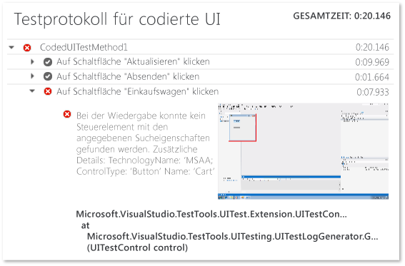

# <a name="analyzing-coded-ui-tests-using-coded-ui-test-logs"></a>Analysieren von Tests der programmierten UI mithilfe der Testprotokolle der programmierten UI

Testprotokolle für codierte UI filtern wichtige Informationen zum ausgeführten Test der codierten UI und zeichnen diese auf. Die Protokolle werden in einem Format dargestellt, mit dem sich Probleme schnell debuggen lassen.

## <a name="step-1-enable-logging"></a>Schritt 1: Aktivieren der Protokollierung

Verwenden Sie je nach Szenario eine der folgenden Methoden zur Aktivierung des Protokolls:

- Auf .NET Framework Version 4 abzielen, wenn keine Datei *App.config* im Testprojekt vorhanden ist:

   1. Öffnen Sie die Datei **QTAgent32_40.exe.config**. Diese Datei befindet sich standardmäßig unter *%Programme (x86)%\Microsoft Visual Studio\2017\Enterprise\Common7\IDE*.

   2. Ändern Sie den Wert für EqtTraceLevel auf die gewünschte Protokollebene.

   3. Speichern Sie die Datei.

- Auf .NET Framework Version 4.5 abzielen, wenn keine Datei *App.config* im Testprojekt vorhanden ist:

   1. Öffnen Sie die Datei **QTAgent32.exe.config**. Diese Datei befindet sich standardmäßig unter *%Programme (x86)%\Microsoft Visual Studio\2017\Enterprise\Common7\IDE*.

   2. Ändern Sie den Wert für EqtTraceLevel auf die gewünschte Protokollebene.

   3. Speichern Sie die Datei.

- Die Datei *App.config* ist im Testprojekt vorhanden:

    - Öffnen Sie die Datei *App.config* im Projekt, und fügen Sie den folgenden Code unter dem Konfigurationsknoten hinzu:

      ```xml
      <system.diagnostics>
        <switches>
          <add name="EqtTraceLevel" value="4" />
        </switches>
      </system.diagnostics>`
      ```

- Die Anmeldung aus dem Testcode selbst aktivieren:

   <xref:Microsoft.VisualStudio.TestTools.UITesting.PlaybackSettings.LoggerOverrideState%2A> = HtmlLoggerState.AllActionSnapshot;

## <a name="step-2-run-your-coded-ui-test-and-view-the-log"></a>Schritt 2: Den Test der programmierten UI ausführen und das Protokoll anzeigen

Wenn Sie einen Test der programmierten Benutzeroberfläche mit der modifizierten Datei **QTAgent32.exe.config** ausführen, dann sehen Sie, dass es einen Ausgabelink in den Ergebnissen des Test-Explorers gibt. Protokolldateien werden nicht nur produziert, wenn beim Test ein Fehler auftritt, sondern auch für erfolgreiche Tests, wenn das Level der Ablaufverfolgung auf „verbose“ gesetzt ist.

1.  Wählen Sie im Menü **Test** **Fenster** und dann **Test-Explorer** aus.

2.  Wählen Sie im Menü **Erstellen** die Option **Projektmappe erstellen**.

3.  Wählen Sie in Test-Explorer den Test der programmierten Benutzeroberfläche, den Sie ausführen möchten. Öffnen Sie dessen Kontextmenü, und wählen Sie **Ausgewählte Tests ausführen**.

     Die automatisierten Tests werden ausgeführt und geben an, wenn sie erfolgreich waren oder Fehler aufgetreten sind.

    > [!TIP]
    > Um Test-Explorer anzuzeigen, wählen Sie **Test** > **Fenster** und dann **Test-Explorer** aus.

4.  Wählen Sie den Link **Ausgabe** in den Test-Explorer-Ergebnissen.

     

     Damit wird die Ausgabe für den Test angezeigt, in der ein Link zum Aktionsprotokoll enthalten ist.

     

5.  Wählen Sie den Link *UITestActionLog.html* aus.

     Das Protokoll wird im Webbrowser angezeigt.

     

## <a name="see-also"></a>Siehe auch

- [Verwenden von Benutzeroberflächenautomatisierung zum Testen des Codes](../test/use-ui-automation-to-test-your-code.md)
- [Gewusst wie: Ausführen von Tests in Microsoft Visual Studio](http://msdn.microsoft.com/Library/1a1207a9-2a33-4a1e-a1e3-ddf0181b1046)