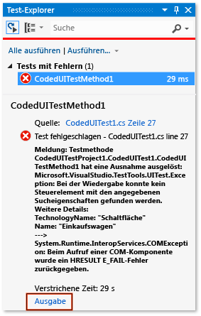

# Analysieren von Tests der programmierten UI mithilfe der Testprotokolle der programmierten UI
[!INCLUDE[vs2017banner](../code-quality/includes/vs2017banner.md)]

Testprotokolle für programmierten UI filtern wichtige Informationen zu den Ausführungen Ihrer Tests der programmierten UI und zeichnen diese auf.  
  
 **Anforderungen**  
  
-   Visual Studio Enterprise  
  
## <a name="why-should-i-do-this"></a>Warum sollte ich das tun?  
 Die Protokolle werden in einem Format dargestellt, mit dem sich Probleme schnell debuggen lassen.  
  
## <a name="how-do-i-do-this"></a>Vorgehensweise  
  
### <a name="step-1-enable-logging"></a>Schritt 1: Aktivieren der Protokollierung  
 Verwenden Sie je nach Szenario eine der folgenden Methoden zur Aktivierung des Protokolls.  
  
-   Auf .NET Framework Version 4 abzielen, wenn keine Datei App.config im Testprojekt vorhanden ist  
  
    -   Öffnen Sie die **QTAgent32_40.exe.config** Datei.  
  
         Standardmäßig befindet sich diese Datei im **\< Drvie>: \Program Files (x86) \Microsoft Visual Studio 12.0\Common7\IDE**.  
  
         Ändern Sie den Wert für EqtTraceLevel auf die gewünschte Protokollebene.  
  
         Speichern Sie die Datei.  
  
-   Auf .NET Framework Version 4,5 abzielen, wenn keine Datei App.config im Testprojekt vorhanden ist  
  
    -   Öffnen Sie die **QTAgent32.exe.config** Datei.  
  
         Standardmäßig befindet sich diese Datei im **\< Drvie>: \Program Files (x86) \Microsoft Visual Studio 12.0\Common7\IDE**.  
  
         Ändern Sie den Wert für EqtTraceLevel auf die gewünschte Protokollebene.  
  
         Speichern Sie die Datei.  
  
-   Datei App.config im Testprojekt vorhanden  
  
    -   Öffnen Sie die Datei App.config im Projekt.  
  
         Fügen Sie unter dem Konfigurationsknoten den folgenden Code hinzu:  
  
         `<system.diagnostics>     <switches>       <add name="EqtTraceLevel" value="4" />     </switches>  </system.diagnostics>`  
  
-   Die Anmeldung aus dem Testcode selbst aktivieren  
  
    -   <xref:Microsoft.VisualStudio.TestTools.UITesting.PlaybackSettings.LoggerOverrideState%2A> = HtmlLoggerState.AllActionSnapshot;  
  
### <a name="step-2-run-your-coded-ui-test-and-view-the-log"></a>Schritt 2: Den Test der programmierten UI ausführen und das Protokoll anzeigen  
 Beim Ausführen eines Tests der codierten UI mit dem Änderungen an der **QTAgent32.exe.config** Datei an, sehen Sie in den Ergebnissen des Test-Explorer eine ausgabeverknüpfung vorliegt. Protokolldateien werden nicht nur produziert, wenn der Test fehlschlägt, sondern auch für erfolgreiche Tests, wenn das Level der Ablaufverfolgung auf "verbose" gesetzt ist.  
  
1.  Auf der **TEST** Menü wählen **Windows** und wählen Sie dann **Test-Explorer**.  
  
2.  Auf der **ERSTELLEN** Menü wählen **Projektmappe**.  
  
3.  Wählen Sie den Test der codierten UI zu auszuführen, öffnen das Kontextmenü, und wählen Sie im Test-Explorer **Ausgewählte Tests ausführen**.  
  
     Die automatisierten Tests werden ausgeführt und geben an, wenn sie erfolgreich waren oder Fehler aufgetreten sind.  
  
    > [!TIP]
    >  Anzeigen von Test-Explorer aus der **Menü Test**, zeigen Sie auf **Windows** und wählen Sie dann **Test-Explorer**.  
  
4.  Wählen Sie die **Ausgabe** Link in den Ergebnissen des Test-Explorer.  
  
       
  
     Damit wird die Ausgabe für den Test angezeigt, in der ein Link zum Aktionsprotokoll enthalten ist.  
  
       
  
5.  Wählen Sie den Link UITestActionLog.html.  
  
     Das Protokoll wird im Webbrowser angezeigt.  
  
       
  
## <a name="q-a"></a>Fragen und Antworten  
  
### <a name="q-what-happened-to-the-enablehtmllogger-key"></a>F: Was ist mit dem Schlüssel EnableHtmlLogger passiert?  
 In früheren Versionen von Visual Studio gab es zwei zusätzliche Konfigurationseinstellungen mit denen der HtmlLogger in Coded UI-Test aktiviert werden konnte:  
  
```  
  
<add key="EnableHtmlLogger" value="true"/>  
  
<add key="EnableSnapshotInfo" value="true"/>  
  
```  
  
 Diese beiden Einstellungen sind ab Visual Studio 2012 veraltet. Sie müssen nur noch die Einstellung EqtTraceLevel ändern, damit HtmlLogger aktiviert wird.  
  
## <a name="see-also"></a>Siehe auch  
 [Verwenden von Benutzeroberflächenautomatisierung zum Testen Ihres Codes](../test/use-ui-automation-to-test-your-code.md)   
 [Gewusst wie: Ausführen von Tests in Microsoft Visual Studio](../Topic/How%20to:%20Run%20Tests%20from%20Microsoft%20Visual%20Studio.md)