# <a name="create-a-data-driven-coded-ui-test"></a>Erstellen eines datengesteuerten Tests für die codierte UI

Um unterschiedliche Bedingungen zu testen, können Sie die Tests mit anderen Parameterwerten mehrfach ausführen. Datengesteuerte Tests für die codierte UI stellen dafür eine bequeme Möglichkeit dar. Sie definieren Parameterwerte in einer Datenquelle. Jede Zeile in der Datenquelle ist eine Iteration des Tests der codierten UI. Das Gesamtergebnis des Tests basiert auf dem Ergebnis für alle Iterationen. Wenn beispielsweise eine Testiteration fehlschlägt, ist das Gesamttestergebnis ein Fehler.

[!INCLUDE [coded-ui-test-deprecation](includes/coded-ui-test-deprecation.md)]

**Anforderungen**

- Visual Studio Enterprise
- Komponente „Test der programmierten UI“

## <a name="create-a-test-project"></a>Erstellen eines Testprojekts

Dieses Beispiel erstellt einen Test für die codierte UI, der auf der Anwendung Windows-Rechner ausgeführt wird. Er addiert zwei Zahlen und verwendet eine Assertion, um zu überprüfen, ob die Summe richtig ist. Als nächstes werden die Assertions- und Parameterwerte für die zwei Zahlen codiert, sodass sie datengesteuert sind und in einer *CSV*-Datei gespeichert werden.

### <a name="step-1---create-a-coded-ui-test"></a>Schritt 1: Erstellen Sie einen Test für die codierte UI

1. Erstellen eines Projekts.

    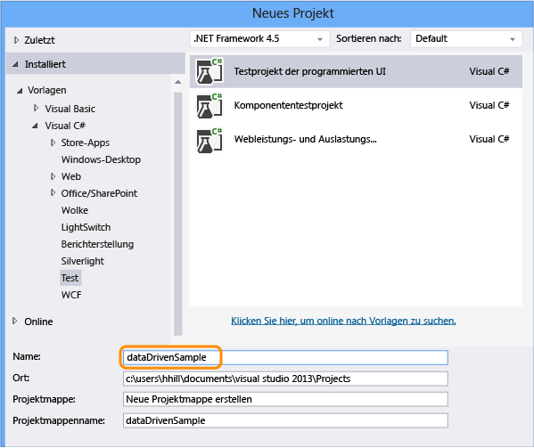

   > [!NOTE]
   > Wenn Ihnen die Vorlage **Test der programmierten UI** nicht angezeigt wird, müssen Sie die Komponente [Test der programmierten UI](../test/use-ui-automation-to-test-your-code.md#install-the-coded-ui-test-component) installieren.

2. Wählen Sie das **Aufzeichnen der Aktionen** aus.

    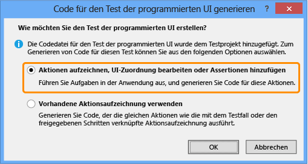

3. Öffnen Sie die Rechner-Anwendung und starten Sie die Testaufzeichnung.

    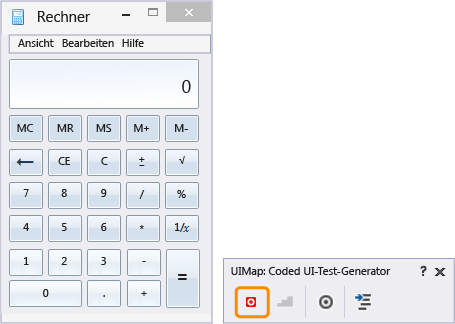

4. Fügen Sie 1 plus 2 hinzu, halten Sie die Aufzeichnung an und generieren Sie die Testmethode. Später werden wir die Werte dieser Benutzereingaben mit Werten aus einer Datendatei ersetzen.

    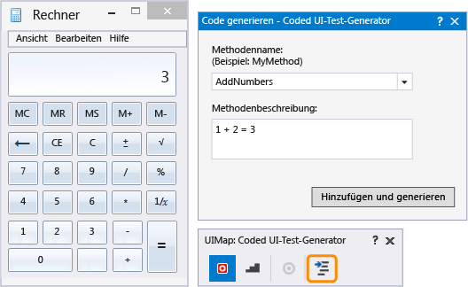

    Schließen Sie den Test-Generator. Die Methode wird dem Test hinzugefügt:

   ```csharp
   [TestMethod]
   public void CodedUITestMethod1()
   {
       // To generate code for this test, select "Generate Code for Coded UI Test"
       // from the shortcut menu and select one of the menu items.
       this.UIMap.AddNumbers();
   }
   ```

5. Verwenden Sie die `AddNumbers()`-Methode, um sicherzustellen, dass der Test ausgeführt wird. Platzieren Sie den Cursor in der oben gezeigten Testmethode, öffnen Sie das Kontextmenü, und wählen Sie **Tests ausführen** aus. (Tastenkombination: **Strg**+**R**,**T**).

    Das Testergebnis, das anzeigt, ob der Test erfolgreich war oder fehlgeschlagen ist, wird im Fenster des **Test-Explorers** angezeigt. Zum Öffnen des Fensters des Test-Explorers wählen Sie aus dem Menü **Test** die Option **Windows** und anschließend **Test-Explorer** aus.

6. Da eine Datenquelle auch zur Assertion von Parameterwerten verwendet werden kann, die vom Test zur Überprüfung erwarteter Werte verwendet wird, fügen wir eine Assertion hinzu, um zu überprüfen, dass die Summe der beiden Zahlen korrekt ist. Platzieren Sie den Cursor in der oben gezeigten Testmethode, öffnen Sie das Kontextmenü, wählen Sie **Code für den Coded UI-Test generieren** und anschließend **Coded UI-Test-Generator verwenden** aus.

    Ordnen Sie das Text-Steuerelement im Rechner zu, der die Summe anzeigt.

    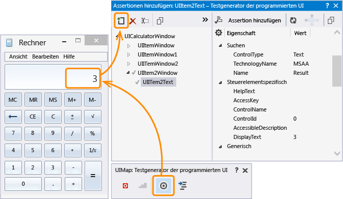

7. Fügen Sie eine Assertion hinzu, die überprüft, ob der Wert der Summe korrekt ist. Wählen Sie die Eigenschaft **DisplayText**, die den Wert **3** hat, und wählen Sie anschließend **Assertion hinzufügen** aus. Verwenden Sie den Vergleichsoperator **AreEqual**, und stellen Sie sicher, dass der Vergleichswert **3** ist.

    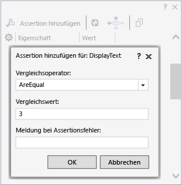

8. Nach dem Konfigurieren der Assertion generieren Sie erneut Code aus dem Generator. Dies erstellt eine neue Methode für die Validierung.

    

    Da die Methode `ValidateSum` die Ergebnisse der Methode `AddNumbers` überprüft, verschieben Sie es an das Ende des Codeblocks.

   ```csharp
   public void CodedUITestMethod1()
   {
       this.UIMap.AddNumbers();
       this.UIMap.ValidateSum();
   }
   ```

9. Stellen Sie sicher, dass der Test mithilfe der Methode `ValidateSum()` ausgeführt wird. Platzieren Sie den Cursor in der oben gezeigten Testmethode, öffnen Sie das Kontextmenü, und wählen Sie **Tests ausführen** aus. (Tastenkombination: **Strg**+**R**,**T**).

     An diesem Punkt werden alle Parameterwerte in ihren Methoden als Konstanten definiert. Als Nächstes erstellen wir ein Dataset, um unseren Test datengesteuert zu machen.

### <a name="step-2---create-a-data-set"></a>Schritt 2: Erstellen eines Datensatzes

1.  Fügen Sie eine Textdatei in das DataDrivenSample-Projekt namens *data.csv* hinzu.

     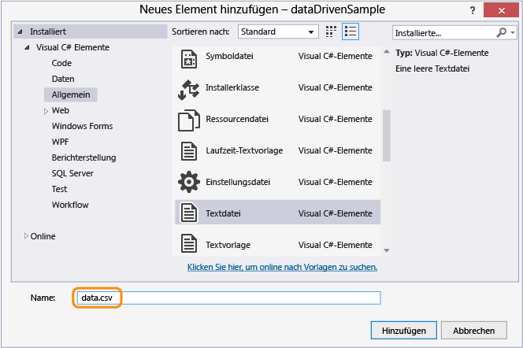

2.  Füllen Sie die *CSV*-Datei mit den folgenden Daten aus:

    |Num1|Num2|Summe|
    |-|-|-|
    |3|4|7|
    |5|6|11|
    |6|8|14|

     Nach dem Hinzufügen der Daten sollte die Datei wie folgt aussehen:

     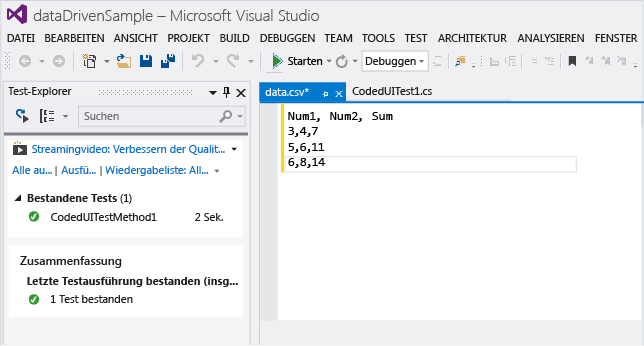

3.  Es ist wichtig, dass die *CSV*-Datei mit der richtigen Codierung gespeichert wird. Wählen Sie im Menü **Datei** die Option **Erweiterte Speicheroptionen** und als Kodierung **Unicode (UTF-8 ohne Signatur) – Codepage 65001** aus.

4.  Die *CSV*-Datei muss in das Ausgabeverzeichnis kopiert werden, damit der Test ausgeführt werden kann. Verwenden Sie das **Eigenschaftenfenster**, um sie zu kopieren.

     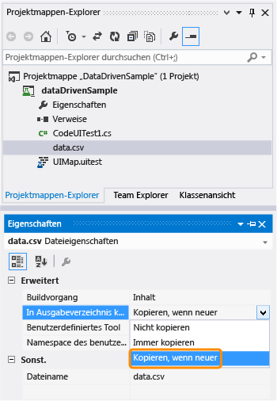

     Da wir jetzt das Dataset erstellt haben, binden wir die Daten für den Test.

### <a name="step-3---add-data-source-binding"></a>Schritt 3: Hinzufügen der Datenquellenbindung

1.  Um die Datenquelle zu binden, fügen Sie ein Attribut `DataSource` innerhalb des vorhandenen Attributs `[TestMethod]` hinzu, das sich direkt über der Testmethode befindet.

    ```csharp
    [DataSource("Microsoft.VisualStudio.TestTools.DataSource.CSV", "|DataDirectory|\\data.csv", "data#csv", DataAccessMethod.Sequential), DeploymentItem("data.csv"), TestMethod]
    public void CodedUITestMethod1()
    {
        this.UIMap.AddNumbers();
        this.UIMap.ValidateSum();
    }
    ```

     Die Datenquelle steht Ihnen jetzt für die Verwendung in dieser Testmethode zur Verfügung.

    > [!TIP]
    > Informationen dazu finden Sie unter [Datenquellen-Attribut-Beispiele](#CreateDataDrivenCUIT_QA_DataSourceAttributes) im Fragen-und-Antworten-Bereich für Beispiele, die andere Datenquellentypen wie XML, SQL Express und Excel verwenden.

2.  Führen Sie den Test aus.

     Beachten Sie, dass der Test über drei Iterationen ausgeführt wird. Der Grund ist, dass die gebundene Datenquelle drei Zeilen mit Daten enthält. Sie werden aber auch feststellen, dass der Test immer noch die konstanten Parameterwerte verwendet und jedes Mal 1 + 2 mit einer Summe von 3 hinzufügen wird.

     Als Nächstes konfigurieren wir den Test, um die Werte in der Datenquelldatei zu verwenden.

### <a name="step-4---use-the-data-in-the-coded-ui-test"></a>Schritt 4: Verwenden der Daten im Test der codierten UI

1. Fügen Sie `using Microsoft.VisualStudio.TestTools.UITesting.WinControls` am Anfang der Datei *CodedUITest.cs* ein:

    ```csharp
    using System;
    using System.Collections.Generic;
    using System.Text.RegularExpressions;
    using System.Windows.Input;
    using System.Windows.Forms;
    using System.Drawing;
    using Microsoft.VisualStudio.TestTools.UITesting;
    using Microsoft.VisualStudio.TestTools.UnitTesting;
    using Microsoft.VisualStudio.TestTools.UITest.Extension;
    using Keyboard = Microsoft.VisualStudio.TestTools.UITesting.Keyboard;
    using Microsoft.VisualStudio.TestTools.UITesting.WinControls;
    ```

2. Fügen Sie `TestContext.DataRow[]` in der Methode `CodedUITestMethod1()` ein, damit die Werte aus der Datenquelle angewendet werden. Die Datenquellenwerten überschreiben die Konstanten, die den UIMap-Steuerelemente mit den Steuerelementen `SearchProperties` zugewiesen sind:

   ```csharp
   public void CodedUITestMethod1()
   {
       this.UIMap.UICalculatorWindow.UIItemWindow.UIItem1Button.SearchProperties[WinButton.PropertyNames.Name] = TestContext.DataRow["Num1"].ToString();
       this.UIMap.UICalculatorWindow.UIItemWindow2.UIItem2Button.SearchProperties[WinButton.PropertyNames.Name] = TestContext.DataRow["Num2"].ToString();
       this.UIMap.AddNumbers();
       this.UIMap.ValidateSumExpectedValues.UIItem3TextDisplayText = TestContext.DataRow["Sum"].ToString();
       this.UIMap.ValidateSum();
    }
    ```

     Verwenden Sie den Editor für den Test der codierten UI, um herauszufinden, zu welchen Sucheigenschaften die Daten codieren werden sollen.

    -   Öffnen Sie die *UIMap.uitest*-Datei.

         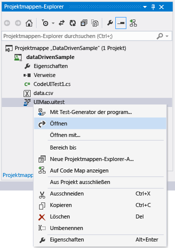

    -   Wählen Sie die UI-Aktion aus und beobachten Sie die entsprechende Zuordnung des UI-Steuerelements. Beachten Sie die Zuordnung des Codes, wie z. B. `this.UIMap.UICalculatorWindow.UIItemWindow.UIItem1Button`.

         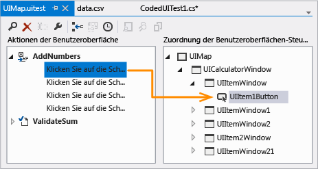

    -   Öffnen Sie im **Eigenschaftenfenster** die Auswahl **Sucheigenschaften**. Der Wert der Sucheigenschaften **Name** ist der Wert, der im Code unter Verwendung der Datenquelle manipuliert wird. Angenommen, den `SearchProperties` werden die Werte in der ersten Spalte jeder Datenzeile zugewiesen: `UIItem1Button.SearchProperties[WinButton.PropertyNames.Name] = TestContext.DataRow["Num1"].ToString();` Bei den drei Iterationen dieses Tests ändert sich der Wert **Name** für die Sucheigenschaft auf 3, dann auf 5 und zuletzt auf 6.

         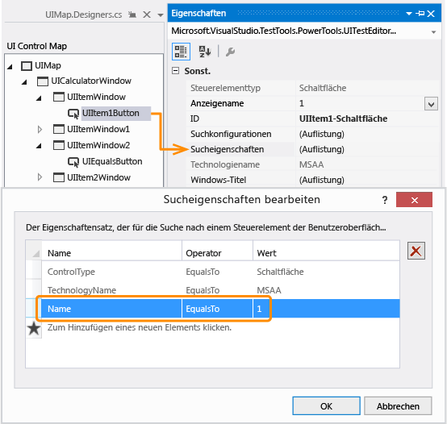

3.  Speichern Sie die Projektmappe.

### <a name="step-5---run-the-data-driven-test"></a>Schritt 5: Ausführen des datengesteuerten Tests

Überprüfen Sie durch erneutes Ausführen des Tests, dass der Test jetzt datengesteuerte ist.

Der Testlauf über die drei Iterationen sollte unter Verwendung der Werte in der *CSV*-Datei angezeigt werden. Die Validierung sollte auch funktionieren und der Test sollte im Test-Explorer als erfolgreich angezeigt werden.

## <a name="q--a"></a>Fragen und Antworten

### <a name="CreateDataDrivenCUIT_QA_DataSourceAttributes"></a>Was bedeuten die Attribute für Datenquellen für andere Datenquellentypen wie SQL Express oder XML?

**Antwort:** Sie können die Beispiel-Datenquellenzeichenfolgen in der folgenden Tabelle verwenden, indem Sie diese in Ihren Code kopieren und die erforderlichen Anpassungen vornehmen.

**Arten von Datenquellen und Attribute**

-   CSV

     `[DataSource("Microsoft.VisualStudio.TestTools.DataSource.CSV", "|DataDirectory|\\data.csv", "data#csv", DataAccessMethod.Sequential), DeploymentItem("data.csv"), TestMethod]`

-   Excel

     `DataSource("System.Data.Odbc", "Dsn=ExcelFiles;Driver={Microsoft Excel Driver (*.xls)};dbq=|DataDirectory|\\Data.xls;defaultdir=.;driverid=790;maxbuffersize=2048;pagetimeout=5;readonly=true", "Sheet1$", DataAccessMethod.Sequential), DeploymentItem("Sheet1.xls"), TestMethod]`

-   Testfall in Team Foundation Server

     `[DataSource("Microsoft.VisualStudio.TestTools.DataSource.TestCase", "http://vlm13261329:8080/tfs/DefaultCollection;Agile", "30", DataAccessMethod.Sequential), TestMethod]`

-   XML

     `[DataSource("Microsoft.VisualStudio.TestTools.DataSource.XML", "|DataDirectory|\\data.xml", "Iterations", DataAccessMethod.Sequential), DeploymentItem("data.xml"), TestMethod]`

-   SQL Express

     `[DataSource("System.Data.SqlClient", "Data Source=.\\sqlexpress;Initial Catalog=tempdb;Integrated Security=True", "Data", DataAccessMethod.Sequential), TestMethod]`

### <a name="q-why-cant-i-modify-the-code-in-the-uimapdesigner-file"></a>Frage: Warum kann ich den Code in der Datei „UIMap.Designer“ nicht ändern?

**Antwort:** Alle Codeänderungen, die Sie an der Datei *UIMapDesigner.cs* vornehmen, werden jedes Mal überschrieben, wenn Sie Code mithilfe des Dialogfelds „UIMap: kodierter UI-Test-Builder“ generieren. In diesem Beispiel sowie in den meisten Fällen können die Codeänderungen, die benötigt werden, um eine Datenquelle in einem Test zu verwenden, an der Quellcodedatei (*CodedUITest1.cs*) des Tests vorgenommen werden.

Wenn Sie eine aufgezeichnete Methode ändern müssen, müssen Sie sie in die *UIMap.cs*-Datei kopieren und umbenennen. Die Datei *UIMap.cs* kann verwendet werden, um Methoden und Eigenschaften in der Datei *UIMapDesigner.cs* zu überschreiben. Sie müssen den Verweis auf die ursprüngliche Methode in der Datei *Coded UITest.cs* entfernen und ihn durch den umbenannten Methodennamen ersetzen.

## <a name="see-also"></a>Siehe auch

- <xref:Microsoft.VisualStudio.TestTools.UITest.Common.UIMap.UIMap>
- <xref:Microsoft.VisualStudio.TestTools.UnitTesting.Assert>
- [Verwenden der Benutzeroberflächenautomatisierung zum Testen des Codes](../test/use-ui-automation-to-test-your-code.md)
- [Erstellen von Tests der programmierten UI](../test/use-ui-automation-to-test-your-code.md)
- [Bewährte Methoden für Tests der programmierten UI](../test/best-practices-for-coded-ui-tests.md)
- [Unterstützte Konfigurationen und Plattformen für Tests der programmierten UI und Aktionsaufzeichnungen](../test/supported-configurations-and-platforms-for-coded-ui-tests-and-action-recordings.md)