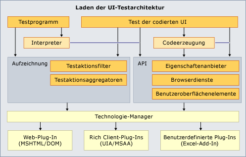

# Erweitern von Tests der codierten UI-Tests und Aktionsaufzeichnungen zur Unterstützung von Microsoft Excel
Das Testframework für Tests der programmierten UI und Aktionsaufzeichnungen unterstützen nicht jede mögliche Benutzeroberfläche. Es kann vorkommen, dass die zu testende Benutzeroberfläche nicht unterstützt wird. Es ist z. B. nicht möglich, direkt einen Test der codierten UI oder eine Aktionsaufzeichnung für ein [!INCLUDE[ofprexcel](../test/includes/ofprexcel_md.md)]-Arbeitsblatt zu erstellen. Die Erweiterbarkeit des Frameworks für Tests der codierten UI bietet Ihnen jedoch die Möglichkeit, eine eigene Erweiterung des Frameworks zu erstellen, die die spezifische Benutzeroberfläche unterstützt. Im folgenden Thema wird ein Beispiel vorgestellt, in dem das Framework erweitert wird, um die Erstellung von Tests der codierten UI und Aktionsaufzeichnungen für [!INCLUDE[ofprexcel](../test/includes/ofprexcel_md.md)] zu unterstützen. Weitere Informationen zu den unterstützten Plattformen finden Sie unter [Unterstützte Konfigurationen und Plattformen für Tests der codierten UI und Aktionsaufzeichnungen](../test/supported-configurations-and-platforms-for-coded-ui-tests-and-action-recordings.md).  
  
 **Anforderungen**  
  
-   Visual Studio Enterprise  
  
 In diesem Abschnitt wird eine Erweiterung des Tests der codierten UI beschrieben, mit der Tests von Excel-Arbeitsblättern aufgezeichnet und wiedergegeben werden können. Entwickler, die eine solche Erweiterung erstellen möchten, finden in diesem Abschnitt und in den Codekommentaren eine Erläuterung der einzelnen Teile der Erweiterung.  
  
   
Architekturübersicht  
  
## Herunterladen des Beispiels  
 Das Beispiel besteht aus vier Projekten in der `CodedUIExtensibilitySample.sln`-Projektmappe:  
  
-   CodedUIextensibilitySample  
  
-   ExcelCodedUIAddInHelper  
  
-   ExcelUICommunicationHelper  
  
-   SampleTestProject  
  
 Rufen Sie das Beispiel aus diesem [Blogbeitrag](http://go.microsoft.com/fwlink/?LinkID=185592) ab.  
  
> [!NOTE]
>  Das Beispiel ist zur Verwendung mit Microsoft Excel 2010 gedacht. Das Beispiel funktioniert möglicherweise mit anderen Versionen von Microsoft Excel, dies wird jedoch derzeit nicht unterstützt.  
  
## Details zum Beispiel  
 Die folgenden Abschnitte enthalten Informationen zum Beispiel und seiner Struktur.  
  
### Microsoft Excel-Add-In: ExcelCodedUIAddinHelper  
 Dieses Projekt enthält ein Add-In, das im Excel-Prozess ausgeführt wird. Eine kurze Übersicht des Add-In-Projekts finden Sie unter [Sample Excel Add-In for Coded UI Testing](../test/sample-excel-add-in-for-coded-ui-testing.md) (Beispiel eines Excel-Add-Ins für den Test der programmierten UI).  
  
 Weitere Informationen finden Sie unter [Exemplarische Vorgehensweise: Erstellen des ersten VSTO-Add-Ins für Excel](http://msdn.microsoft.com/Library/a855e2be-3ecf-4112-a7f5-ec0f7fad3b5f).  
  
### Excel-UI-Kommunikation: ExcelUIcommunicationHelper  
 Dieses Projekt enthält die `IExcelUICommunication`-Schnittstelle und die Informationsklassen, mit denen Daten zwischen dem Framework für den Test der codierten Benutzeroberfläche und Excel übergeben werden. Weitere Informationen finden Sie unter [Beispiel für Excel-Communicator-Schnittstelle](../test/sample-excel-communicator-interface.md).  
  
### Erweiterung für den Test der programmierten UI: CodedUIExentsibilitySample  
 Dieses Projekt enthält die benutzerdefinierten Klassen, die in Tests eines Excel-Arbeitsblatts verwendet werden. Der Code für diese Klassen ist ohne Erläuterung verständlich. Sie finden hier jedoch eine kurze Beschreibung jeder benutzerdefinierten Klasse. Weitere Informationen finden Sie unter [Beispielerweiterung für Tests der programmierten Benutzeroberfläche für Excel](../test/sample-coded-ui-test-extension-for-excel.md).  
  
### Bereitstellen des Add-Ins und der Erweiterung  
 Nachdem Sie alle Projekte und Objekte erstellt haben, führen Sie die bereitgestellte Datei `CopyDrop.bat` als Administrator aus. Diese Datei kopiert die `ExcelCodedUIAddinHelper`-DLL- und PDB-Dateien in:  
  
 "`%CommonProgramFiles(x86)%\Microsoft Shared\VSTT\<version number>\UITestExtensionPackages\*.*`", wobei 11.0, 12.0 usw. die Versionsnummer auf Grundlage Ihrer Visual Studio-Version sein kann.  
  
 Die `ExcelUICommunicationHelper`-DLL- und PDB-Dateien werden nach `"%ProgramFiles(x86)%\Microsoft Visual Studio <version number>\Common7\IDE\PrivateAssemblies"` kopiert.  
  
 Möglicherweise müssen Sie die genauen Kopierpfade anpassen, es ist jedoch keine zusätzliche Installation erforderlich. Verwenden Sie auf einem 64-Bit-Computer die 32-Bit-Eingabeaufforderung von Visual Studio Enterprise, um die Datei `CopyDrop.bat` auszuführen.  
  
### Testen von Excel mit "SampleTestProject"  
 Sie können den Test im bereitgestellten Testprojekt ausführen, in dem eine bestimmte Excel-Version verwendet wird, über die Sie möglicherweise nicht verfügen, oder ein eigenes Testprojekt erstellen und einen eigenen Test aufzeichnen. Weitere Informationen finden Sie unter [Erstellen von Tests der programmierten UI](../test/use-ui-automation-to-test-your-code.md#VerifyingCodeUsingCUITCreate).  
  
## Siehe auch  
 <xref:Microsoft.VisualStudio.TestTools.UITesting.UITestPropertyProvider>   
 <xref:Microsoft.VisualStudio.TestTools.UITest.Extension.UITechnologyElement>   
 <xref:Microsoft.VisualStudio.TestTools.UITest.Common.UITestActionFilter>   
 <xref:Microsoft.VisualStudio.TestTools.UITest.Extension.UITestExtensionPackage>   
 [Verwenden von Benutzeroberflächenautomatisierung zum Testen des Codes](../test/use-ui-automation-to-test-your-code.md)   
 [Best Practices for Coded UI Tests (Bewährte Methoden für Tests der programmierten UI)](../test/best-practices-for-coded-ui-tests.md)   
 [Unterstützte Konfigurationen und Plattformen für Tests der programmierten UI und Aktionsaufzeichnungen](../test/supported-configurations-and-platforms-for-coded-ui-tests-and-action-recordings.md)

