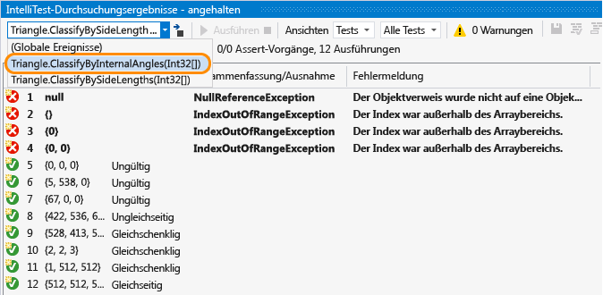
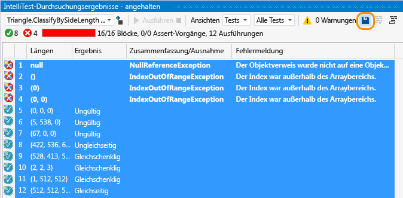
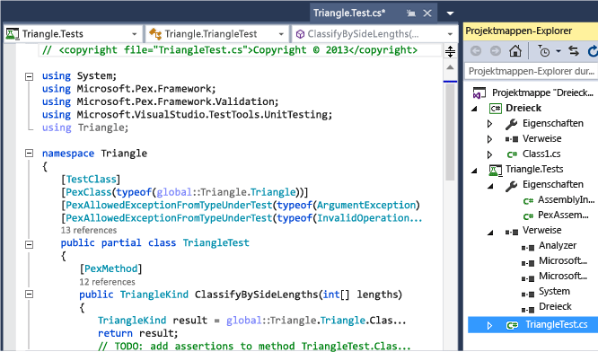
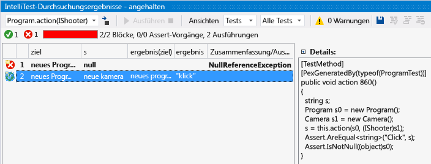

# Generieren von Komponententests für Code mit IntelliTest
IntelliTest untersucht Ihren .NET-Code, um Testdaten und eine Reihe von Komponententests zu erzeugen. Für jede Anweisung im Code wird eine Testeingabe generiert, die die betreffende Anweisung ausführt. Für jede bedingte Verzweigung im Code wird eine Fallanalyse ausgeführt. Beispielsweise werden `if`-Anweisungen, Assertionen und alle Vorgänge analysiert, die Ausnahmen auslösen können. Auf Basis dieser Analyse werden Testdaten für einen parametrisierten Einheitstest jeder Ihrer Methoden erzeugt, wobei Komponententests mit einer hohen Codeabdeckung erstellt werden.

 Wenn Sie IntelliTest ausführen, erkennen Sie ohne weiteres, welche Tests zu einem Fehler führen, und können den erforderlichen Code hinzufügen, um die Fehler zu beseitigen. Sie können wählen, welche der generierten Tests in einem Testprojekt gespeichert werden sollen, um eine Regressionsreihe zu erstellen. Wenn Sie den Code ändern, führen Sie IntelliTest erneut aus, damit die generierten Tests mit den Codeänderungen synchronisiert werden.

## Verfügbarkeit und Erweiterungen

Die Menübefehle **IntelliTest erstellen** und **IntelliTest ausführen**:

* Sind nur in der Enterprise Edition von Visual Studio 2015 und höher verfügbar

* Unterstützen nur C#-Code, der das .NET Framework als Ziel hat

* Sind [erweiterbar](#extend-framework) und unterstützen das Ausgeben von Tests im Format MSTest, MSTest V2, NUnit und xUnit

* Unterstützen keine x64-Konfiguration

## Untersuchen: Verwenden Sie IntelliTest, um Ihren Code zu untersuchen und Komponententests zu generieren.
 Die Typen müssen öffentlich sein, um Komponententests zu generieren. [Erstellen Sie Komponententests](#NoRun) andernfalls, bevor Sie sie generieren.

1.  Öffnen Sie Ihre Projektmappe in Visual Studio. Öffnen Sie dann die Klassendatei, welche die zu testenden Methoden enthält.

2.  Klicken Sie mit der rechten Maustaste auf eine Methode im Code, und wählen Sie **IntelliTest ausführen** , um Komponententests für den Code in der Methode zu generieren.

     

     IntelliTest führt den Code mehrfach mit unterschiedlichen Eingaben aus. Zu jedem Durchlauf werden in der Tabelle die Testeingabedaten und die resultierende Ausgabe oder Ausnahme aufgeführt.

     

     Um Komponententests für alle öffentlichen Methoden in einer Klasse zu generieren, klicken Sie einfach mit der rechten Maustaste auf die Klasse anstatt auf eine bestimmte Methode. Wählen Sie dann **IntelliTest ausführen**. Verwenden Sie die Dropdownliste im Fenster **Durchsuchungsergebnisse**, um die Komponententests und die Eingabedaten für jede Methode der Klasse anzuzeigen.

     

     Prüfen Sie bei bestandenen Tests, ob die gemeldeten Ergebnisse in der Ergebnisspalte den Erwartungen an den Code entsprechen. Korrigieren Sie bei nicht bestandenen Tests den Code entsprechend. Führen Sie dann IntelliTest noch einmal aus, um die Korrekturen zu überprüfen.

## Beibehalten: Speichern Sie die Komponententests als Regressionsreihe.

1.  Wählen Sie die Datenzeilen aus, die Sie mit dem parametrisierten Komponententest in einem Testprojekt speichern möchten.

     

     Sie können das Testprojekt und den erstellten parametrisierten Komponententest anzeigen. Die einzelnen Komponententests, die jeweils einer Zeile entsprechen, werden in der *G.CS*-Datei im Testprojekt gespeichert, und ein parametrisierter Komponententest wird in der entsprechenden *CS*-Datei gespeichert. Sie können die Komponententests wie bei manuell erstellten Komponententests im Test-Explorer ausführen und die Ergebnisse anzeigen.

     

     Dem Testprojekt werden auch alle erforderlichen Verweise hinzugefügt.

     Wenn sich der Methodencode ändert, führen Sie IntelliTest erneut aus, damit die Komponententests mit den Änderungen synchron bleiben.

## Hilfe: Verwenden Sie IntelliTest für die Codeuntersuchung.

1.  Wenn Ihr Code komplizierter ist, hilft Ihnen IntelliTest bei der Untersuchung des Codes. Ein Beispiel: Sie verwenden eine Methode, die eine Schnittstelle als Parameter hat, und diese Schnittstelle wird von mehreren Klassen implementiert. Dann ermittelt IntelliTest diese Klassen und gibt eine Warnung aus.

     Rufen Sie die Warnungen auf, um zu entscheiden, was zu tun ist.

     

2.  Nachdem Sie den Code untersucht haben und wissen, was Sie testen möchten, können Sie die Warnung beheben, indem Sie die Klassen wählen, mit denen die Schnittstelle getestet werden soll.

     

     Diese Wahlmöglichkeit wird der Datei *PexAssemblyInfo.cs* hinzugefügt.

     `[assembly: PexUseType(typeof(Camera))]`

3.  Jetzt können Sie IntelliTest erneut ausführen, um einen parametrisierten Komponententest und Testdaten zu generieren, wobei nur die korrigierte Klasse verwendet wird.

     

## Angeben: Verwenden Sie IntelliTest, um Eigenschaften für die Richtigkeit zu überprüfen, die Sie im Code angeben.

Geben Sie die allgemeine Beziehung zwischen Eingaben und Ausgaben an, die von den generierten Komponententests überprüft werden soll. Diese Spezifikation ist in einer Methode gekapselt, die wie eine Testmethode aussieht, aber universell quantifiziert ist. Dies ist die parametrisierte Komponententestmethode, und alle Assertionen, die Sie vornehmen, müssen für alle möglichen Eingabewerte gelten, die IntelliTest generieren kann.

##  Fragen und Antworten

### F: Kann IntelliTest für nicht verwalteten Code verwendet werden?

**A:** Nein, IntelliTest funktioniert nur mit verwaltetem Code.

### F: Wann gilt ein generierter Test als bestanden oder nicht bestanden?

**A:** Er gilt wie jeder andere Komponententest als bestanden, wenn keine Ausnahmen auftreten. Er gilt als nicht bestanden, wenn eine Assertion fehlschlägt oder wenn der getestete Code eine nicht behandelte Ausnahme auslöst.

 Wenn Sie einen Test haben, der bestanden wird, wenn bestimmte Ausnahmen ausgelöst werden, können Sie je nach Ihren Anforderungen auf Ebene der Testmethode, der Testklasse oder der Assembly eines der folgenden Attribute festlegen:

-   **PexAllowedExceptionAttribute**

-   **PexAllowedExceptionFromTypeAttribute**

-   **PexAllowedExceptionFromTypeUnderTestAttribute**

-   **PexAllowedExceptionFromAssemblyAttribute**

### F: Kann ich dem parametrisierten Komponententest Annahmen hinzufügen?

**A:** Ja. Geben Sie mit Annahmen an, welche Testdaten für den Komponententest einer bestimmten Methode nicht benötigt werden. Verwenden Sie die Klasse <xref:Microsoft.Pex.Framework.PexAssume> , um Annahmen hinzuzufügen. Sie können z. B. die Annahme hinzufügen, dass die Längenvariable ungleich null ist:

 `PexAssume.IsNotNull(lengths);`

 Wenn Sie eine Annahme hinzufügen und IntelliTest erneut ausführen, werden die nicht mehr relevanten Testdaten entfernt.

### F: Kann ich dem parametrisierten Komponententest Assertionen hinzufügen?

**A:** Ja. IntelliTest prüft beim Ausführen der Komponententests, dass die Assertion in Ihrer Anweisung wirklich richtig ist. Verwenden Sie die Klasse <xref:Microsoft.Pex.Framework.PexAssert> oder die Assertions-API aus dem Testframework, um Assertionen hinzufügen. Sie können z. B. die Assertion hinzufügen, dass zwei Variablen gleich sind.

 `PexAssert.AreEqual(a, b);`

 Wenn Sie eine Assertion hinzufügen und IntelliTest erneut ausführen, wird geprüft, ob die Assertion gültig ist; falls nicht, schlägt der Test fehl.

###   F: Kann ich parametrisierte Komponententests generieren, ohne zuerst IntelliTest auszuführen?

**A:** Ja, klicken Sie mit der rechten Maustaste auf die Klasse oder Methode, und wählen Sie dann **IntelliTest erstellen**aus.

 

 Übernehmen Sie das Standardformat, um Ihre Tests zu generieren, oder ändern Sie die Benennung von Projekten und Tests. Sie können ein neues Testprojekt erstellen oder die Tests in einem vorhandenen Projekt speichern.

 

### F: Kann ich andere Komponententestframeworks mit IntelliTest verwenden?

**A:** Ja, führen Sie diese Schritte aus, um [andere Frameworks zu finden und zu installieren](../test/install-third-party-unit-test-frameworks.md).
Testframeworkerweiterungen sind auch in Visual Studio Marketplace verfügbar:

* [NUnit-Erweiterung für die Testgeneratoren](https://marketplace.visualstudio.com/items?itemName=NUnitDevelopers.TestGeneratorNUnitextension-18371)
* [xUnit.net-Erweiterung für die Testgeneratoren](https://marketplace.visualstudio.com/items?itemName=BradWilson.xUnitnetTestExtensions)

Wenn Sie Visual Studio neu gestartet und Ihre Projektmappe geöffnet haben, klicken Sie mit der rechten Maustaste auf die Klasse oder Methode, und wählen Sie dann **IntelliTest erstellen**aus. Wählen Sie hier das installierte Framework aus:

Führen Sie dann IntelliTest aus, um einzelne Komponententests in den zugehörigen *G.CS*-Dateien zu generieren.

### F: Kann ich mehr darüber erfahren, wie die Tests generiert werden?

**A:** Ja, einen allgemeinen Überblick finden Sie in diesem [Blogbeitrag](https://blogs.msdn.microsoft.com/devops/2015/07/05/intellitest-one-test-to-rule-them-all/).
