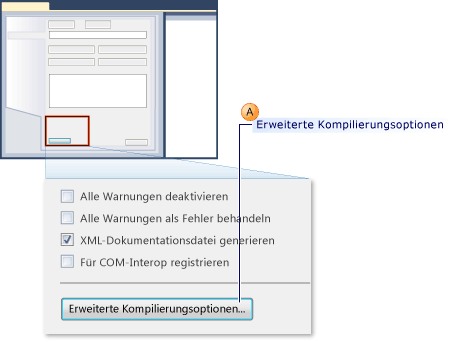
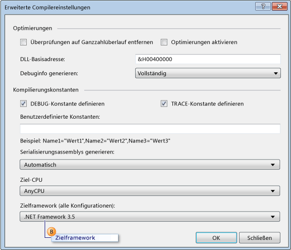

# Gewusst wie: Konfigurieren von Komponententests zur Ausrichtung auf eine fr&#252;here Version von .NET Framework
[!INCLUDE[vs2017banner](../code-quality/includes/vs2017banner.md)]

Wenn Sie ein Testprojekt in Microsoft Visual Studio erstellen, wird die neueste Version von .NET Framework als Ziel, standardmäßig festgelegt.  Wenn Sie Testprojekte von früheren Versionen von Visual Studio aktualisieren, werden sie aktualisiert, um auf die aktuelle Version von .NET Framework festzulegen.  Indem Sie die Projekteigenschaften bearbeiten, können Sie das Projekt in früheren Versionen von .NET Framework umleiten explizit.  
  
 Sie können Komponententestprojekte erstellen, die für bestimmte Versionen von .NET Framework abzielen.  Die verwendete Version muss 3,5 oder höher sein und kann keine Clientversion sein.  Visual Studio bietet die folgende grundlegende Unterstützung für Komponententests, die für bestimmte Versionen ausgerichtet sind:  
  
-   Sie können Komponententestprojekte erstellen und darauf zu einer bestimmten Version von .NET Framework abzielen.  
  
-   Sie können Komponententests, die auf eine bestimmte Version von .NET Framework von Visual Studio auf dem lokalen Computer ausgelegt.  
  
-   Sie können Komponententests, die auf eine bestimmte Version von .NET Framework abzielen, über einen Aufruf von MSTest.exe von der Eingabeaufforderung verwenden.  
  
-   Sie können Komponententests auf einem Build\-Agent als Teil eines Builds ausführen.  
  
 **Tests\-SharePoint\-Anwendungen**  
  
 Die Funktionen, die weiter oben aufgeführten aktivieren Sie auch, um Komponententests und Integrationstests für SharePoint\-Anwendungen mit Visual Studio zu schreiben.  [!INCLUDE[crabout](../test/includes/crabout_md.md)], wie SharePoint\-Anwendungen mit Visual Studio finden, [Erstellen von SharePoint\-Lösungen](/office-dev/office-dev/create-sharepoint-solutions), [Erstellen und Debuggen von SharePoint\-Lösungen](/office-dev/office-dev/building-and-debugging-sharepoint-solutions) und [Überprüfen und Debuggen von SharePoint\-Code](/office-dev/office-dev/verifying-and-debugging-sharepoint-code) entwickelt.  
  
 **Einschränkungen**  
  
 Die folgenden Einschränkungen gelten, wenn Sie die Testprojekte umleiten, frühere Versionen von .NET Framework zu verwenden:  
  
-   In .NET Framework 3.5 wird die Festlegung von mehreren Zielversionen nur für Testprojekte unterstützt, die ausschließlich Komponententests enthalten.  .NET Framework 3.5 unterstützt keine anderen Testtypen, z. B. codierte Benutzeroberflächen\- oder Auslastungstest.  Die Neudefinition der Zielversion wird für andere Testtypen als Komponententests blockiert.  
  
-   Ausführung von Tests auf, die an einer früheren Version von .NET Framework abzielen, wird nur im Standardhostadapter unterstützt.  Im ASP.NET\-Hostadapter wird sie nicht unterstützt.  ASP.NET\-Anwendungen, die im ASP.NET Development Server\-Kontext ausgeführt werden müssen, müssen mit der aktuellen Version von .NET Framework kompatibel sein.  
  
-   Die Unterstützung der Datensammlung wird deaktiviert, wenn Sie Tests ausführen, welche die .NET Framework 3.5\-Funktion zur Festlegung von mehreren Zielversionen unterstützen.  Sie können mit den Visual Studio\-Befehlszeilentools Testläufe ausführen, denen Statistiken zur Codeabdeckung zugeordnet sind.  
  
-   Komponententests, die .NET Framework 3.5 verwenden, können nicht auf einem Remotecomputer ausgeführt werden.  
  
-   Sie können auf Komponententests nicht auf früheren Clientversionen des Frameworks abzielen.  
  
### Umleiten zu einer bestimmten Version von .NET Framework für Visual Basic\-Komponententestprojekte  
  
1.  Erstellen Sie ein neues Visual Basic\-Komponententestprojekt.  Wählen Sie im Menü **Datei** die Option **Neu** aus, und klicken Sie dann auf **Projekt**.  
  
     Das Dialogfeld **Neues Projekt** wird angezeigt.  
  
2.  Erweitern Sie unter **Installierte Vorlagen** den Ordner **Visual Basic**.  Wählen Sie **Test** und anschließend die Vorlage **Testprojekt** aus.  
  
3.  Im Textfeld **Name** geben Sie einen Namen für das Visual Basic\-Testprojekt ein und wählen Sie dann **OK** aus.  
  
4.  Wählen Sie im Projektmappen\-Explorer, im Kontextmenü des neuen Visual Basic\-Testprojekts **Eigenschaften** aus.  
  
     Die Eigenschaften des Visual Basic\-Testprojekts werden angezeigt.  
  
5.  Auf der Registerkarte **Kompilieren** wählen Sie wie in der folgenden Abbildung gezeigt **Erweiterte Kompilierungsoptionen** aus.  
  
       
  
6.  Verwenden Sie die Dropdownliste **Zielframework \(alle Konfigurationen\)**, um das Zielframework auf **.NET Framework 3.5** oder eine höhere Version zu ändern wie in Legende B der folgenden Abbildung dargestellt.  Sie sollten eine Clientversion nicht angeben.  
  
       
  
### Umleiten zu einer bestimmten Version von .NET Framework für Visual C\#\-Komponententestprojekte  
  
1.  Erstellen Sie ein neues Visual C\#\-Komponententestprojekt.  Wählen Sie im Menü **Datei** die Option **Neu** aus, und klicken Sie dann auf **Projekt**.  
  
     Das Dialogfeld **Neues Projekt** wird angezeigt.  
  
2.  Erweitern Sie unter **Installierte Vorlagen** den Ordner **Visual C\#**.  Wählen Sie **Test** und anschließend die Vorlage **Testprojekt** aus.  
  
3.  Im Textfeld **Name** geben Sie einen Namen für das Visual C\#\-Testprojekt ein und wählen Sie dann **OK** aus.  
  
4.  Wählen Sie im Projektmappen\-Explorer, im Kontextmenü des neuen Visual C\#testprojekts **Eigenschaften** aus.  
  
     Die Eigenschaften des Visual C\#\-Testprojekts werden angezeigt.  
  
5.  Auf der Registerkarte **Anwendung** wählen Sie dann oder höher aus der Dropdownliste **Zielframework**, um das Ziel framework.as zu ändern, das in der folgenden Abbildung.  Sie sollten eine Clientversion nicht angeben.  
  
       
  
### Umleiten zu einer bestimmten Version von .NET Framework für C\+\+\/CLI\-Komponententestprojekte  
  
1.  Erstellen Sie ein neues C\+\+\-Komponententestprojekt.  Klicken Sie im Menü **Datei** auf **Neu** und dann auf **Projekt**.  
  
     Das Dialogfeld **Neues Projekt** wird angezeigt.  
  
    > [!WARNING]
    >  Um C\+\+\/CLI\-Komponententests für eine frühere Version des .NET\-Frameworks für Visual C\+\+ erstellen, müssen Sie die entsprechende Version von Visual Studio.  Zur Festlegung auf .NET Framework 3.5, müssen Sie [!INCLUDE[vs_orcas_long](../debugger/includes/vs_orcas_long_md.md)] und [!INCLUDE[vs_orcas_long](../debugger/includes/vs_orcas_long_md.md)] Service Pack 1 installieren.  
  
2.  Erweitern Sie unter **Installierte Vorlagen** den Ordner **Visual C\+\+**.  Wählen Sie **Test** und anschließend die Vorlage **Testprojekt** aus.  
  
3.  Geben Sie im Textfeld **Name** einen Namen für das Visual C\+\+\-Testprojekt ein, und klicken Sie dann auf **OK**.  
  
4.  Wählen Sie im Projektmappen\-Explorer, der das neue Visual C\+\+\-Testprojekt **Projekt entladen** aus.  
  
5.  Wählen Sie im Projektmappen\-Explorer, das entladen akzeptierte Visual C\+\+\-Testprojekt aus und wählen dann **Bearbeiten \<Projektname\>.vcxproj** aus.  
  
     Die VCXPROJ\-Datei wird im Editor geöffnet.  
  
6.  Legen Sie `TargetFrameworkVersion` auf Version 3.5 fest, oder eine höhere Version in `PropertyGroup` beschriftete `"Globals"`.  Sie sollten eine Clientversion nicht angeben:  
  
    ```  
    <PropertyGroup Label="Globals">  
        <TargetName>DefaultTest</TargetName>  
        <ProjectTypes>{3AC096D0-A1C2-E12C-1390-A8335801FDAB};{8BC9CEB8-8B4A-11D0-8D11-00A0C91BC942}</ProjectTypes>  
        <ProjectGUID>{CE16D77A-E364-4ACD-948B-1EB6218B0EA3}</ProjectGUID>  
        <TargetFrameworkVersion>3.5</TargetFrameworkVersion>  
        <Keyword>ManagedCProj</Keyword>  
        <RootNamespace>CPP_Test</RootNamespace>  
      </PropertyGroup>  
  
    ```  
  
7.  Speichern und schließen Sie die VCXPROJ\-Datei.  
  
8.  Wählen Sie im Projektmappen\-Explorer, **Projekt erneut laden** auswählen im Kontextmenü des neuen Visual C\+\+\-Testprojekts aus.  
  
## Siehe auch  
 [Creating and Running Unit Tests for Existing Code](http://msdn.microsoft.com/de-de/e8370b93-085b-41c9-8dec-655bd886f173)   
 [Erstellen von SharePoint\-Lösungen](/office-dev/office-dev/create-sharepoint-solutions)   
 [Erstellen und Debuggen von SharePoint\-Lösungen](/office-dev/office-dev/building-and-debugging-sharepoint-solutions)   
 [Dialogfeld "Erweiterte Compilereinstellungen \(Visual Basic\)](../ide/reference/advanced-compiler-settings-dialog-box-visual-basic.md)