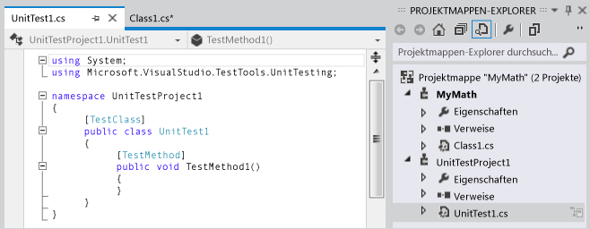
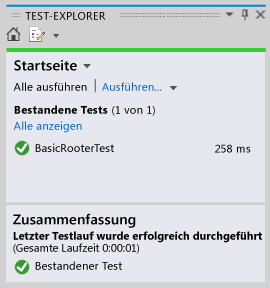
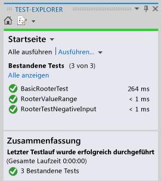

# <a name="quickstart-test-driven-development-with-test-explorer"></a>Schnellstart: Testgesteuerte Entwicklung mit dem Test-Explorer

Es wird empfohlen, Komponententests zu erstellen, damit der Code in den vielen Schritten der inkrementellen Entwicklung ordnungsgemäß funktioniert. Es gibt mehrere Frameworks, die Sie nutzen können, um Komponententests zu schreiben, darunter auch einige von Drittanbietern. Einige Testframeworks wurden speziell zum Testen in verschiedenen Sprachen oder Plattformen entwickelt. Der Test-Explorer stellt eine zentrale Oberfläche für Komponententests in einem dieser Frameworks bereit. Für die am häufigsten verwendeten Frameworks sind Adapter verfügbar. Sie können auch eigene Adapter für andere Frameworks schreiben.

Der Test-Explorer löst die Komponententestfenster früherer Versionen von Visual Studio ab. Seine Vorteile:

- Sie können .NET-, nicht verwaltete und Datenbanktests sowie alle weiteren Arten von Tests über eine einzige Oberfläche ausführen.

- Sie können das Komponententestframework Ihrer Wahl verwenden, z.B. NUnit- oder MSTest-Frameworks.

- Sie können alle benötigten Informationen in einem Fenster anzeigen.

## <a name="use-test-explorer"></a>Verwenden des Test-Explorers


### <a name="to-run-unit-tests-by-using-test-explorer"></a>So führen Sie Komponententests mithilfe des Test-Explorers aus

1. Erstellen Sie Komponententests, die die Testframeworks Ihrer Wahl verwenden. Erstellen Sie beispielsweise einen Test, der das MSTest-Framework verwendet:

   1. Erstellen Sie ein neues **Komponententestprojekt** für C#, Visual Basic oder C++.

   2. Schreiben Sie jeden Komponententest als Methode. Stellen Sie jeder Testmethode das `[TestMethod]` -Attribut als Präfix voran.

2. Wenn einzelne Tests keine Abhängigkeiten haben, die verhindern, dass sie in beliebiger Reihenfolge ausgeführt werden können, sollten Sie parallele Testausführung über die  -Umschaltfläche auf der Symbolleiste aktivieren. Dadurch lässt sich die Zeit deutlich verkürzen, die zum Ausführen aller Tests erforderlich ist.

3. Klicken Sie in der Menüleiste auf **Test** > **Komponententests ausführen** > **Alle Tests**.

    Die Projektmappe wird erstellt, und die Tests werden ausgeführt.

    Der Test-Explorer wird geöffnet und zeigt eine Zusammenfassung der Ergebnisse an.

   **So können Sie eine vollständige Liste der Tests anzeigen:** Klicken Sie in einer beliebigen Kategorie auf **Alle anzeigen**.

   **So können Sie Details zu Testergebnissen anzeigen:** Wählen Sie den Test im Test-Explorer aus, um Details wie Ausnahmemeldungen im Detailbereich anzuzeigen.

   **So können Sie zum Code eines Tests navigieren:** Doppelklicken Sie im Test-Explorer auf den Test, oder wählen Sie im Kontextmenü die Option **Test öffnen** aus.

   **So debuggen Sie einen Test:** Öffnen Sie das Kontextmenü für einen oder mehrere Tests, und wählen Sie dann die Option **Ausgewählte Tests debuggen** aus.

> [!IMPORTANT]
> Die Ergebnisse, die angezeigt werden, gelten für den jeweils zuletzt ausgeführten Testlauf. Die farbige Ergebnisleiste zeigt nur die Ergebnisse von Tests an, die ausgeführt wurden. Wenn Sie z. B. mehrere Tests ausführen, davon einige fehlschlagen, und Sie dann nur die erfolgreichen Tests ausführen, ist die Ergebnisleiste ganz grün.


> [!NOTE]
> Wenn kein Test angezeigt wird, überprüfen Sie, ob Sie einen Adapter installiert haben, um Test-Explorer mit dem Testframework, das Sie verwenden, zu verbinden. Weitere Informationen finden Sie unter [Installieren von Frameworks für Komponententests von Drittanbietern](install-third-party-unit-test-frameworks.md).

## <a name="walkthrough-using-unit-tests-to-develop-a-method"></a>Exemplarische Vorgehensweise: Verwenden von Komponententests zur Entwicklung einer Methode

Diese exemplarische Vorgehensweise veranschaulicht, wie eine getestete Methode in C# mithilfe des Microsoft-Komponententest-Frameworks entwickelt wird. Sie können es problemlos für andere Sprachen und zur Verwendung anderer Testframeworks wie NUnit anpassen. Weitere Informationen finden Sie unter [Installieren von Frameworks für Komponententests von Drittanbietern](install-third-party-unit-test-frameworks.md).

### <a name="create-the-test-and-method"></a>Erstellen des Tests und der Methode

1. Erstellen Sie ein C#-**Klassenbibliotheksprojekt**. Dieses Projekt enthält den Code, den Sie bereitstellen möchten. In diesem Beispiel hat es den Namen `MyMath`.

2. Erstellen Sie ein neues Projekt **Komponententestprojekt**.

   

3. Schreiben Sie eine einfache Testmethode. Überprüfen Sie das Ergebnis, das für eine bestimmte Eingabe erreicht wurde:

   ```csharp

   [TestMethod]
   public void BasicRooterTest()
   {
     // Create an instance to test:
     Rooter rooter = new Rooter();
     // Define a test input and output value:
     double expectedResult = 2.0;
     double input = expectedResult * expectedResult;
     // Run the method under test:
     double actualResult = rooter.SquareRoot(input);
     // Verify the result:
     Assert.AreEqual(expectedResult, actualResult,
         delta: expectedResult / 100);
   }
   ```

4. Generieren Sie die Methode von dem Test.

   1.  Platzieren Sie den Cursor auf `Rooter`, und klicken Sie im Kontextmenü auf **Generieren** > **Neuer Typ**.

   2.  Legen Sie im Dialogfeld **Neuen Typ generieren** unter **Projekt** das Klassenbibliotheksprojekt fest. In diesem Beispiel ist dies `MyMath`.

   3.  Platzieren Sie den Cursor auf `SquareRoot`, und klicken Sie im Kontextmenü auf **Generieren**  > **Methodenstub**.

5. Führen Sie den Komponententest aus.

   1.  Klicken Sie im Menü **Test** auf **Komponententests ausführen** > **Alle Tests**.

        Die Projektmappe wird erstellt und ausgeführt.

        Test-Explorer wird geöffnet und zeigt die Ergebnisse an.

        Der Test wird unter **Fehlgeschlagene Tests**angezeigt:

6. Wählen Sie den Namen des Tests aus.

    Die Details des Tests werden im unteren Teil des Test-Explorers angezeigt.

7. Wählen Sie die Elemente unter **Stapelüberwachung** aus, um festzustellen, wo der Test fehlgeschlagen ist.

   

   Sie haben jetzt einen Test und einen Stub erstellt, die Sie ändern werden, damit der Test erfolgreich verläuft.

#### <a name="after-every-change-make-all-the-tests-pass"></a>Sorgen Sie dafür, dass der Test nach jeder Änderung erfolgreich verläuft.

1.  Verbessern Sie in *MyMath\Rooter.cs* den Code von `SquareRoot`:

    ```csharp
    public double SquareRoot(double input)
     {
       return input / 2;
     }
    ```

2.  Wählen Sie im Test-Explorer **Alle ausführen**aus.

     Der Code wird erstellt, und der Test wird ausgeführt.

     Der Test wurde erfolgreich ausgeführt.

     

#### <a name="add-tests-to-extend-the-range-of-inputs"></a>Fügen Sie Tests hinzu, um den Eingabebereich zu erweitern

1.  Um sich sicherer sein zu können, dass Ihr Code in allen Fällen funktioniert, fügen Sie Tests hinzu, die einen größeren Bereich an Eingabewerten testen.

    > [!TIP]
    > Vermeiden Sie, vorhandene erfolgreiche Tests zu ändern. Fügen Sie stattdessen lieber neue Tests hinzu. Ändern Sie vorhandene Tests nur, wenn sich die Benutzeranforderungen ändern. Dieses Vorgehen hilft sicherzustellen, dass durch die Erweiterung des Codes keine vorhandene Funktionalität verloren geht.

     Fügen Sie in der Testklasse den folgenden Test hinzu, der einen Bereich von Eingabewerten testet:

    ```csharp
    [TestMethod]
    public void RooterValueRange()
    {
      // Create an instance to test:
      Rooter rooter = new Rooter();
      // Try a range of values:
      for (double expectedResult = 1e-8;
          expectedResult < 1e+8;
          expectedResult = expectedResult * 3.2)
      {
        RooterOneValue(rooter, expectedResult);
      }
    }

    private void RooterOneValue(Rooter rooter, double expectedResult)
    {
      double input = expectedResult * expectedResult;
      double actualResult = rooter.SquareRoot(input);
      Assert.AreEqual(expectedResult, actualResult,
          delta: expectedResult / 1000);
    }
    ```

2.  Wählen Sie im Test-Explorer **Alle ausführen**aus.

     Der neue Test schlägt fehl, obwohl der erste Test weiterhin erfolgreich verläuft.

     Um die Fehlerursache herauszufinden, wählen Sie den fehlgeschlagenen Test aus. Wählen Sie dann im unteren Teil des Test-Explorers das oberste Element der **Stapelüberwachung**aus.

3.  Überprüfen Sie die zu testende Methode, um zu sehen, was falsch sein könnte. Schreiben Sie den Code der `MyMath.Rooter` -Klasse neu:

    ```csharp
    public double SquareRoot(double input)
    {
      double result = input;
      double previousResult = -input;
      while (Math.Abs(previousResult - result) > result / 1000)
      {
        previousResult = result;
        result = result - (result * result - input) / (2 * result);
      }
      return result;
    }
    ```

4.  Wählen Sie im Test-Explorer **Alle ausführen**aus.

     Beide Tests sind nun erfolgreich.

#### <a name="add-tests-for-exceptional-cases"></a>Hinzufügen von Tests für Sonderfälle

1.  Fügen Sie einen Test für negative Eingaben hinzu:

    ```csharp
    [TestMethod]
     public void RooterTestNegativeInputx()
     {
         Rooter rooter = new Rooter();
         try
         {
             rooter.SquareRoot(-10);
         }
         catch (ArgumentOutOfRangeException e)
         {
             return;
         }
         Assert.Fail();
     }
    ```

2.  Wählen Sie im Test-Explorer **Alle ausführen**aus.

     Die zu testende Methode bildet eine Schleife und muss manuell abgebrochen werden.

3.  Wählen Sie **Abbrechen**aus.

     Der Test wird nach 10 Sekunden beendet.

4.  Beheben Sie den Code der Methode:

    ```csharp

    public double SquareRoot(double input)
    {
      if (input <= 0.0)
      {
        throw new ArgumentOutOfRangeException();
      }
    ...
    ```

5.  Wählen Sie im Test-Explorer **Alle ausführen**aus.

     Alle Tests sind erfolgreich.

#### <a name="refactor-without-changing-tests"></a>Den Code umgestalten, ohne Tests zu ändern

1.  Vereinfachen Sie den Code, ohne jedoch die Tests zu ändern.

    > [!TIP]
    > Eine *Umgestaltung* ist eine Änderung, die vorgenommen wird, damit der Code besser funktioniert oder verständlicher wird. Eine Umgestaltung sieht nicht vor, das Verhalten des Codes zu ändern. Deshalb werden die Tests nicht geändert.
    >
    > Es wird empfohlen, die Schritte der Umgestaltung separat von den Schritten auszuführen, die die Funktionalität erweitern. Wenn Sie die Tests nicht ändern, können Sie sichergehen, dass während der Umgestaltung nicht versehentlich Fehler eingebaut wurden.

    ```csharp
    public class Rooter
    {
      public double SquareRoot(double input)
      {
        if (input <= 0.0)
        {
          throw new ArgumentOutOfRangeException();
        }
        double result = input;
        double previousResult = -input;
        while (Math.Abs(previousResult - result) > result / 1000)
        {
          previousResult = result;
          result = (result + input / result) / 2;
          //was: result = result - (result * result - input) / (2*result);
        }
        return result;
      }
    }
    ```

2.  Wählen Sie **Alle ausführen**aus.

     Alle Tests sind weiterhin erfolgreich.

     
