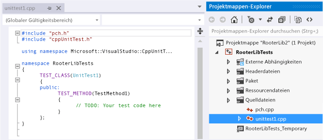
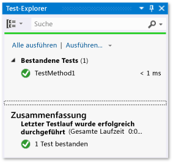
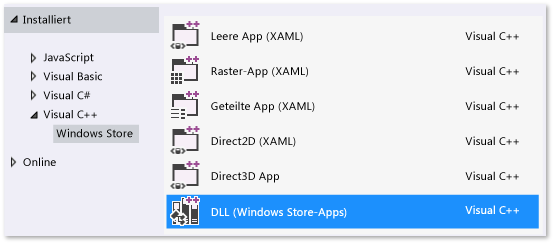
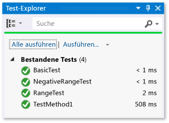

# <a name="how-to-test-a-visual-c-dll"></a>Vorgehensweise: Testen einer Visual C++-DLL

In diesem Artikel wird eine Möglichkeit zum Erstellen von Komponententests für eine C++-DLL für UWP-Apps (Universelle Windows-Plattform) mit dem Microsoft-Testframework für C++ dargestellt. Die RooterLib-DLL implementiert eine Funktion zum annähernden Berechnen der Quadratwurzel einer vorgegebenen Zahl, und zwar in einer Weise, die entfernt an Grenzwertberechnungen in der Analysis erinnert. Die DLL kann dann in eine UWP-App eingeschlossen werden, die Benutzern Spaß an der Mathematik vermittelt.

 In diesem Thema wird gezeigt, wie Komponententests als erster Schritt in der Entwicklung verwendet werden. Bei dieser Vorgehensweise schreiben Sie zuerst eine Testmethode, die ein bestimmtes Verhalten in Ihrem Testsystem überprüft. Anschließend schreiben Sie den Code, der im Test erfolgreich ist. Durch das Ändern der Reihenfolge bei den folgenden Prozeduren, können Sie diese Strategie umkehren und zuerst den zu testenden Code und anschließend die Komponententests schreiben.

 In diesem Thema werden auch eine einzelne Visual Studio-Projektmappe und separate Projekte für die zu testenden Komponententests und DLLs erstellt. Sie können die Komponententests auch direkt in das DLL-Projekt einfügen, oder Sie können separate Lösungen für die Komponententests und die DLL erstellen. Hinweise dazu, welche Struktur verwendet werden soll, erhalten Sie unter [Ausführen von Komponententests für vorhandene C++-Anwendungen mit dem Test-Explorer](../test/how-to-use-microsoft-test-framework-for-cpp.md).

##  <a name="Create_the_solution_and_the_unit_test_project"></a> Erstellen der Projektmappe und des Komponententestprojekts

1.  Klicken Sie im Menü **Datei** auf **Neu** > **Neues Projekt**.

2.  Erweitern Sie im Dialogfeld „Neues Projekt“ den Eintrag **Installiert** > **Visual C++**, und wählen Sie **Windows Universal** aus. Klicken Sie dann in der Liste der Projektvorlagen auf **Komponententest-App (Universelle Windows-App)**.

3.  Geben Sie dem Projekt den Namen `RooterLibTests`, legen Sie den Speicherort fest, geben Sie der Projektmappe den Namen `RooterLib`, und stellen Sie sicher, dass die Option **Projektmappenverzeichnis erstellen** aktiviert ist.

     

4.  Öffnen Sie im neuen Projekt **unittest1.cpp**.

     

     Hinweis:

    -   Jeder Test wird definiert, indem `TEST_METHOD(YourTestName){...}` verwendet wird.

         Sie müssen keine herkömmliche Funktionssignatur schreiben. Die Signatur wird durch das Makro TEST_METHOD erstellt. Das Makro generiert eine Instanzfunktion ohne Rückgabe. Es generiert außerdem eine statische Funktion, die Informationen zur Testmethode zurückgibt. Diese Informationen ermöglichen dem Test-Explorer, die Methode zu finden.

    -   Testmethoden werden in Klassen zusammengefasst, indem `TEST_CLASS(YourClassName){...}`verwendet wird.

         Wenn die Tests ausgeführt werden, wird eine Instanz jeder Testklasse erstellt. Die Testmethoden werden in einer nicht vorgegebenen Reihenfolge aufgerufen. Sie können spezielle Methoden definieren, die vor und nach jedem Modul, jeder Klasse oder Methode aufgerufen werden. Weitere Informationen finden Sie unter [Verwenden von Microsoft.VisualStudio.TestTools.CppUnitTestFramework](how-to-use-microsoft-test-framework-for-cpp.md).

##  <a name="Verify_that_the_tests_run_in_Test_Explorer"></a> Sicherstellen, dass die Tests im Test-Explorer ausgeführt werden

1.  Fügen Sie den Testcode ein:

    ```cpp
    TEST_METHOD(TestMethod1)
    {
        Assert::AreEqual(1,1);
    }
    ```

     Beachten Sie, dass die `Assert` -Klasse mehrere statische Methoden zur Verfügung stellt, die Sie verwenden können, um Ergebnisse in den Testmethoden zu überprüfen.

2.  Wählen Sie im Menü **Test** die Option **Ausführen** und dann **Alle ausführen** aus.

     Das Testprojekt wird erstellt und ausgeführt. Das Fenster **Test-Explorer** wird angezeigt, und der Test wird unter **Bestandene Tests** aufgeführt. Unten im Fenster im Bereich **Zusammenfassung** werden weitere Informationen zum ausgewählten Test angezeigt.

     

##  <a name="Add_the_DLL_project_to_the_solution"></a> Hinzufügen des DLL-Projekts zur Projektmappe

1.  Wählen Sie im **Projektmappen-Explorer** den Projektmappennamen aus. Wählen Sie im Kontextmenü **Hinzufügen** und dann **Neues Projekt hinzufügen** aus.

     

2.  Klicken Sie im Dialogfeld **Neues Projekt hinzufügen** auf die Option **DLL (UWP-Apps)**.

3.  Fügen Sie der *RooterLib.h*-Datei den folgenden Code hinzu:

    ```cpp
    // The following ifdef block is the standard way of creating macros which make exporting
    // from a DLL simpler. All files within this DLL are compiled with the ROOTERLIB_EXPORTS
    // symbol defined on the command line. This symbol should not be defined on any project
    // that uses this DLL. This way any other project whose source files include this file see
    // ROOTERLIB_API functions as being imported from a DLL, whereas this DLL sees symbols
    // defined with this macro as being exported.
    #ifdef ROOTERLIB_EXPORTS
    #define ROOTERLIB_API  __declspec(dllexport)
    #else
    #define ROOTERLIB_API __declspec(dllimport)
    #endif //ROOTERLIB_EXPORTS

    class ROOTERLIB_API CRooterLib {
    public:
        CRooterLib(void);
        double SquareRoot(double v);
    };
    ```

     Die Kommentare enthalten nicht nur für den Entwickler der DLL, sondern auch für alle Anwender, die in ihrem Projekt auf die DLL verweisen, Erläuterungen zum ifdef-Block. Sie können das ROOTERLIB_EXPORTS-Symbol in der Befehlszeile mithilfe der Projekteigenschaften der DLL hinzufügen.

     Die `CRooterLib`-Klasse deklariert einen Konstruktor und die `SqareRoot`-Abschätzermethode.

4.  Fügen Sie der Befehlszeile das ROOTERLIB_EXPORTS-Symbol hinzu.

    1.  Wählen Sie im **Projektmappen-Explorer** das Projekt **RooterLib** aus, und klicken Sie anschließend im Kontextmenü auf **Eigenschaften**.

         

    2.  Erweitern Sie im Dialogfeld **RooterLib Property Page** (RooterLib-Eigenschaftenseite) die Option **Konfigurationseigenschaften** und anschließend **C++**, und wählen Sie **Präprozessor** aus.

    3.  Wählen Sie **\<Bearbeiten...>** aus der Liste **Präprozessordefinitionen** aus, und fügen Sie anschließend `ROOTERLIB_EXPORTS` zum Dialogfeld **Präprozessordefinitionen** hinzu.

5.  Fügen Sie minimale Implementierungen der deklarierten Funktionen hinzu. Öffnen Sie *RooterLib.cpp* und fügen Sie den folgenden Code hinzu:

    ```cpp
    // constructor
    CRooterLib::CRooterLib()
    {
    }

    // Find the square root of a number.
    double CRooterLib::SquareRoot(double v)
    {
        return 0.0;
    }

    ```

##  <a name="make_the_dll_functions_visible_to_the_test_code"></a> Sichtbarmachen der DLL-Funktionen für den Testcode

1. Fügen Sie dem Projekt "RooterLibTests" "RooterLib" hinzu.

   1.  Wählen Sie im **Projektmappen-Explorer** das Projekt **RooterLibTests** aus, und klicken Sie anschließend im Kontextmenü auf **Verweise**.

   2.  Erweitern Sie im Dialogfeld **RooterLib Project Properties** (RooterLib-Projekteigenschaften) die Option **Allgemeine Eigenschaften**, und wählen Sie **Framework und Verweise** aus.

   3.  Klicken Sie auf **Neuen Verweis hinzufügen**.

   4.  Erweitern Sie im Dialogfeld **Verweis hinzufügen** den Eintrag **Projektmappe**, und wählen Sie **Projekte** aus. Wählen Sie dann das Element **RouterLib** aus.

2. Fügen Sie die RooterLib-Headerdatei in *unittest1.cpp* ein.

   1.  Öffnen *unittest1.cpp*.

   2.  Fügen Sie diesen Code unter der Zeile `#include "CppUnitTest.h"` hinzu:

       ```cpp
       #include "..\RooterLib\RooterLib.h"
       ```

3. Fügen Sie einen Test hinzu, der die importierte Funktion verwendet. Fügen Sie *unittest1.cpp* den folgenden Code hinzu:

   ```cpp
   TEST_METHOD(BasicTest)
   {
       CRooterLib rooter;
       Assert::AreEqual(
           // Expected value:
           0.0,
           // Actual value:
           rooter.SquareRoot(0.0),
           // Tolerance:
           0.01,
           // Message:
           L"Basic test failed",
           // Line number - used if there is no PDB file:
           LINE_INFO());
   }
   ```

4. Erstellen Sie die Projektmappe.

    Der neue Test wird im **Test-Explorer** im Knoten **Nicht ausgeführte Tests** angezeigt.

5. Wählen Sie im **Test-Explorer** die Option **Alle ausführen** aus.

    

   Sie haben den Test und die Codeprojekte eingerichtet und überprüft, dass Sie Tests ausführen können, die Funktionen im Codeprojekt ausführen. Jetzt können Sie beginnen, echte Tests und Code zu schreiben.

##  <a name="Iteratively_augment_the_tests_and_make_them_pass"></a> Die Tests iterativ steigern und erfolgreich abschließen

1.  Fügen Sie einen neuen Test hinzu:

    ```cpp
    TEST_METHOD(RangeTest)
    {
        CRooterLib rooter;
        for (double v = 1e-6; v < 1e6; v = v * 3.2)
        {
            double expected = v;
            double actual = rooter.SquareRoot(v*v);
            double tolerance = expected/1000;
            Assert::AreEqual(expected, actual, tolerance);
        }
    };
    ```

    > [!TIP]
    > Es wird empfohlen, keine Tests zu ändern, die erfolgreich abgeschlossen wurden. Fügen Sie stattdessen einen neuen Test hinzu, aktualisieren Sie den Code, damit der Test erfolgreich ist, und fügen Sie dann einen weiteren Test hinzu, usw.
    >
    > Wenn Benutzer ihre Anforderungen ändern, deaktivieren Sie die Tests, die nicht mehr richtig sind. Schreiben Sie neue Tests und führen Sie diese jeweils nacheinander auf dieselbe inkrementelle Weise durch.

2.  Wählen Sie im **Test-Explorer** die Option **Alle ausführen** aus.

3.  Der Test schlägt fehl.

     

    > [!TIP]
    > Stellen Sie bei jedem Test unmittelbar nachdem Sie ihn geschrieben haben sicher, dass ein Fehler bei seiner Ausführung auftritt. Dadurch können Sie vermeiden, dass Sie einen Test schreiben, bei dessen Ausführung nie ein Fehler auftritt.

4.  Erweitern Sie den Code unter dem Test, damit der neue Test erfolgreich ist. Fügen Sie *RooterLib.cpp* Folgendes hinzu:

    ```cpp
    #include <math.h>
    ...
    // Find the square root of a number.
    double CRooterLib::SquareRoot(double v)
    {
        double result = v;
        double diff = v;
        while (diff > result/1000)
        {
            double oldResult = result;
            result = result - (result*result - v)/(2*result);
            diff = abs (oldResult - result);
        }
        return result;
    }

    ```

5.  Erstellen Sie die Projektmappe, und wählen Sie dann im **Test-Explorer** die Option **Alle ausführen** aus.

     Beide Tests sind erfolgreich.

> [!TIP]
> Entwickeln Sie Code, indem Sie währenddessen Tests hinzufügen. Stellen Sie sicher, dass alle Tests nach jeder Iteration erfolgreich sind.


##  <a name="Debug_a_failing_test"></a> Einen nicht bestandenen Test debuggen

1. Fügen Sie einen anderen Test zu *unittest1.cpp* hinzu:

   ```cpp
   // Verify that negative inputs throw an exception.
    TEST_METHOD(NegativeRangeTest)
    {
      wchar_t message[200];
      CRooterLib rooter;
      for (double v = -0.1; v > -3.0; v = v - 0.5)
      {
        try
        {
          // Should raise an exception:
          double result = rooter.SquareRoot(v);

          swprintf_s(message, L"No exception for input %g", v);
          Assert::Fail(message, LINE_INFO());
        }
        catch (std::out_of_range ex)
        {
          continue; // Correct exception.
        }
        catch (...)
        {
          swprintf_s(message, L"Incorrect exception for %g", v);
          Assert::Fail(message, LINE_INFO());
        }
      }
   };
   ```

2. Wählen Sie im **Test-Explorer** die Option **Alle ausführen** aus.

    Der Test schlägt fehl. Wählen Sie den Testnamen im **Test-Explorer** aus. Die Assertation, bei der ein Fehler aufgetreten ist, wird gekennzeichnet. Die Fehlermeldung wird im Detailbereich vom **Test-Explorer** angezeigt.

    

3. Um zu sehen, warum der Test nicht erfolgreich war, führen Sie schrittweise die Funktion aus:

   1.  Legen Sie einen Haltepunkt am Anfang der `SquareRoot`-Funktion fest.

   2.  Wählen Sie im Kontextmenü des nicht erfolgreichen Tests **Ausgewählte Tests debuggen**.

        Wenn die Ausführung am Haltepunkt angehalten wird, führen Sie den Code schrittweise aus.

   3.  Fügen Sie *RooterLib.cpp* einen Code hinzu, um die Ausnahme abzufangen:

       ```cpp
       #include <stdexcept>
       ...
       double CRooterLib::SquareRoot(double v)
       {
           //Validate the input parameter:
           if (v < 0.0)
           {
             throw std::out_of_range("Can't do square roots of negatives");
           }
       ...

       ```

   1.  Klicken Sie im **Test-Explorer** auf **Alle ausführen**, um die korrigierte Methode zu testen und sicherzustellen, dass Sie keine Regression eingeführt haben.

   Alle Tests sind nun erfolgreich.

   

##  <a name="Refactor_the_code_without_changing_tests"></a> Umgestalten des Codes, ohne Tests zu ändern

1.  Vereinfachen Sie die zentrale Berechnung in der `SquareRoot`-Funktion:

    ```csharp
    // old code
    //result = result - (result*result - v)/(2*result);
    // new code
    result = (result + v/result) / 2.0;
    ```

2.  Wählen Sie **Alle ausführen** aus, um die umgestaltete Methode zu testen und zu überprüfen, dass Sie keine Regression eingeführt haben.

    > [!TIP]
    > Mit einem stabilen Satz guter Komponententests haben Sie mehr Gewissheit, dass Sie beim Ändern des Codes keine Fehler eingeführt haben.
    >
    > Halten Sie Umgestaltungen getrennt von anderen Änderungen.
