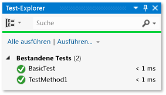
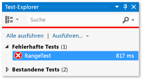

# Komponententest von Visual C#-Code in einer Store-App
[!INCLUDE[vs2017banner](../code-quality/includes/vs2017banner.md)]

Dieses Thema beschreibt eine Möglichkeit zum Erstellen von Komponententests für eine Visual C\#\-Klasse in einer Windows Store\-App.  Die Klasse "Rooter" implementiert eine Funktion zum näherungsweisen Berechnen der Quadratwurzel einer vorgegebenen Zahl, und zwar in einer Weise, die entfernt an Grenzwertberechnungen in der Analysis erinnert.  Von der Mathematik\-App kann diese Funktion dann verwendet werden, um Benutzern zu zeigen, wie interessant und unterhaltsam Mathematik sein kann.  
  
 In diesem Thema wird gezeigt, wie Komponententests als erster Schritt in der Entwicklung verwendet werden.  Bei dieser Vorgehensweise schreiben Sie zuerst eine Testmethode, die ein bestimmtes Verhalten in Ihrem Testsystem überprüft. Anschließend schreiben Sie den Code, der im Test erfolgreich ist.  Durch das Ändern der Reihenfolge bei den folgenden Prozeduren, können Sie diese Strategie umkehren und zuerst den zu testenden Code und anschließend die Komponententests schreiben.  
  
 In diesem Thema werden auch eine einzelne Visual Studio\-Projektmappe und separate Projekte für die zu testenden Komponententests und DLLs erstellt.  Sie können die Komponententests auch direkt in das DLL\-Projekt einfügen, oder Sie können separate Lösungen für die Komponententests und die DLL erstellen.  
  
> [!NOTE]
>  Visual Studio\-Community, Enterprise  und Professional stellen zusätzliche Funktionen für Komponententests bereit.  
>   
>  -   Sie können ein beliebiges Drittanbieter\- und Open Source\-Framework für Komponententest verwenden, mit dem ein Add\-On\-Adapter für den Microsoft\-Test\-Explorer erstellt wurde.  Sie können auch Codeabdeckungsinformationen für die Tests analysieren und anzeigen.  
> -   Führen Sie Ihre Tests nach jedem Build aus.  
> -   VS Enterprise enthält auch Microsoft Fakes, ein Isolationsframework für verwalteten Code, mit dem Sie Ihre Tests auf den eigenen Code ausrichten können, indem Sie Testcode für System\- und Drittanbieterfunktionalität ersetzen.  
>   
>  Weitere Informationen finden Sie unter [Überprüfen von Code mithilfe von Komponententests](http://msdn.microsoft.com/library/dd264975.aspx) in der MSDN Library.  
  
##  <a name="BKMK_In_this_topic"></a> In diesem Thema  
 [Erstellen Sie die Projektmappe und das Komponententestprojekt.](#BKMK_Create_the_solution_and_the_unit_test_project)  
  
 [Stellen Sie sicher, dass die Tests im Test-Explorer ausgeführt werden.](#BKMK_Verify_that_the_tests_run_in_Test_Explorer)  
  
 [Fügen Sie die Klasse "Rooter" zu dem Projekt "Mathematik" hinzu.](#BKMK_Add_the_Rooter_class_to_the_Maths_project)  
  
 [Verknüpfen Sie das Testprojekt mit dem App-Projekt.](#BKMK_Couple_the_test_project_to_the_app_project)  
  
 [Die Tests iterativ steigern und erfolgreich abschließen](#BKMK_Iteratively_augment_the_tests_and_make_them_pass)  
  
 [Debuggen Sie einen fehlgeschlagenen Test.](#BKMK_Debug_a_failing_test)  
  
 [Gestalten Sie den Code um.](#BKMK_Refactor_the_code_)  
  
##  <a name="BKMK_Create_the_solution_and_the_unit_test_project"></a> Erstellen Sie die Projektmappe und das Komponententestprojekt.  
  
1.  Wählen Sie im Menü **Datei** die Option **Neu** aus, und klicken Sie dann auf **Neues Projekt**.  
  
2.  Erweitern Sie im Dialogfeld **Neues Projekt** den Eintrag **Installiert**, erweitern Sie **Visual C\#**, und wählen Sie **Windows Store** aus.  Wählen Sie dann in der Liste der Projektvorlagen **Leere App** aus.  
  
3.  Nennen Sie das Projekt `Mathematik`, und stellen Sie sicher, dass **Projektmappenverzeichnis erstellen** ausgewählt ist.  
  
4.  Wählen Sie im Projektmappen\-Explorer den Projektmappenname aus. Wählen Sie anschließend aus dem Kontextmenü **Hinzufügen** und dann **Neues Projekt** aus.  
  
5.  Erweitern Sie im Dialogfeld **Neues Projekt** den Eintrag **Installiert**, erweitern Sie **Visual C\#**, und wählen Sie **Windows Store** aus.  Wählen Sie dann **Komponententestbibliothek \(Windows Store\-Apps\)** aus der Liste der Projektvorlagen aus.  
  
       
  
6.  Öffnen Sie UnitTest1.cs im Visual Studio\-Editor.  
  
    ```c#  
  
    using System;  
    using System.Collections.Generic;  
    using System.Linq;  
    using System.Text;  
    using Microsoft.VisualStudio.TestPlatform.UnitTestFramework;  
    using Maths;  
  
    namespace RooterTests  
    {  
        [TestClass]  
        public class UnitTest1  
  
            [TestMethod]  
            public void TestMethod1()  
            {  
  
            }  
  
    ```  
  
     Hinweis:  
  
    1.  Jeder Test wird durch die `[TestMethod]`\-Verwendung definiert.  Eine Testmethode muss den Wert "void" zurückgeben und darf keine Parameter haben.  
  
    2.  Testmethoden müssen in einer Klasse enthalten sein, die durch das `[TestClass]`\-Attribut ergänzt wird.  
  
         Wenn die Tests ausgeführt werden, wird eine Instanz jeder Testklasse erstellt.  Die Testmethoden werden in einer nicht vorgegebenen Reihenfolge aufgerufen.  
  
    3.  Sie können spezielle Methoden definieren, die vor und nach jedem Modul, jeder Klasse oder Methode aufgerufen werden.  Weitere Informationen finden Sie unter [Verwenden von Microsoft.VisualStudio.TestTools.UnitTesting\-Membern in Komponententests](../test/using-microsoft-visualstudio-testtools-unittesting-members-in-unit-tests.md) in der MSDN Library.  
  
##  <a name="BKMK_Verify_that_the_tests_run_in_Test_Explorer"></a> Stellen Sie sicher, dass die Tests im Test\-Explorer ausgeführt werden.  
  
1.  Fügen Sie einen Testcode in `TestMethod1` der **UnitTest1.cs**\-Datei ein:  
  
    ```c#  
  
    [TestMethod]  
    public void TestMethod1()  
    {  
        Assert.AreEqual(0, 0);  
    }  
  
    ```  
  
     Die `Assert`\-Klasse stellt mehrere statische Methoden bereit, um die Ergebnisse in den Testmethoden zu überprüfen.  
  
2.  Wählen Sie im Menü **Test** die Option **Ausführen** und dann **Alle ausführen** aus.  
  
     Das Testprojekt wird erstellt und ausgeführt.  Das Test\-Explorer\-Fenster wird angezeigt, und der Test wird unter **Bestandene Tests** aufgeführt.  Unten im Fenster im Bereich "Zusammenfassung" werden weitere Informationen über den ausgewählten Test angezeigt.  
  
       
  
##  <a name="BKMK_Add_the_Rooter_class_to_the_Maths_project"></a> Fügen Sie die Klasse "Rooter" zu dem Projekt "Mathematik" hinzu.  
  
1.  Wählen Sie im Projektmappen\-Explorer den Projektname **Mathematik**.  Wählen Sie im Kontextmenü **Hinzufügen** und dann **Klasse** aus.  
  
2.  Nennen Sie die Klassendatei `Rooter.cs`  
  
3.  Fügen Sie der Rooter\-Klassendatei **Rooter.cs** den folgenden Code hinzu:  
  
    ```c#  
  
    public Rooter()  
    {  
    }  
  
    // estimate the square root of a number  
    public double SquareRoot(double x)  
    {  
        return 0.0;  
    }  
  
    ```  
  
     Die `Rooter`\-Klasse deklariert einen Konstruktor und die `SqareRoot`\-Abschätzermethode.  
  
4.  Die `SqareRoot`\-Methode ist nur eine minimale Implementierung, die gerade ausreicht, um die Grundstruktur des Testsetups zu testen.  
  
##  <a name="BKMK_Couple_the_test_project_to_the_app_project"></a> Verknüpfen Sie das Testprojekt mit dem App\-Projekt.  
  
1.  Fügen Sie dem RooterTests\-Projekt einen Verweis auf die Mathematik\-App hinzu.  
  
    1.  Wählen Sie im Projektmappen\-Explorer das Projekt **RooterTests** aus, und wählen Sie dann im Kontextmenü die Option **Verweis hinzufügen** aus.  
  
    2.  Erweitern Sie im Dialogfeld **Verweis hinzufügen \- RooterTests** den Eintrag **Projektmappe** und wählen Sie **Projekte** aus.  Wählen Sie dann das Element **Mathematik** aus.  
  
           
  
2.  Fügen Sie der Datei "UnitTest1.cs" eine using\-Anweisung hinzu:  
  
    1.  Öffnen Sie **UnitTest1.cs**.  
  
    2.  Fügen Sie diesen Code unter der Zeile `using Microsoft.VisualStudio.TestPlatform.UnitTestFramework;` hinzu:  
  
        ```c#  
        using Maths;  
        ```  
  
3.  Fügen Sie einen Test hinzu, der die Funktion "Rooter" verwendet.  Fügen Sie den folgenden Code zu **UnitTest1.cpp** hinzu:  
  
    ```c#  
    [TestMethod]  
    public void BasicTest()  
    {  
        Maths.Rooter rooter = new Rooter();  
        double expected = 0.0;  
        double actual = rooter.SquareRoot(expected * expected);  
        double tolerance = .001;  
        Assert.AreEqual(expected, actual, tolerance);  
    }  
  
    ```  
  
4.  Erstellen Sie die Projektmappe.  
  
     Der neue Test wird im Test\-Explorer im Knoten **Nicht ausgeführte Tests** angezeigt.  
  
5.  Wählen Sie im Test\-Explorer die Option **Alle ausführen** aus.  
  
       
  
 Sie haben den Test und die Codeprojekte eingerichtet und überprüft, dass Sie Tests ausführen können, die Funktionen im Codeprojekt ausführen.  Jetzt können Sie beginnen, echte Tests und Code zu schreiben.  
  
##  <a name="BKMK_Iteratively_augment_the_tests_and_make_them_pass"></a> Die Tests iterativ steigern und erfolgreich abschließen  
  
1.  Fügen Sie einen neuen Test hinzu:  
  
    ```c#  
    [TestMethod]  
    public void RangeTest()  
    {  
        Rooter rooter = new Rooter();  
        for (double v = 1e-6; v < 1e6; v = v * 3.2)  
        {  
            double expected = v;  
            double actual = rooter.SquareRoot(v*v);  
            double tolerance = ToleranceHelper(expected);  
            Assert.AreEqual(expected, actual, tolerance);  
        }  
    }  
  
    ```  
  
    > [!TIP]
    >  Es wird empfohlen, keine Tests zu ändern, die erfolgreich abgeschlossen wurden.  Fügen Sie stattdessen einen neuen Test hinzu, aktualisieren Sie den Code, damit der Test erfolgreich ist, und fügen Sie dann einen weiteren Test hinzu, usw.  
    >   
    >  Wenn Benutzer ihre Anforderungen ändern, deaktivieren Sie die Tests, die nicht mehr richtig sind.  Schreiben Sie neue Tests, und lassen Sie sie auf die gleiche stufenweise Art arbeiten.  
  
2.  Wählen Sie im Test\-Explorer die Option **Alle ausführen** aus.  
  
3.  Der Test schlägt fehl.  
  
       
  
    > [!TIP]
    >  Überprüfen Sie unmittelbar nach dem Schreiben eines Tests, dass er fehlschlägt.  Dadurch können Sie vermeiden, dass Sie einen Test schreiben, bei dessen Ausführung nie ein Fehler auftritt.  
  
4.  Erweitern Sie den Code unter dem Test, damit der neue Test erfolgreich ist.  Ändern Sie die `SqareRoot`\-Funktion in **Rooter.cs** in:  
  
    ```c#  
    public double SquareRoot(double x)  
    {  
        double estimate = x;  
        double diff = x;  
        while (diff > estimate / 1000)  
        {  
            double previousEstimate = estimate;  
            estimate = estimate - (estimate * estimate - x) / (2 * estimate);  
            diff = Math.Abs(previousEstimate - estimate);  
        }  
        return estimate;  
    }  
  
    ```  
  
5.  Erstellen Sie die Projektmappe, und wählen Sie dann im Test\-Explorer **Alle ausführen** aus.  
  
     Alle drei Tests sind jetzt erfolgreich.  
  
> [!TIP]
>  Entwickeln Sie Code, indem Sie währenddessen Tests hinzufügen.  Stellen Sie sicher, dass alle Tests nach jeder Iteration erfolgreich sind.  
  
##  <a name="BKMK_Debug_a_failing_test"></a> Debuggen Sie einen fehlgeschlagenen Test.  
  
1.  Fügen Sie einen anderen Test zu **UnitTest1.cs** hinzu:  
  
    ```c#  
    // Verify that negative inputs throw an exception.  
    [TestMethod]  
    public void NegativeRangeTest()  
    {  
        string message;  
        Rooter rooter = new Rooter();  
        for (double v = -0.1; v > -3.0; v = v - 0.5)  
        {  
            try  
            {  
                // Should raise an exception:  
                double actual = rooter.SquareRoot(v);  
  
                message = String.Format("No exception for input {0}", v);  
                Assert.Fail(message);  
            }  
            catch (ArgumentOutOfRangeException ex)  
            {  
                continue; // Correct exception.  
            }  
            catch (Exception e)  
            {  
                message = String.Format("Incorrect exception for {0}", v);  
                Assert.Fail(message);  
            }  
        }  
    }  
  
    ```  
  
2.  Wählen Sie im Test\-Explorer die Option **Alle ausführen** aus.  
  
     Der Test schlägt fehl.  Wählen Sie den Testnamen im Test\-Explorer aus.  Die Assertation, bei der ein Fehler aufgetreten ist, wird gekennzeichnet.  Die Fehlermeldung wird im Detailbereich vom Test\-Explorer angezeigt.  
  
       
  
3.  Gehen Sie die Funktion durch, um herauszufinden, weshalb der Test fehlschlägt:  
  
    1.  Legen Sie einen Haltepunkt am Anfang der `SquareRoot`\-Funktion fest.  
  
    2.  Wählen Sie im Kontextmenü des fehlgeschlagenen Tests die Option **Ausgewählte Tests debuggen** aus.  
  
         Wenn die Ausführung am Haltepunkt beendet wird, gehen Sie den Code schrittweise durch.  
  
    3.  Fügen Sie Code zur Rooter\-Methode hinzu, um die Ausnahme zu erfassen:  
  
        ```c#  
        public double SquareRoot(double x)  
        {  
            if (x < 0.0)  
            {  
                throw new ArgumentOutOfRangeException();  
        }  
  
        ```  
  
    1.  Wählen Sie im Test\-Explorer **Alle ausführen** aus, um die korrigierte Methode zu testen und zu überprüfen, dass Sie keine Regression eingeführt haben.  
  
 Alle Tests sind jetzt erfolgreich.  
  
   
  
##  <a name="BKMK_Refactor_the_code_"></a> Gestalten Sie den Code um.  
 **Vereinfachen Sie die zentrale Berechnung in der SquareRoot\-Funktion.**  
  
1.  Ändern Sie die Ergebnisimplementierung.  
  
    ```c#  
    // old code  
    //result = result - (result*result - v)/(2*result);  
    // new code  
    result = (result + v/result) / 2.0;  
  
    ```  
  
2.  Wählen Sie **Alle ausführen** aus, um die umgestaltete Methode zu testen und zu überprüfen, dass Sie keine Regression eingeführt haben.  
  
> [!TIP]
>  Mit einem stabilen Satz guter Komponententests haben Sie mehr Gewissheit, dass Sie beim Ändern des Codes keine Fehler eingeführt haben.  
  
 **Gestalten Sie den Testcode um, um doppelten Code zu vermeiden.**  
  
 Die `RangeTest`\-Methode weist dem Nenner der Toleranzvariablen, die in der `Assert`\-Methode verwendet wird, vordefinierten Code zu.  Wenn Sie zusätzliche Tests hinzufügen möchten, in denen die gleiche Toleranzberechnung zur Anwendung kommt, können Fehler auftreten, wenn ein vordefinierter Wert an mehreren Speicherorten verwendet wird.  
  
1.  Fügen Sie eine private Methode zur Unit1Test\-Klasse hinzu, um den Toleranzwert zu berechnen und anschließend stattdessen diese Methode aufzurufen.  
  
    ```c#  
    private double ToleranceHelper(double expected)  
    {  
        return expected / 1000;  
    }  
  
    ...  
  
    [TestMethod]  
    public void RangeTest()  
    {  
        ...  
        // old code  
        // double tolerance = expected/1000;  
        // new code  
        double tolerance = ToleranceHelper(expected);  
        Assert.AreEqual(expected, actual, tolerance);  
    }  
    ...  
  
    ```  
  
2.  Wählen Sie **Alle ausführen** aus, um die umgestaltete Methode zu testen und zu überprüfen, dass Sie keinen Fehler eingeführt haben.  
  
> [!NOTE]
>  Wenn Sie eine Hilfsmethode zu einer Testklasse hinzufügen, dürfen Sie nicht das `[TestMethod]`\-Attribut zur Methode hinzufügen.  Die auszuführende Methode wird vom Test\-Explorer nicht registriert.