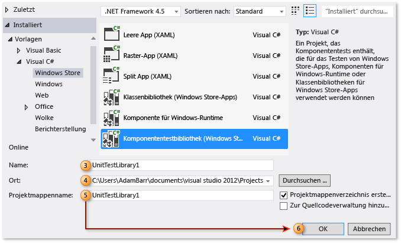
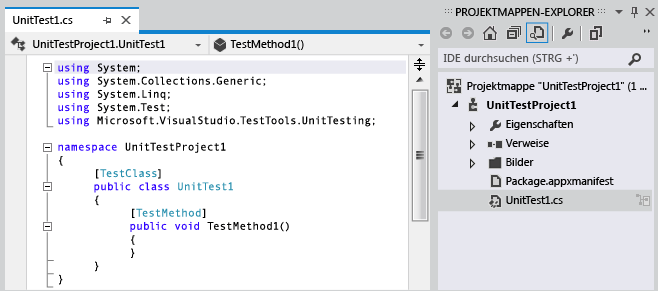
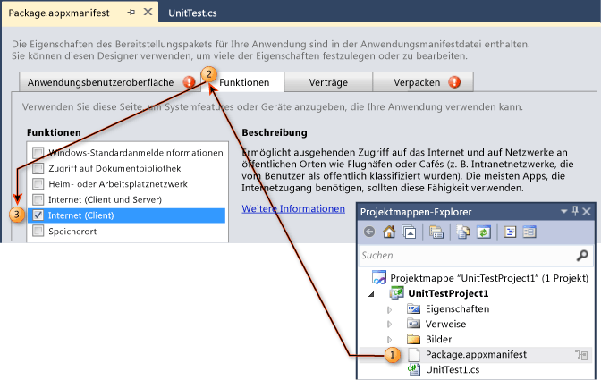
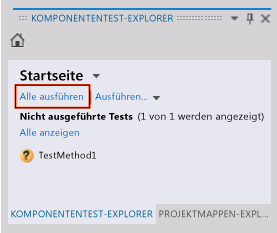
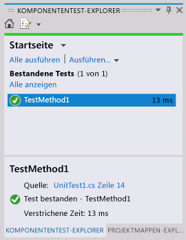

# Exemplarische Vorgehensweise: Erstellen und Ausführen von Komponententests für UWP-Apps

Visual Studio unterstützt Komponententests für UWP-Apps (Universelle Windows-Plattform). Es enthält Komponententest-Projektvorlagen für Visual C#, Visual Basic und Visual C++.

> [!TIP]
> Weitere Informationen zum Entwickeln von UWP-Apps finden Sie unter [Erste Schritte mit UWP-Apps](/windows/uwp/get-started/).

Im folgenden sind Schritte zum Erstellen, zum Ausführen und zum Debuggen von Komponententests für eine UWP-App beschrieben.

## Erstellen eines Komponententestprojekts für eine UWP-App

1.  Wählen Sie im Menü **Datei** die Option **Neues Projekt**aus.

     Daraufhin wird das Dialogfeld "Neues Projekt" angezeigt.

2.  Wählen Sie unter „Vorlagen“ die Programmiersprache aus, in der Sie den Komponententest erstellen möchten, und wählen Sie dann die zugeordnete Windows Universal-Komponententestbibliothek aus. Wählen Sie beispielsweise **Visual C#** aus, und wählen Sie dann **Windows Universal** gefolgt von **Komponententestbibliothek (Universal Windows)** aus.

3.  (Optional) Geben Sie im Textfeld **Name** den Namen ein, den Sie für das Projekt verwenden möchten.

4.  (Optional) Ändern Sie den Pfad, unter dem Sie das Projekt erstellen möchten, indem Sie ihn im Textfeld **Speicherort** eingeben, oder klicken Sie auf die Schaltfläche **Durchsuchen** .

5.  (Optional) Geben Sie im Textfeld **Projektmappe** den Namen ein, den Sie für die Projektmappe verwenden möchten.

6.  Vergewissern Sie sich, dass die Option **Projektmappenverzeichnis erstellen** ausgewählt ist, und klicken Sie auf **OK** .

     

     Der Projektmappen-Explorer wird mit dem UWP-Komponententestprojekt ausgefüllt, und der Code-Editor zeigt den Standardkomponententest „UnitTest1“ an.

     

## Bearbeiten der UWP-Anwendungsmanifestdatei für das Komponententestprojekt

1.  Klicken Sie im Projektmappen-Explorer mit der rechten Maustaste auf die Datei *Package.appxmanifest*, und wählen Sie **Öffnen** aus.

     Daraufhin wird der Manifest-Designer für die Bearbeitung angezeigt.

2.  Wählen Sie im Manifest-Designer die Registerkarte **Funktionen** aus.

3.  Wählen Sie in der **Funktionen**-Liste die Funktionen, über die die getestete Komponente verfügen soll, und den für diese Tests erforderlichen Code aus. Aktivieren Sie beispielsweise das Kontrollkästchen **Internet** , wenn die Komponente, die getestet werden soll, und der Code Zugriff auf das Internet benötigen.

    > [!NOTE]
    > Die ausgewählten Funktionen sollten nur Funktionen enthalten, die für das ordnungsgemäße Ausführen des Komponententests erforderlich sind.

     

## Schreiben von Code für den Komponententest einer UWP-App

Bearbeiten Sie im Code-Editor den Komponententest und fügen Sie die Bestätigungs- und Logikanforderungen für den Test hinzu.

## Ausführen von Komponententests

### So erstellen Sie die Projektmappe und führen den Komponententest mit dem Komponententest-Explorer aus

1.  Wählen Sie im Menü **Test** den Punkt **Windows**und dann **Test-Explorer**aus.

     Daraufhin wird der Komponententest-Explorer ohne Ihren Test angezeigt.

2.  Wählen Sie im Menü **Erstellen** die Option **Projektmappe erstellen**aus.

     Der Komponententest wird jetzt aufgeführt.

    > [!NOTE]
    > Sie müssen die Projektmappe erstellen, um die Liste der Komponententests im Komponententest-Explorer zu aktualisieren.

3.  Wählen Sie im Test-Explorer den Komponententest aus, den Sie erstellt haben.

    > [!TIP]
    > Der Test-Explorer stellt neben **Quelle:** einen Link zum Quellcode bereit.

4.  Wählen Sie **Alle ausführen** aus.

     

    > [!TIP]
    > Sie können mehr als einen der im Komponententest-Explorer aufgeführten Komponententests auswählen und per Rechtsklick **Ausgewählte Tests ausführen**auswählen.
    >
    > Außerdem können Sie die Optionen **Ausgewählte Tests debuggen**, **Test öffnen**und **Eigenschaften** auswählen.
    >
    > 

    Der Komponententest läuft. Nach Abschluss zeigt der Komponententest-Explorer den Teststatus und die verstrichene Zeit an und stellt einen Link zur Quelle bereit.

    

## Siehe auch

- [Testen von UWP-Apps mit Visual Studio](../test/testing-store-apps-with-visual-studio.md)
- [Erstellen und Testen einer UWP-App](/vsts/build-release/apps/windows/universal?tabs=vsts)
