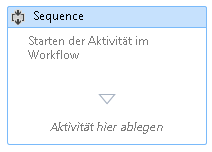
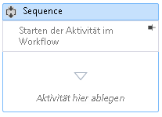

# Vorgehensweise: Hinzuf&#252;gen von Kommentaren zu einem Workflow im Workflow-Designer
Um die Erstellung größerer, komplexerer Workflows zu erleichtern, bietet [!INCLUDE[net_v45](../ide/includes/net_v45_md.md)] dem Entwickler die Möglichkeit, den folgenden Elementtypen im Designer Anmerkungen hinzuzufügen:  
  
-   <xref:System.Activities.Activity>  
  
-   <xref:System.Activities.Statements.State>  
  
-   <xref:System.Activities.Statements.Transition>  
  
-   Von <xref:System.Activities.Statements.FlowNode> abgeleitete Klassen  
  
-   <xref:System.Activities.Variable>  
  
-   <xref:System.Activities.Argument>  
  
> [!IMPORTANT]
>  Der Inhalt einer Anmerkung wird im Nur\-Text\-Format in der XAML\-Datei gespeichert, die dem Workflow zugeordnet ist, und kann möglicherweise von anderen gelesen werden.Bedenken Sie diesen Umstand, wenn Sie vertrauliche Informationen in eine Anmerkung einfügen.  
  
### Hinzufügen einer Anmerkung zu einer Aktivität im Designer  
  
1.  Klicken Sie mit der rechten Maustaste auf einem Element im Workflow\-Designer, und wählen Sie **Anmerkungen**, **Anmerkung hinzufügen** aus.  
  
2.  Fügen Sie den Text der Anmerkung im angegebenen Bereich ein.  
  
3.  Für das Element wird ein Anmerkungssymbol angezeigt.Wenn Sie auf das Anmerkungssymbol zeigen, wird der Text der Anmerkung angezeigt.  
  
       
  
### Anzeigen einer Anmerkung in einem Aktivitätsdesigner  
  
1.  Bei einem Aktivitätsdesigner, bei dem eine Anmerkung außerhalb der Aktivität angezeigt wird, klicken Sie im Anmerkungsadorner auf das Symbol **Anheften**.  
  
2.  Die Anmerkung wird im Aktivitätsdesigner angezeigt.Im der unten stehenden Bildschirmaufnahme wird die Anmerkung "Starting activity in the workflow" im Aktivitätsdesigner angezeigt.  
  
       
  
3.  Um die Anmerkung außerhalb des Aktivitätsdesigners anzuzeigen, zeigen Sie auf den Anmerkungsbereich im Aktivitätsdesigner und klicken auf das Symbol **Fixierung aufheben**.  
  
       
  
### Anzeigen oder Ausblendenden aller Anmerkungen  
  
1.  Klicken Sie mit der rechten Maustaste auf eine Aktivität, die eine Anmerkung enthält.Wählen Sie **Anmerkungen**, **Alle Anmerkungen anzeigen** aus.  
  
2.  In den Aktivitätsdesignern werden alle Anmerkungen angezeigt.  
  
3.  Um alle Anmerkungen außerhalb des Aktivitätsdesigners anzuzeigen, klicken Sie mit der rechten Maustaste auf die Aktivität und wählen **Anmerkungen**, **Alle Anmerkungen ausblenden** aus.  
  
### Bearbeiten oder Löschen einer Anmerkung für eine Aktivität  
  
1.  Klicken Sie mit der rechten Maustaste auf eine Aktivität, die eine Anmerkung enthält.  
  
2.  Wählen Sie **Anmerkungen**, **Anmerkung bearbeiten** oder **Anmerkung löschen** aus.  
  
3.  Die Anmerkung wird zur Bearbeitung geöffnet oder gelöscht.  
  
4.  Um alle Anmerkungen gleichzeitig zu löschen, klicken Sie mit der rechten Maustaste auf den Workflow\-Designer und wählen **Anmerkung**, **Alle Anmerkungen löschen** aus.  
  
### Hinzufügen, Bearbeiten und Löschen einer Anmerkung für eine Variable oder ein Argument  
  
1.  Klicken Sie mit der rechten Maustaste auf eine Variable oder ein Argument, und wählen Sie "Anmerkung hinzufügen".  
  
2.  Geben Sie den Text der Anmerkung ein.Für die Variable oder das Argument wird ein Anmerkungssymbol angezeigt.  
  
3.  Klicken Sie mit der rechten Maustaste auf eine Variable oder ein Argument, die bzw. das eine Anmerkung enthält.Wählen Sie "Anmerkung bearbeiten" aus.  
  
4.  Die Anmerkung wird zur Bearbeitung geöffnet.  
  
5.  Klicken Sie mit der rechten Maustaste auf eine Variable oder ein Argument, die bzw. das eine Anmerkung enthält.Wählen Sie "Anmerkung löschen" aus.  
  
6.  Die Anmerkung wird gelöscht.