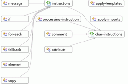

# Gewusst wie: Anzeigen einer Übersicht über ein Schemaset in der Diagrammansicht

Dieses Thema beschreibt, wie die [Diagrammansicht](../xml-tools/graph-view.md) um einen allgemeinen Überblick über die Knoten in einem Schemaset und die Beziehungen zwischen den Knoten anzuzeigen.

## So erstellen Sie eine neue XSD-Datei und zeigen Sie das Stammelement in der Inhaltsmodellansicht an

1.  Erstellen Sie eine neue XML-Schemadatei, und speichern Sie die Datei unter dem Namen "Relationships.xsd".

2.  Klicken Sie auf die **verwenden Sie den XML-Editor, anzeigen und bearbeiten die zugrunde liegende XML-Schemadatei** Link in der Ausgangsansicht auf.

3.  Kopieren Sie die XML-schemabeispielcode aus [XML-Beispielschema: Beziehungen](../xml-tools/sample-xsd-file-relationships.md) und fügen Sie ihn, um den Standardcode zu ersetzen, der die neue XSD-Datei hinzugefügt wurde.

4.  Mit der rechten Maustaste an einer beliebigen Stelle in der XML-Editor, und wählen Sie **Sicht-Designer**.

5.  Wählen Sie auf der XSD-Symbolleiste die Diagrammansicht aus.

6.  Wählen Sie **Schemaset** Knoten im XML-Schema-Explorer klicken und ziehen Sie den Knoten Suface der Diagrammansicht zu entwerfen. Nun sollten alle globalen Knoten und Verbindungspfeile zwischen den Knoten mit Beziehungen angezeigt werden.

     

7.  Klicken Sie auf der Entwurfsoberfläche auf einen Knoten, und überprüfen Sie in der Breadcrumb-Leiste, wo sich der ausgewählte Knoten im Schemaset befindet.

8.  Rick Klick auf einen Elementknoten, auf die Muster, die Entwurfsoberfläche, und wählen **Beispiel-XML generieren** auf die XML-Instanzdokument anzuzeigen.