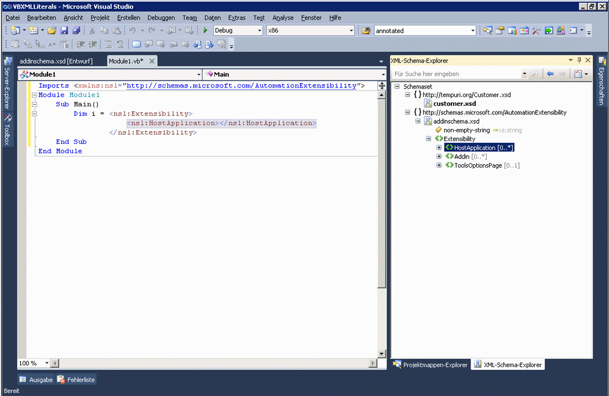

# Integration von XML-Literalen in den XML-Schema-Explorer

Visual Basic unterstützt XML-Literale, was bedeutet, dass Sie XML-Fragmente direkt in Visual Basic-Code integrieren können. Weitere Informationen finden Sie unter [Übersicht über XML-Literale](http://go.microsoft.com/fwlink/?LinkId=140325).

## Gewusst wie

Wenn eine XSD-Datei im Visual Basic-Projekt ein XML-Literal enthält, können Sie das XML-Schemaset im XML-Schema-Explorer anzeigen. Um das Schemaset eines XML-Literals zugeordneten anzuzeigen, mit der rechten Maustaste auf einen XML-Knoten in ein XML-Literal oder einem XML-Namespaceimport, und wählen Sie **im Schema-Explorer anzeigen**.

Dadurch wird der XML-Schema-Explorer neben der Visual Basic-Datei geöffnet.

## Siehe auch

- [Gewusst wie: Verwenden des XML-Schema-Designers mit XML-Literalen](../xml-tools/how-to-use-the-xml-schema-designer-with-xml-literals.md)