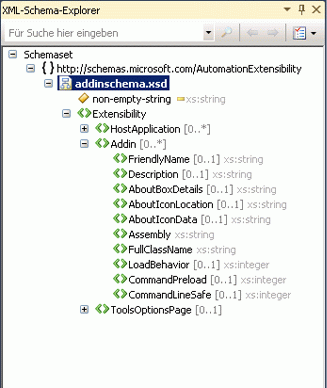

# XML-Schema-Explorer
[!INCLUDE[vs2017banner](../code-quality/includes/vs2017banner.md)]

Der XML\-Schema\-Explorer ist in Microsoft Visual Studio und den XML\-Editor integriert, um die Arbeit mit XSD\-Schemas \(XML\-Schemadefinitionssprache\) zu ermöglichen.Wenn Sie eine XML\-Schemadatei öffnen, wird der Knoten **Schemaset** im XML\-Schema\-Explorer angezeigt.Alle enthaltenen, importierten oder neu definierten Schemas für die Zieldatei und alle Dateien, auf die durch eine `include`\- oder `import`\-Anweisung verwiesen wird, werden auch im XML\-Schema\-Explorer angezeigt.  
  
 Mit dem XML\-Schema\-Explorer können Sie folgende Aufgaben ausführen:  
  
-   Abrufen einer kurzen Übersicht über das Schemaset.  
  
-   Durchsuchen und Navigieren in der Struktur.  
  
-   Durchführen von schlüsselwort\- und schemaspezifischen Suchvorgängen.Weitere Informationen finden Sie unter [Durchsuchen des Schemasets](../xml-tools/searching-the-schema-set.md).  
  
-   Hinzufügen der Suchergebnisse zur Diagramm\- oder Inhaltsmodellansicht.  
  
-   Sortieren der Struktur nach Dokumentreihenfolge, Typ oder Namen.Weitere Informationen finden Sie unter [Sortieren, Filtern und Gruppieren](../xml-tools/sorting-filtering-and-grouping-xml-schema-explorer.md).  
  
-   Öffnen des XML\-Editors und Springen zu Codepositionen in der XSD\-Datei.Weitere Informationen finden Sie unter [Integration in den XML\-Editor](../xml-tools/integration-with-xml-editor.md).  
  
-   Generieren von Beispiel\-XML\-Code für globale Elemente.  
  
 Der XML\-Schema\-Explorer stellt mit einer Strukturansicht eine hierarchische Ansicht des Schemasets bereit.Der XML\-Schema\-Explorer enthält auch Funktionen zur Suche, Filterung, Navigation und Sortierung.Führen Sie einen der folgenden Schritte aus, um auf den XML\-Schema\-Explorer zuzugreifen:  
  
-   Klicken Sie in der [Ausgangsansicht](../xml-tools/start-view.md) auf den Link **XML\-Schema\-Explorer**.  
  
-   Wählen Sie den XML\-Schema\-Explorer in der [Diagrammansicht](../xml-tools/graph-view.md) oder [Inhaltsmodellansicht](../xml-tools/content-model-view.md) im Kontextmenü aus \(wenn im Arbeitsbereich Knoten angezeigt werden\).  
  
-   Sie können den XML\-Schema\-Explorer auch im Menü **Ansicht** auswählen.  
  
-   Sie könnenüber eine VB\-Datei mit einem Visual Basic\-XML\-Literal, das einer XSD\-Datei zugeordnet ist, auf den XML\-Schema\-Explorer zugreifen.Klicken Sie mit der rechten Maustaste auf einen XML\-Knoten in einem XML\-Literal oder einem XML\-Namespaceimport, und wählen Sie den Befehl **In XML\-Schema\-Explorer anzeigen** aus, um das Schemaset im XML\-Schema\-Explorer anzuzeigen.Weitere Informationen finden Sie unter [Integration von XML\-Literalen in den XML\-Schema\-Explorer](../xml-tools/integration-of-xml-literals-with-xml-schema-explorer.md).  
  
## Strukturansicht  
 Der XML\-Schema\-Explorer zeigt vorkompilierte Schemasetinformationen in einer Struktur an.Die Struktur ist wie folgt aufgebaut:  
  
-   Auf oberster Ebene befindet sich der Schemasetknoten.  
  
-   Die zweite Ebene enthält die Namespaces.  
  
-   Die dritte Ebene enthält die Dateien.  
  
-   Die vierte Ebene enthält die globalen Knoten.Dazu können Elemente, Gruppen, komplexe Typen, einfache Typen, Attribute, Attributgruppen und `include`\-, `import`\- und `redefine`\-Anweisungen gehören.  
  
 Im Folgenden Sie ein Beispiel für eine Struktur:  
  
   
  
## Auswahl und Aktivierung  
 Klicken Sie im Schema\-Explorer einmal auf einen Knoten, um ihn hervorzuheben und auszuwählen.  
  
 Doppelklicken Sie auf einen Knoten, oder markieren Sie einen Knoten und drücken Sie die **EINGABETASTE**, um einen Knoten zu aktivieren.  
  
-   Durch das Aktivieren eines Knotens wird die Datei, in der dieser Knoten definiert ist, geöffnet \(wenn sie nicht bereits geöffnet ist\), und der Knoten wird in der Datei ausgewählt.  
  
-   Durch das Aktivieren eines Dateiknotens wird die ausgewählte Datei geöffnet \(wenn sie nicht bereits geöffnet ist\), und der Knoten `<schema>` wird hervorgehoben.  
  
-   Beim Aktivieren eines Schemaset\- oder Namespaceknotens geschieht nichts.  
  
## Drag & Drop von Knoten  
 Sie können globale Knoten, Dateiknoten und Namespaceknoten per Drag & Drop in einer XSD\-Designer\-Ansicht ablegen.In der [Ausgangsansicht](../xml-tools/start-view.md) wird die [Diagrammansicht](../xml-tools/graph-view.md) geöffnet, wenn Sie einen Knoten in die Ansicht ziehen.In der [Inhaltsmodellansicht](../xml-tools/content-model-view.md) oder Diagrammansicht ändert sich die Ansicht nicht, wenn Sie einen Knoten in der Ansicht ablegen.  
  
 Wenn Sie eine Datei in der Ansicht ablegen, werden alle globalen Knoten in der Datei dem [Arbeitsbereich des XSD\-Designers](../xml-tools/xml-schema-designer-workspace.md) hinzugefügt.Wenn Sie Namespaces in der Ansicht ablegen, werden dem Arbeitsbereich alle globalen Knoten im Namespace hinzugefügt.Der Arbeitsbereich wird für alle Ansichten verwendet.  
  
 Lokale Knoten oder Importe können nicht per Drag & Drop verschoben werden.  
  
## Inhalt dieses Abschnitts  
  
-   [Durchsuchen des Schemasets](../xml-tools/searching-the-schema-set.md)  
  
-   [Sortieren, Filtern und Gruppieren](../xml-tools/sorting-filtering-and-grouping-xml-schema-explorer.md)  
  
-   [Kontextmenüs](../xml-tools/context-menus-xml-schema-explorer.md)  
  
-   [Integration von XML\-Literalen in den XML\-Schema\-Explorer](../xml-tools/integration-of-xml-literals-with-xml-schema-explorer.md)  
  
## Siehe auch  
 [Gewusst wie: Hinzufügen von Knoten aus dem XML\-Schema\-Explorer zum Arbeitsbereich](../xml-tools/how-to-add-nodes-to-the-workspace-from-the-xml-schema-explorer.md)